# Lab 2.3 — Mover: Attribute-Driven Access Recalculation

### Closing the privilege creep gap when an employee changes departments

<p>


</p>

---

## The requirement

**Ticket MDS-1052** — Dana Reyes is transferring from Engineering to Contracts, effective Monday. HR has updated her record.

That's the entire ticket. And that's the problem.

An internal transfer generates an HR record change and nothing else. No access request, no deprovisioning task, no approval workflow. The employee keeps working, keeps her accounts, and nobody files anything — because from the business's perspective, nothing was lost.

Meanwhile she now holds Engineering access she has no business reason for. At a defense contractor handling ITAR-controlled technical data, that's not an inconvenience — it's an access control finding.

**The requirement:** department-derived access must recalculate itself when the attribute changes, with no human in the loop.

---

## The gap, demonstrated

Dana starts in Engineering, holding two groups:

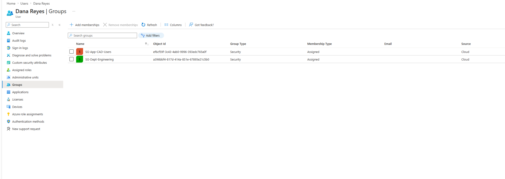

| Group | Membership type | Basis |
|---|---|---|
| `SG-Dept-Engineering` | Assigned | Department |
| `SG-App-CAD-Users` | Assigned | Manager-approved application access |

HR processes the transfer. Department changes to Contracts, job title to Contracts Specialist:

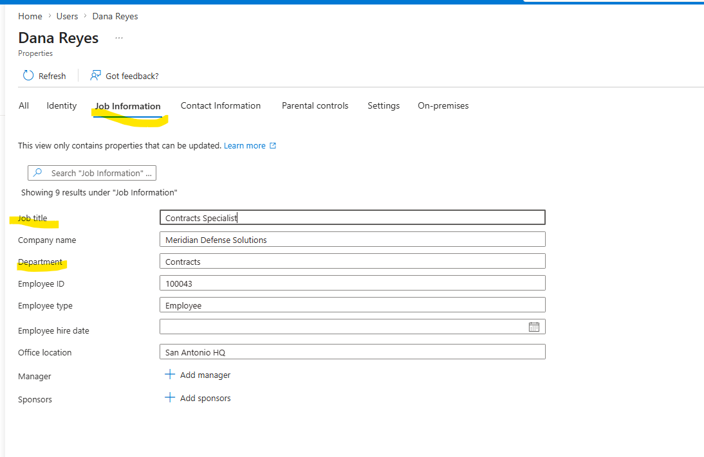

Then check her groups again:

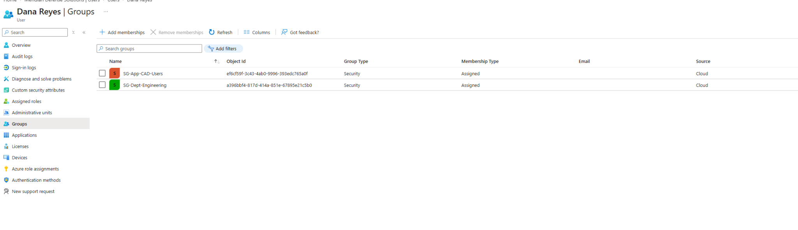

**Nothing moved.** `SG-Dept-Engineering` is still there, still `Assigned`. She is in Contracts on paper and in Engineering in the directory.

> **This is the whole finding.**
> No error was thrown. No alert fired. No ticket was created, because transfers don't generate one. The access simply persisted, silently, until someone happened to run an access review — and if nobody did, until she left the company.
>
> **Privilege creep doesn't accumulate through mistakes. It accumulates through silence.**

---

## Two obstacles hit before the fix

Real friction, in the order it happened.

### Membership type is immutable after creation

`SG-Dept-Engineering` was built as an **Assigned** group. Converting it to Dynamic isn't possible — the field is greyed out permanently:

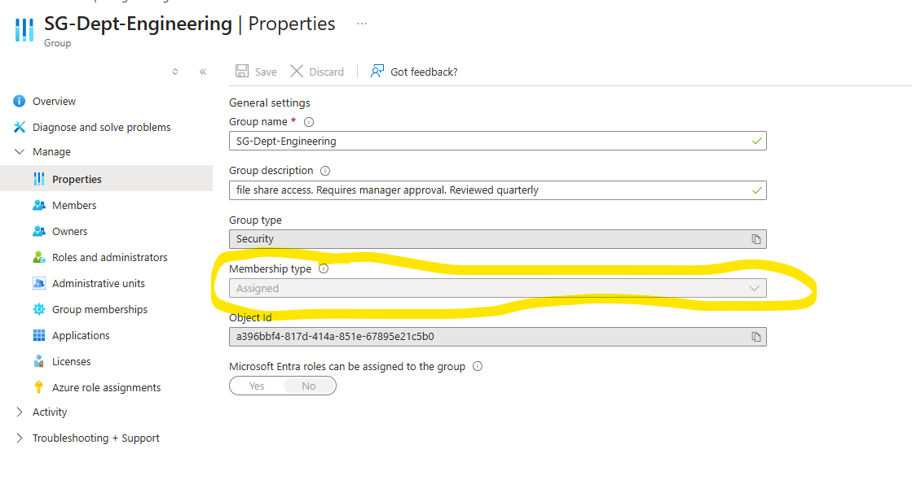

**Resolution:** delete and recreate the group as Dynamic from the start.

> **Design lesson.** Membership type is a permanent decision made at creation. In production, converting a live group means recreating it, remapping every downstream resource permission that referenced the old object ID, and accepting an access outage in the middle. Decide *Assigned vs Dynamic* before the group exists, not after.

### Dynamic groups require Entra ID P2

The Dynamic option wasn't selectable at all under the original licensing:

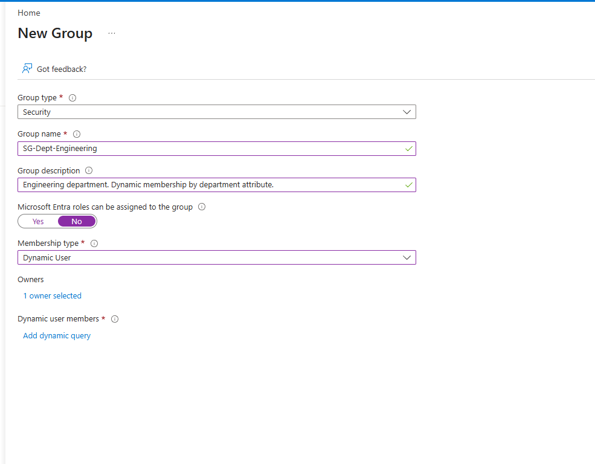

**Resolution:** acquired Entra ID P2 licensing, then proceeded.

> **Design lesson.** Attribute-driven lifecycle automation is a **licensed capability**, not a configuration choice. Any JML architecture that depends on dynamic membership has a cost floor attached to it. That belongs in the design conversation up front, not discovered halfway through implementation.

---

## The fix — dynamic membership

### Engineering group, rebuilt as dynamic

```
(user.department -eq "Engineering") and (user.accountEnabled -eq true) and (user.userType -eq "Member")
```

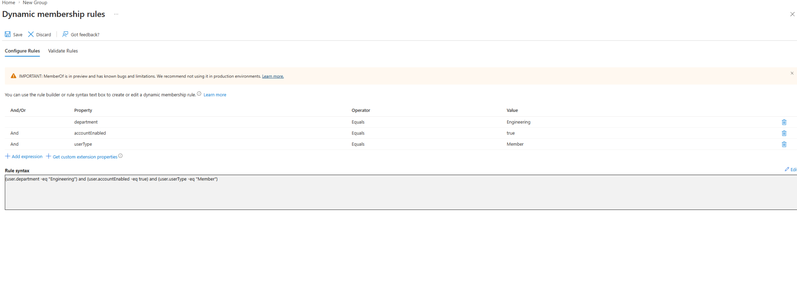

> **Why three conditions instead of one.**
> `department` alone is the access decision. The other two are guardrails:
>
> - **`accountEnabled -eq true`** — a disabled account drops out of the group automatically. Department attributes survive offboarding; this makes sure group membership doesn't.
> - **`userType -eq "Member"`** — keeps guests and external collaborators out. A subcontractor whose record happens to carry a department value should never inherit internal department access. At a defense contractor, that distinction matters more than most places.
>
> Each condition removes a specific failure mode. That's the difference between a rule that works and a rule that works safely.

### Validate before saving

Entra's **Validate Rules** tab tests the expression against a real user before the group is live:

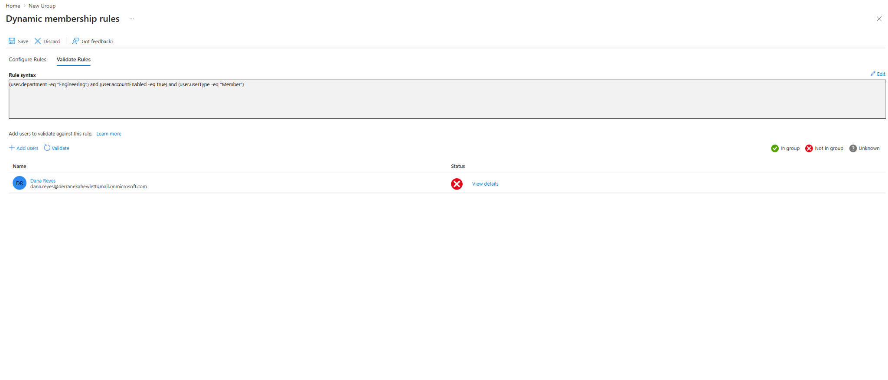

Dana returns ❌ **Not in group** — which is the *correct* result. Her department is now Contracts, so the Engineering rule shouldn't match her.

This is the same discipline as report-only Conditional Access: **prove the rule behaves as intended against known data before it takes effect.** A dynamic rule with a typo in the attribute name silently matches nobody, and an over-broad rule silently matches everybody. Neither throws an error.

### The Engineering membership resolves itself

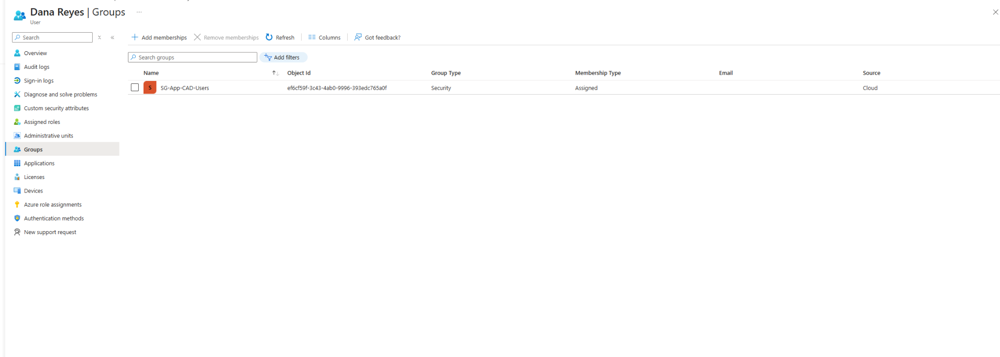

No ticket. No admin action. The attribute changed and the access followed.

---

## Contracts group — access grants itself

Same pattern, opposite direction:

```
(user.department -eq "Contracts") and (user.accountEnabled -eq true) and (user.userType -eq "Member")
```

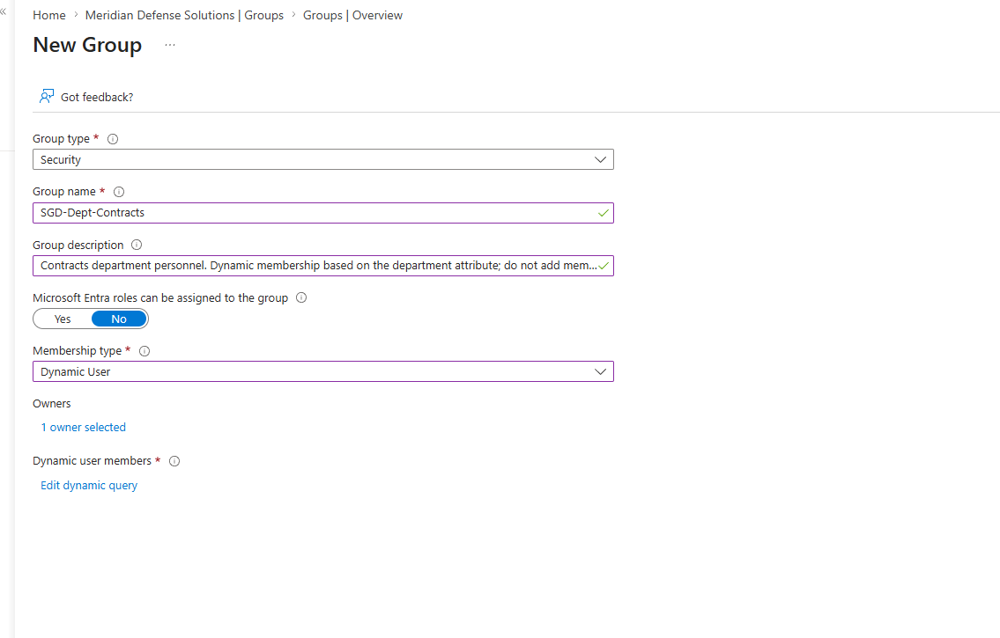

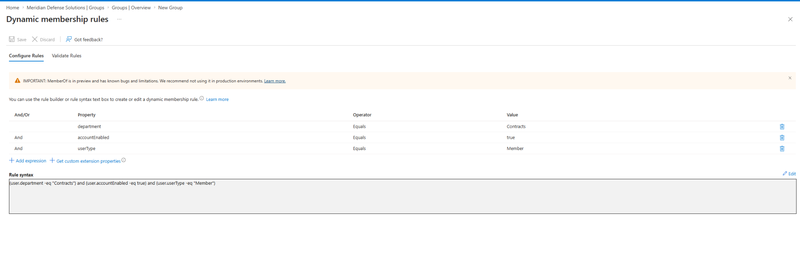

---

## Validation — the end state

Back to Dana's group memberships after both rules processed:

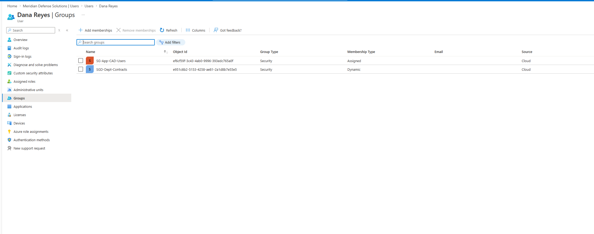

| Group | Membership type | Outcome |
|---|---|---|
| `SG-Dept-Engineering` | Dynamic | **Removed automatically** — department no longer matches |
| `SGD-Dept-Contracts` | Dynamic | **Granted automatically** — department matches |
| `SG-App-CAD-Users` | Assigned | **Persisted** — and that's correct |

Three different outcomes from one attribute change, each one right.

---

## The design boundary — why CAD access stayed

This is the part that matters most.

`SG-App-CAD-Users` did **not** move. That is intentional, not an oversight.

> **Department-derived access resolves itself. Approved access requires a human to revoke it.**
>
> CAD access was granted because a manager approved a business justification. That justification may still hold after the transfer — she may be finishing an engineering project, or Contracts may need CAD for drawing review. An automated rule has no way to know.
>
> If CAD had been bundled into `SG-Dept-Engineering`, it would have vanished the instant her department changed — silently breaking her work mid-project, with no notification and no obvious cause. She'd file a helpdesk ticket describing an application that "just stopped working," and nobody would connect it to a transfer that happened three days earlier.

**The architectural rule this establishes:**

| Access type | Membership | Revocation |
|---|---|---|
| Department / role-derived | Dynamic | Automatic, on attribute change |
| Manager-approved, app-specific | Assigned | Access review, with human context |
| Privileged | PIM eligible | Time-bound activation |

Bundling approved access into department groups is the single most common way organizations build a lifecycle system that breaks people's work. Keeping them separate is what makes automation safe to turn on.

---

## Failure modes handled

| Risk | Mitigation |
|---|---|
| Access persists silently after transfer | Dynamic membership on department attribute |
| Disabled accounts retain group membership | `accountEnabled -eq true` in every rule |
| Guests inherit internal department access | `userType -eq "Member"` in every rule |
| Rule typo silently matches nobody | Validate Rules tab against known user before saving |
| Approved app access destroyed by automation | Kept as Assigned, outside the dynamic rule |
| Group conversion breaks downstream permissions | Membership type decided at creation, documented as permanent |

---

## Key takeaways

**1 · The dangerous failure is the silent one.** Nothing errored when Dana's department changed. No alert, no ticket, no log entry anyone would look at. Access control gaps that announce themselves get fixed; the ones that don't are the ones that show up in an audit finding two years later.

**2 · Transfers don't generate tickets.** Joiners and leavers have workflows because someone notices. Movers don't — the employee is still there, still working, still has everything. That's exactly why the mover case has to be automated rather than proceduralized.

**3 · Validate rules before they go live.** A dynamic rule that matches nobody looks identical to a dynamic rule that hasn't synced yet. The Validate tab is the only way to tell the difference before users are affected.

**4 · Guardrail conditions aren't optional.** `accountEnabled` and `userType` each close a specific hole. A rule with only `department` works right up until a disabled account or an external guest walks through it.

**5 · Membership type is permanent.** Assigned vs Dynamic is decided once, at creation. Getting it wrong means deleting the group and remapping every resource that referenced its object ID.

**6 · Not all access should automate.** The boundary between "derived from an attribute" and "approved by a human" is the most important line in a lifecycle design. Automate the first. Review the second. Never bundle them into the same group.

---

## SC-300 objectives covered

- Create and configure dynamic security groups
- Configure dynamic membership rules and rule syntax
- Validate dynamic membership rules
- Implement attribute-based access assignment
- Manage the identity lifecycle for internal users
- Understand licensing requirements for identity governance features

---

<sub>Meridian Defense Solutions is a fictional organization built in an isolated Microsoft Entra ID lab tenant. All users, data, and programs are synthetic.</sub>
