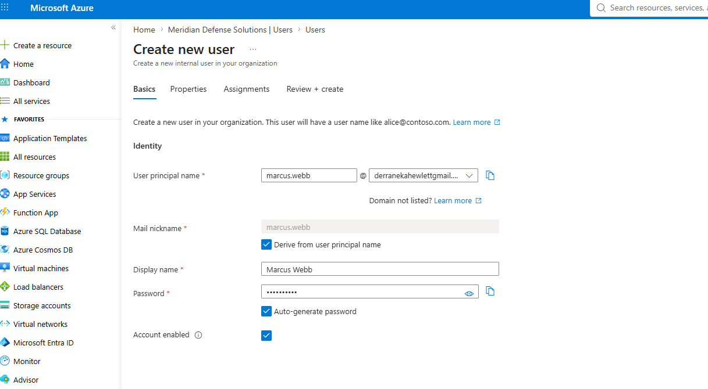
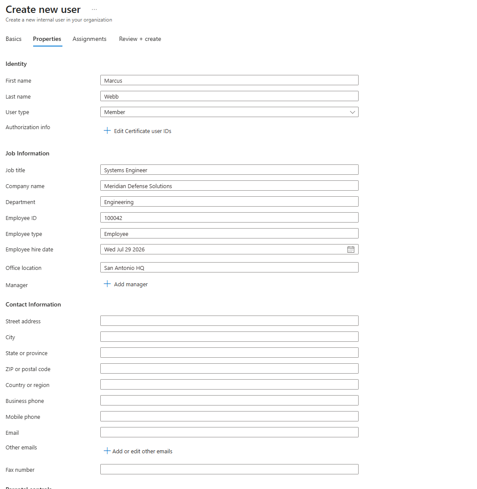
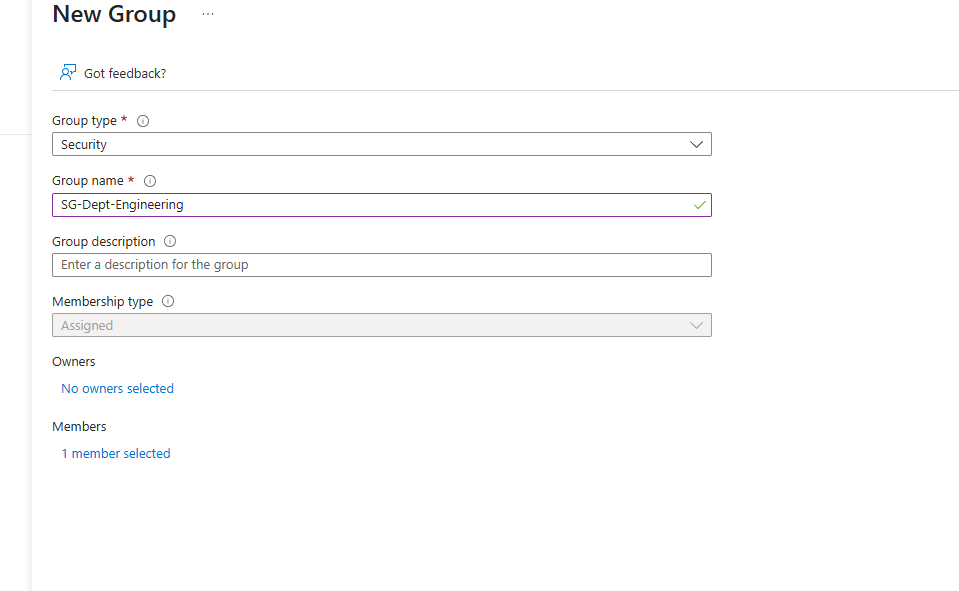
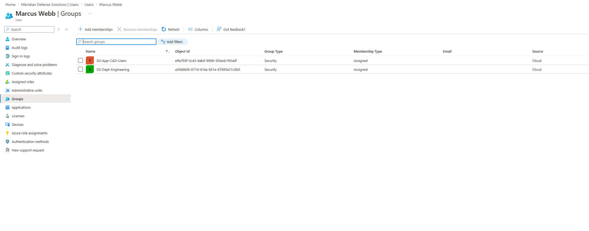
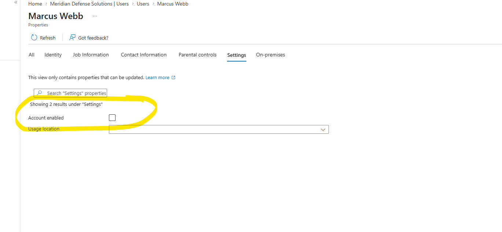
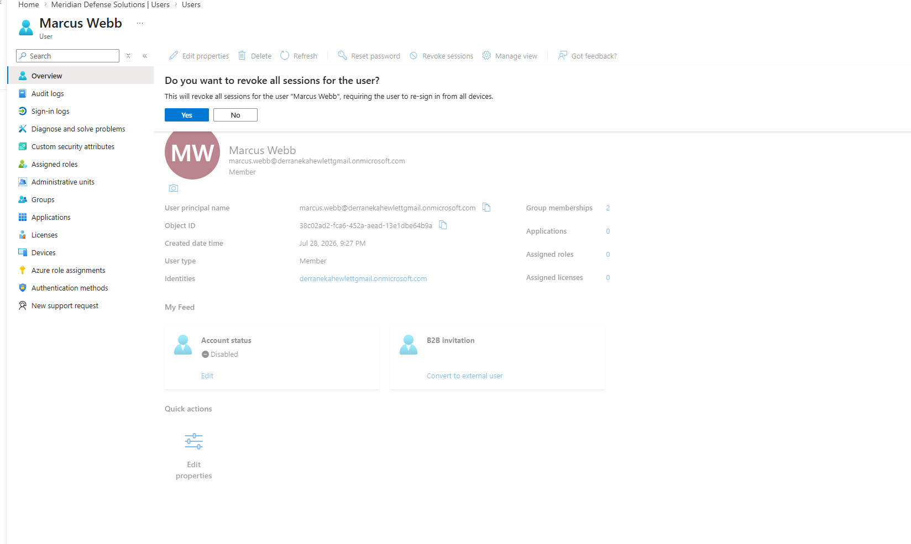
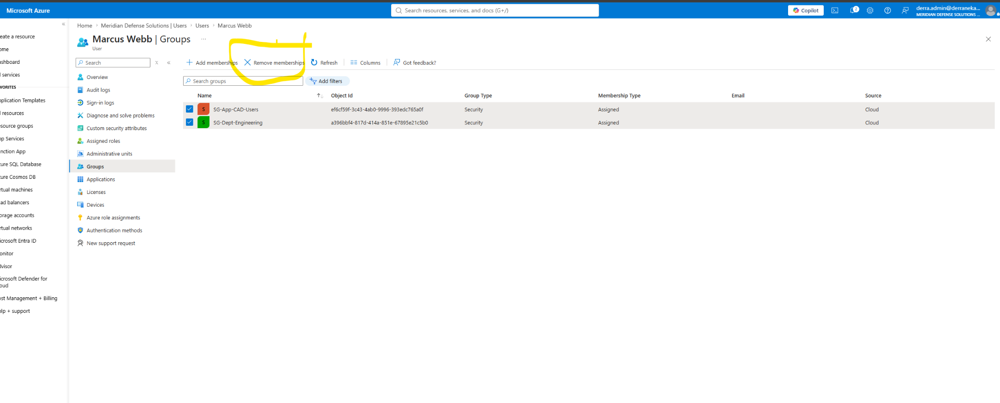
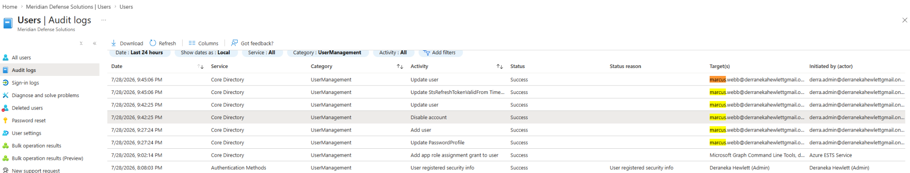

# Lab 2.1 — Joiner and Leaver: Provisioning and Emergency Offboarding

### The two endpoints of the access lifecycle, and the step most people get wrong

---

## Part 1 — Joiner

**Ticket MDS-1041** — New hire starting Monday. Marcus Webb, Systems Engineer, Engineering department, San Antonio HQ. Needs standard Engineering access plus the CAD file share.

Attributes set at creation — department, job title, and location — because these aren't cosmetic. They're the **inputs** that downstream dynamic membership rules evaluate. A user provisioned without a department attribute is a user no lifecycle automation can reason about.

### The two kinds of access

Marcus ends up in two groups, and they are fundamentally different objects:

| Group | What it represents | Basis |
|---|---|---|
| `SG-Dept-Engineering` | **Who he is** | Derived from his department attribute. Every engineer gets it. No approval needed. |
| `SG-App-CAD-Users` | **What he was granted** | Someone made a decision. It's an approval, not a fact about him. |

> **This distinction is the foundation of the entire lifecycle model.**
>
> One is a **fact** — it changes automatically when the underlying attribute changes, and it should. The other is a **decision** — it persists until a human with context revisits it, and it should.
>
> Conflating them is the single most common lifecycle design error. Bundle CAD into the Engineering group and it silently vanishes the moment someone transfers departments — breaking work mid-project with no notification and no obvious cause.
>
> This same boundary is what makes the transfer case work correctly in [Lab 2.3 — Mover](../lab-2-03/), where Dana's department access recalculates itself while her approved CAD access persists.

---

## Part 2 — Leaver

**Ticket MDS-1188** — Marcus Webb terminated effective immediately. Security has directed access be removed **now**, not at end of day. **Evidence required for the personnel file.**

That last sentence changes the task. This isn't just "remove access" — it's "remove access *and be able to prove exactly what you removed and when.*"

### Step 1 — Baseline before touching anything

Two groups documented, with object IDs, before a single change:

| Group | Object ID | Membership type |
|---|---|---|
| `SG-App-CAD-Users` | `ef6cf59f-3c43-4ab0-9996-393edc765a0f` | Assigned |
| `SG-Dept-Engineering` | `a396bbf4-817d-414a-851e-67895e21c5b0` | Assigned |

> **If you can't say what he had, you can't prove you removed it.**
>
> The instinct under time pressure is to start revoking immediately. But an offboarding with no baseline produces an audit trail full of removals with nothing to compare them against. "Did we get everything?" becomes unanswerable.
>
> Thirty seconds of documentation first. Always.

### Step 2 — Disable the account

**Users → Marcus Webb → Edit properties → Settings → Account enabled: No**

This blocks *new* authentication. It does not do what most people assume it does.

### Step 3 — Revoke sessions ← the step that actually matters

> **Disabling an account does not terminate active sessions.**
>
> This is the single most misunderstood step in offboarding. A disabled account cannot authenticate *again* — but any refresh token already issued remains valid, and access tokens stay live until they expire on their own. Someone with an open browser session keeps working for up to an hour after you've "removed" their access.
>
> **Revoke sessions** updates the `StsRefreshTokensValidFrom` timestamp, invalidating every token issued before that moment. It forces re-authentication from every device — and re-authentication fails, because the account is disabled.
>
> **Disable alone is a partial containment. Disable plus revoke is a complete one.**

Note the sequencing logic: revoke sessions *before* resetting the password. Killing live tokens first means there's no window where the user can mint fresh ones off an existing session.

### Step 4 — Strip group memberships

Both groups removed — **after** the disable, not before.

> **Why order matters for the audit trail.**
> The disable timestamp is the **containment moment** — the point at which the organization can say access was cut. Strip groups first and the timeline reads as a gradual access reduction with no clear line. Disable first and the record shows a decisive containment followed by cleanup.
>
> When the personnel file is reviewed, "access terminated at 9:42:25 PM" is a defensible statement. "Access was progressively removed over several minutes" is not.

---

## Validation — the audit trail

**Entra ID → Users → Audit logs → Category: UserManagement**

The complete lifecycle, reconstructed from the log:

| Time | Activity | Phase |
|---|---|---|
| 9:27:24 PM | `Add user` | **Joiner** — account provisioned |
| 9:27:24 PM | `Update PasswordProfile` | Initial credential set |
| 9:42:25 PM | `Disable account` | **Leaver** — containment |
| 9:42:25 PM | `Update user` | Attribute change committed |
| 9:45:06 PM | `Update StsRefreshTokenValidFrom Time` | Session revocation |
| 9:45:06 PM | `Update user` | Group membership removal |

Every entry shows **Status: Success**, target `marcus.webb@`, and actor `derra.admin@`. That's the evidence package the ticket asked for — who did what, to whom, in what order, at what time.

### The finding — a 2 minute 41 second exposure window

The log is honest about something worth calling out.

**Disable completed at 9:42:25. Session revocation completed at 9:45:06.**

For **2 minutes and 41 seconds**, Marcus's account was disabled but his existing tokens were still valid. In a lab that's nothing. In a hostile termination — the exact scenario where "effective immediately" gets written on a ticket — that window is precisely when a departing employee acts.

> **What this changes in a production runbook:**
>
> Session revocation should be **the first action, not the third.** Revoke tokens, then disable, then clean up. Reversing the order I used here closes the gap entirely.
>
> Better still, this is exactly the case for automation. A script executing revoke → disable → strip in sequence closes the window to under a second. Manual offboarding under time pressure is where gaps like this get introduced — not through carelessness, but because clicking through four blades takes time that a script doesn't need.

Documenting the gap is more useful than hiding it. An offboarding process nobody has measured is an offboarding process with unknown exposure.

---

## Failure modes handled

| Risk | Mitigation |
|---|---|
| Cannot prove what access existed | Baseline documented with object IDs before any change |
| Disabled user continues working from live session | Revoke sessions performed, not just disable |
| User mints new tokens from existing session | Revoke sequenced before password reset |
| Ambiguous containment timestamp | Disable performed first; group removal after |
| Approved app access destroyed by department automation | CAD kept as Assigned, separate from department group |
| Exposure window between disable and revoke | Measured at 2m41s; production runbook reorders revoke first |

---

## Key takeaways

**1 · Disable is not containment.** It blocks new authentication and nothing else. Live tokens survive it. The step that actually cuts access is **Revoke sessions**, and skipping it means the person you just offboarded is still working.

**2 · Baseline before you remove.** Thirty seconds of documentation converts "we removed his access" into "we removed these two specific groups, and here are the object IDs." Only one of those survives a personnel file review.

**3 · Order determines what the audit trail says.** Disable first establishes a clean containment timestamp. Everything after is cleanup. Strip groups first and there's no defensible moment to point at.

**4 · Attributes at creation are lifecycle inputs.** Department and job title aren't profile decoration — they're what dynamic rules evaluate. A user provisioned without them is invisible to every automation downstream.

**5 · "Who he is" versus "what he was granted."** Derived access should recalculate automatically. Approved access should persist until a human reviews it. Keeping them in separate groups is what makes both behaviors possible.

**6 · Measure your own gaps.** The 2m41s exposure window only exists as a finding because the audit log was actually read. A process nobody measures has unknown exposure, and unknown exposure is the kind that shows up in an incident report.

---

## SC-300 objectives covered

- Create, configure, and manage user identities
- Manage the identity lifecycle for internal users
- Configure user account properties and attributes
- Assign and remove group memberships
- Disable accounts and revoke user sessions
- Review and interpret Microsoft Entra audit logs

---

Meridian Defense Solutions is a fictional organization built in an isolated Microsoft Entra ID lab tenant. All users, data, and programs are synthetic.
