# Lab 2.4 — Offboarding Automation with Microsoft Graph API

### Closing a measured exposure window with PowerShell

<p>


</p>

---

## The requirement

[Lab 2.1](../lab-2-01/) offboarded a terminated employee through the portal and documented a problem in the audit log:

> Account disabled at **9:42:25 PM**. Sessions revoked at **9:45:06 PM**.
> **A 2 minute 41 second window** in which the account was disabled but existing refresh tokens remained valid.

In a lab that's nothing. In a hostile termination — the exact scenario where *"effective immediately"* gets written on a ticket — that window is when a departing employee acts.

The gap wasn't carelessness. It was the cost of clicking through four blades under time pressure. **The process itself was the vulnerability**, which means the fix isn't a better runbook. It's removing the human from the timing.

**The requirement:** a script that executes the containment sequence in the correct order, closes the window to near-zero, and produces evidence for the personnel file.

---

## Design decisions

### The order is reversed from the manual process

Lab 2.1 ran disable → revoke. This script runs **revoke → disable**.

Disabling blocks *new* authentication. It does nothing to tokens already issued — those stay valid until they expire on their own. Revoking first means there is never a moment where the account looks contained but live sessions persist.

```
1. Baseline    capture all access before any change
2. Revoke      invalidate all refresh tokens        <- first
3. Disable     block new authentication
4. Strip       remove assigned group memberships
5. Evidence    write JSON artifact
```

### Baseline runs before anything else

Same principle as the manual process: **if you can't say what he had, you can't prove you removed it.** The script captures groups, directory roles, and licenses into the evidence file before touching a single object.

### Dynamic groups are detected, not removed

The script separates `Assigned` from `Dynamic` membership and only attempts removal on the former.

This is the [Mover lab](../lab-2-03/) logic expressed in code. Dynamic membership is computed from attributes — there is no member object to delete, and attempting removal throws an error. A naive script reports a failure. This one reports the group as auto-resolving and moves on.

### `-WhatIf` is a first-class feature

Built on `SupportsShouldProcess`, so every destructive call is gated. Dry-run mode reads the full baseline and reports intended actions without changing anything.

Same discipline as report-only Conditional Access in [Lab 4.1](../lab-4-01/), applied to automation: **prove the behaviour before it takes effect.**

---

## Environment setup

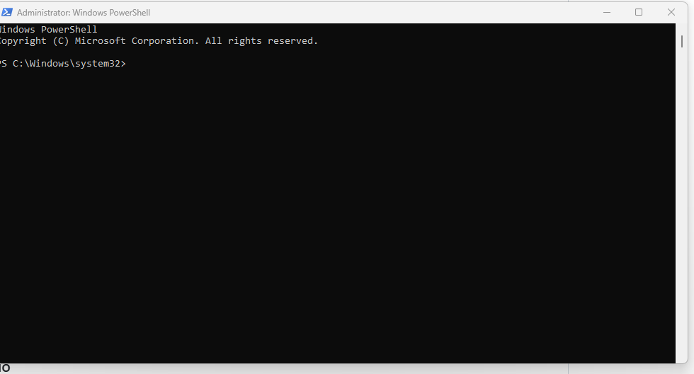

```powershell
Set-ExecutionPolicy -ExecutionPolicy RemoteSigned -Scope CurrentUser
Install-Module Microsoft.Graph -Scope CurrentUser -Force
```

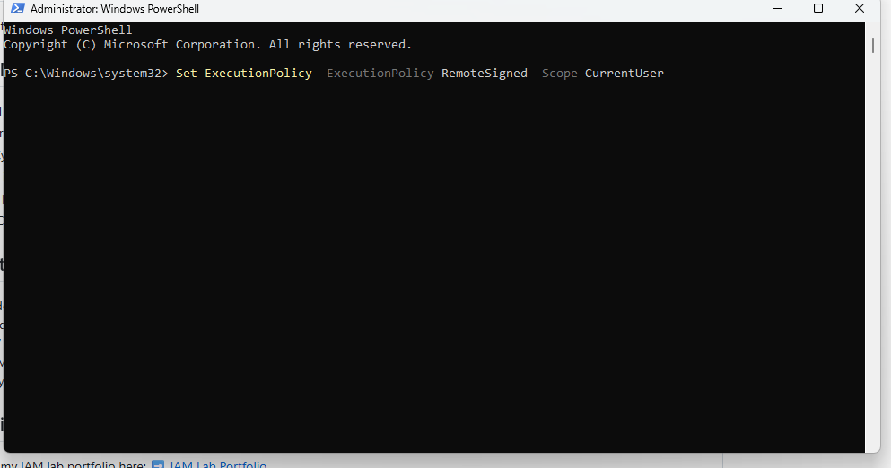

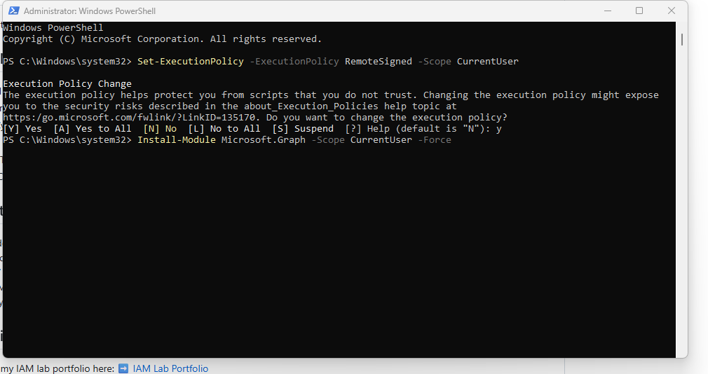

### Connecting with scoped permissions

```powershell
Connect-MgGraph -Scopes "User.ReadWrite.All","Group.ReadWrite.All","Directory.ReadWrite.All"
```

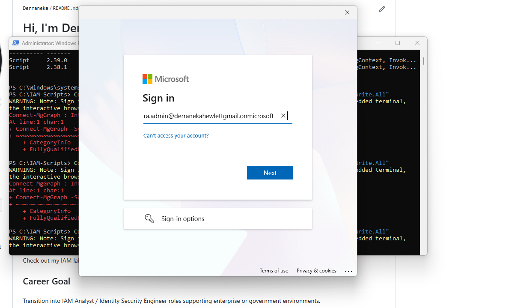

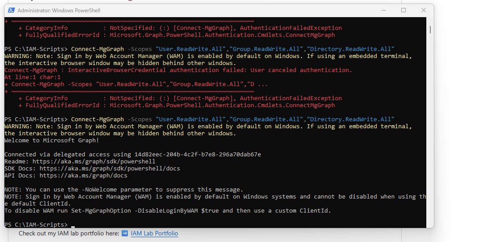

> **Scopes are requested explicitly, not inherited.**
> Connecting without `-Scopes` grants only `User.Read`. Naming the three required permissions means the consent prompt shows exactly what the session can do, and the token carries nothing beyond it.
>
> This is least privilege applied to automation. A script that runs as Global Administrator with unrestricted scope is a script whose blast radius equals the tenant.

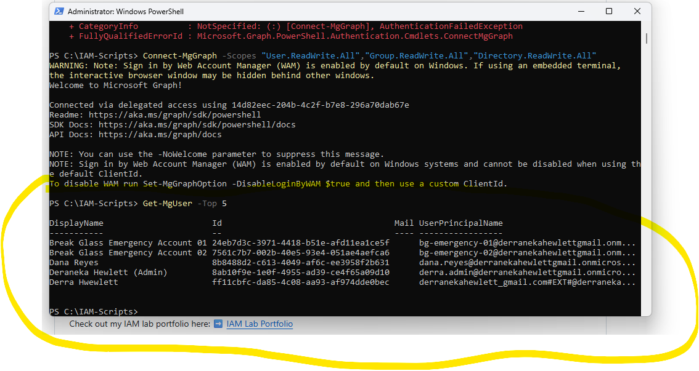

`Get-MgUser -Top 5` returning real directory objects confirms the session works before anything destructive runs.

---

## Test subject

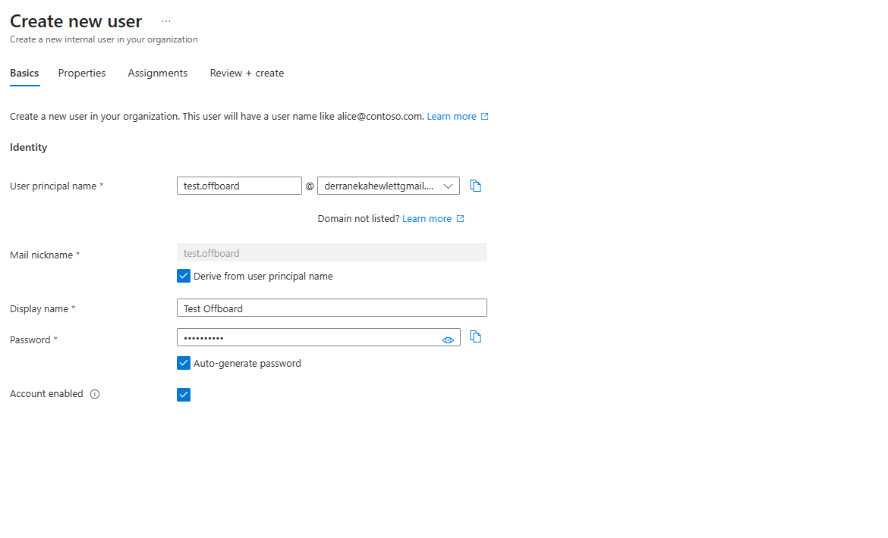

`Test Offboard` — Department `Engineering`, assigned to `SG-App-CAD-Users`.

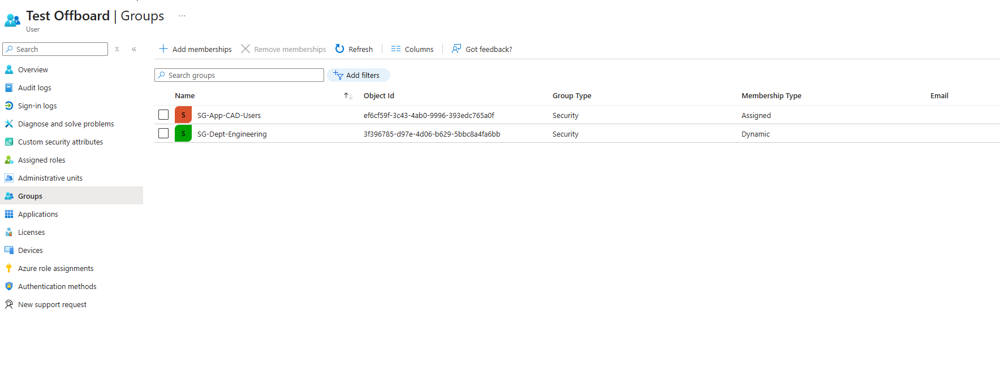

Two memberships by design, one of each type:

| Group | Membership | Expected behaviour |
|---|---|---|
| `SG-App-CAD-Users` | Assigned | Script removes it |
| `SG-Dept-Engineering` | Dynamic | Script skips it — resolves on attribute change |

Deliberately mirrors the access profile from Labs 2.1 and 2.3, so the script is tested against the same **derived vs. approved** distinction the whole lifecycle design rests on.

---

## Three failures before it ran

Every one of these is a real constraint worth documenting.

### 1 — Execution policy blocks downloaded scripts

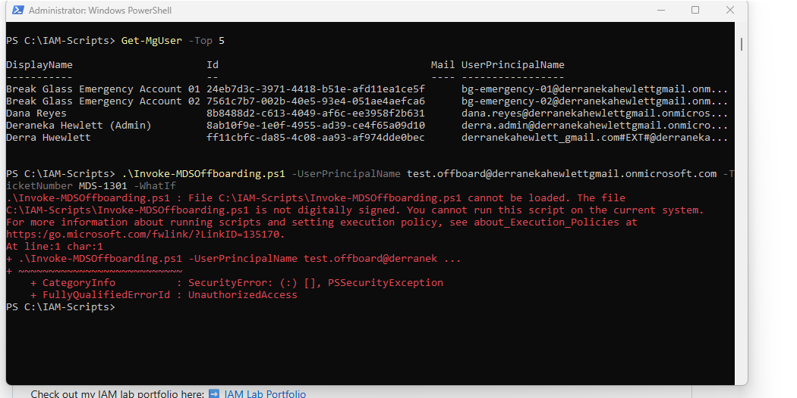

```
File ... cannot be loaded. The file ... is not digitally signed.
```

`RemoteSigned` permits locally-authored scripts but requires a code-signing certificate for anything originating elsewhere. Windows tags downloaded files with a zone identifier, and the policy honours it.

**Resolution:**
```powershell
Get-ChildItem C:\IAM-Scripts\*.ps1 | Unblock-File
```

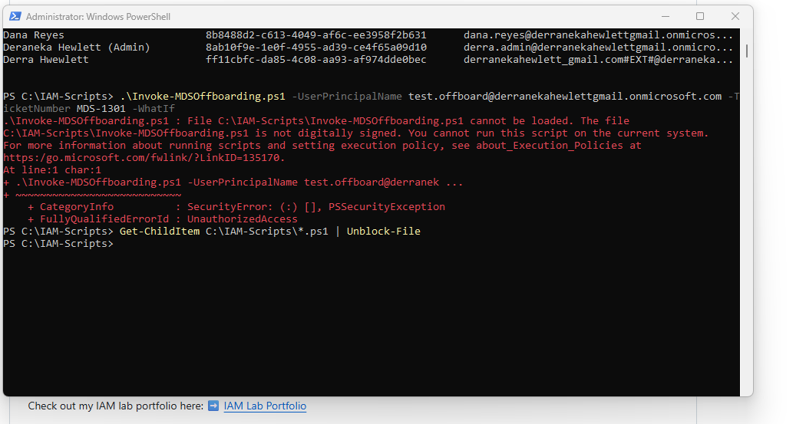

> This is a reasonable default, not an obstacle. It's what stops someone running an emailed script without thinking about it. `Unblock-File` is an explicit statement of trust in a specific file — the right shape for the control.

### 2 — Non-ASCII characters break the parser

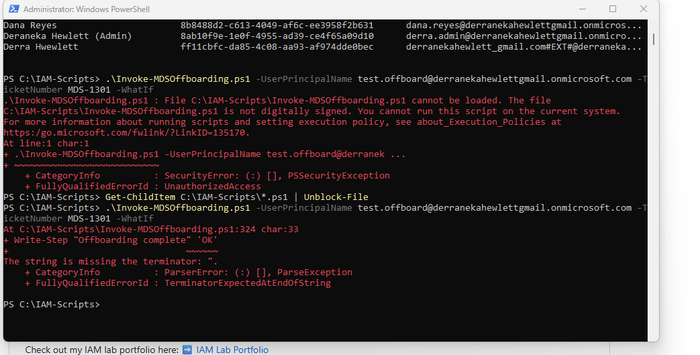

```
At line:324 char:33
The string is missing the terminator: ".
```

The script used box-drawing characters (`─`) in its output dividers. **Windows PowerShell 5.1 reads script files as ANSI when there is no byte-order mark**, so those multi-byte UTF-8 sequences were misread and left a string unterminated.

The error reported line 324. The actual problem was at line 111.

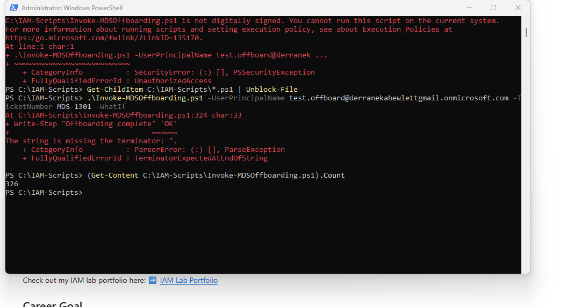

> **Diagnostic lesson: a parse error points at where the parser gave up, not where the problem started.** An unterminated string swallows everything after it, so the reported line is wherever the file ran out — usually near the end, and almost never the cause.
>
> **Prevention:** keep script files pure ASCII, or save as UTF-8 with BOM. Formatting flourishes aren't worth an encoding dependency.

**Resolution:** rewrote with ASCII-only output.

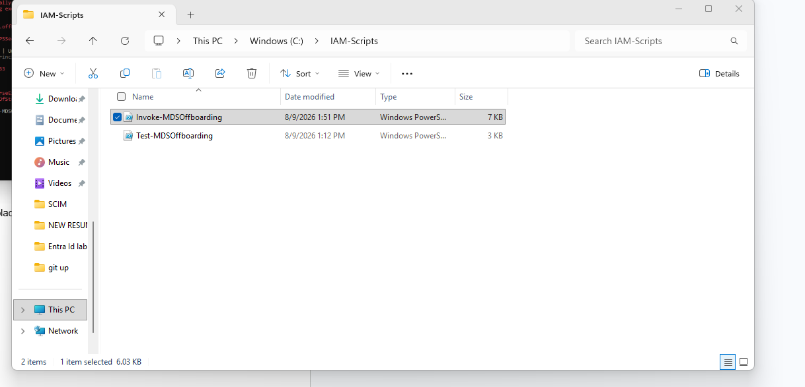

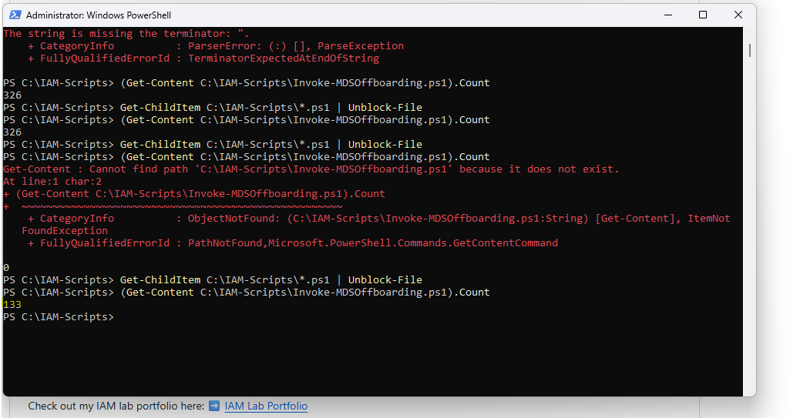

### 3 — The SDK cmdlet no longer exists

The dry run then completed cleanly:

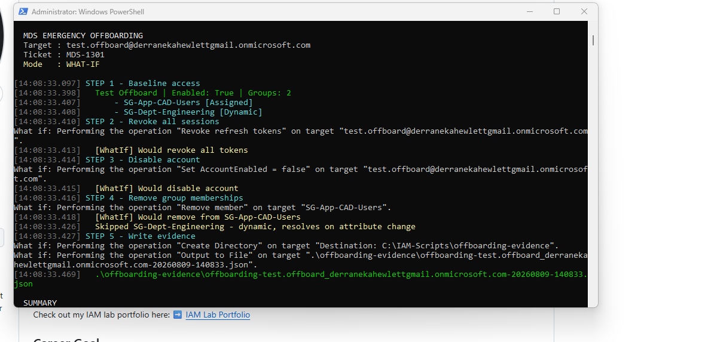

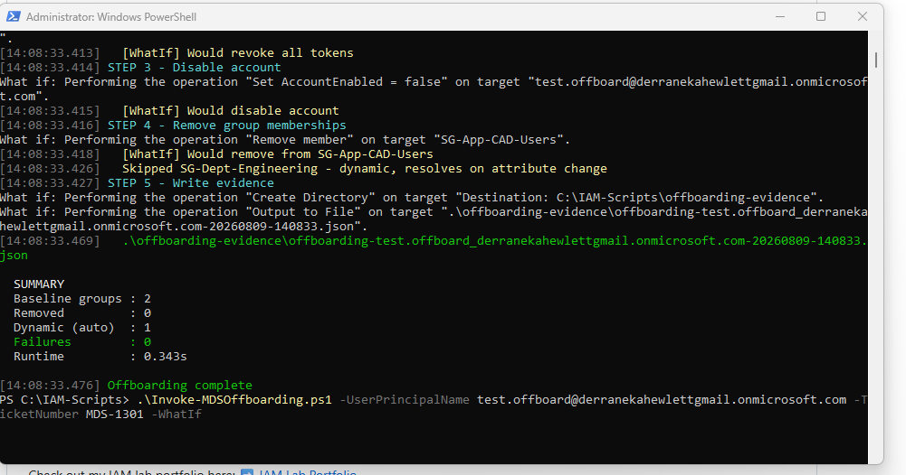

Baseline found both groups, correctly classified them, and reported intended actions — with nothing changed.

But the live run failed at Step 2:

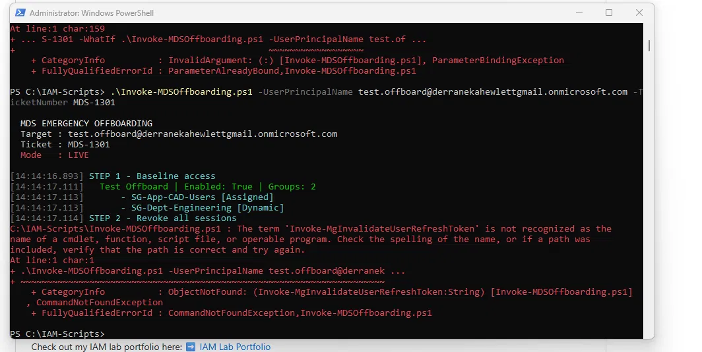

```
The term 'Invoke-MgInvalidateUserRefreshToken' is not recognized...
```

**Nothing was modified.** The script stopped before any destructive call — one benefit of failing at the first write operation rather than the last.

---

## The SDK is not the API

The Microsoft Graph PowerShell SDK is **auto-generated from the Graph API specification**, and cmdlet names change between versions as the generator's conventions shift. `Invoke-MgInvalidateUserRefreshToken` was renamed to `Revoke-MgUserSignInSession`.

**The underlying REST endpoint never changed.**

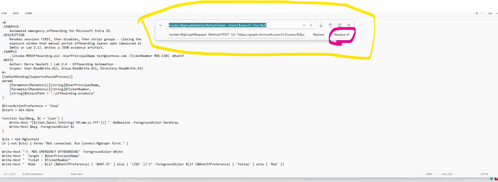

```powershell
# Before - SDK cmdlet, version-dependent
Invoke-MgInvalidateUserRefreshToken -UserId $user.Id

# After - REST endpoint, stable across SDK versions
Invoke-MgGraphRequest -Method POST `
  -Uri "https://graph.microsoft.com/v1.0/users/$($user.Id)/revokeSignInSessions"
```

> **This is the most transferable thing in the lab.**
>
> A script built on generated cmdlets carries a dependency on the generator's naming conventions. A script built on documented REST endpoints carries a dependency on the API contract — which Microsoft versions explicitly and deprecates on a published schedule.
>
> `Invoke-MgGraphRequest` still uses the SDK's authentication and token handling, so nothing is lost on the auth side. It trades a little readability for a script that survives an SDK upgrade.
>
> **The trade-off in practice:** cmdlets for interactive exploration, REST calls for anything that runs unattended. An offboarding script that fails because of a module update is a script that fails during an incident.

---

## Execution

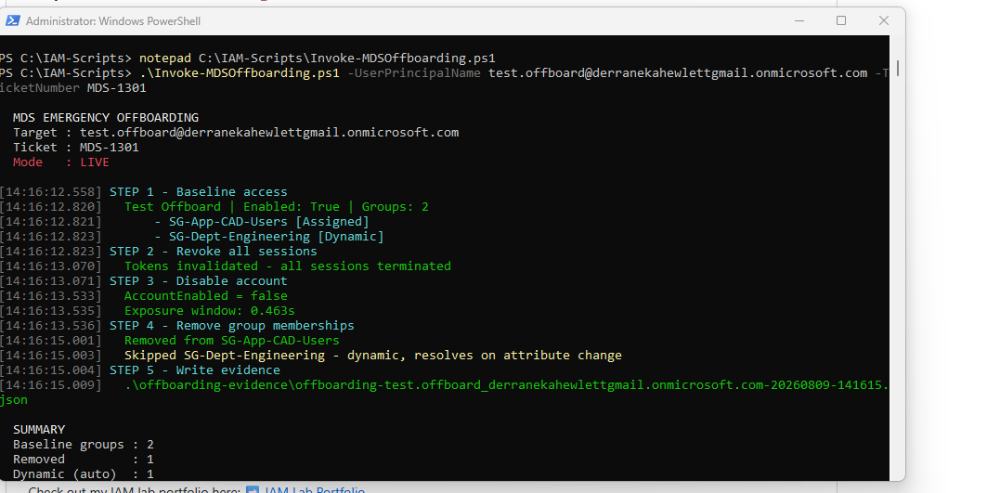

```
[14:16:12.558] STEP 1 - Baseline access
[14:16:12.820]   Test Offboard | Enabled: True | Groups: 2
[14:16:12.821]       - SG-App-CAD-Users [Assigned]
[14:16:12.823]       - SG-Dept-Engineering [Dynamic]
[14:16:12.823] STEP 2 - Revoke all sessions
[14:16:13.070]   Tokens invalidated - all sessions terminated
[14:16:13.071] STEP 3 - Disable account
[14:16:13.533]   AccountEnabled = false
[14:16:13.535]   Exposure window: 0.463s
[14:16:13.536] STEP 4 - Remove group memberships
[14:16:15.001]   Removed from SG-App-CAD-Users
[14:16:15.003]   Skipped SG-Dept-Engineering - dynamic, resolves on attribute change
[14:16:15.004] STEP 5 - Write evidence
```

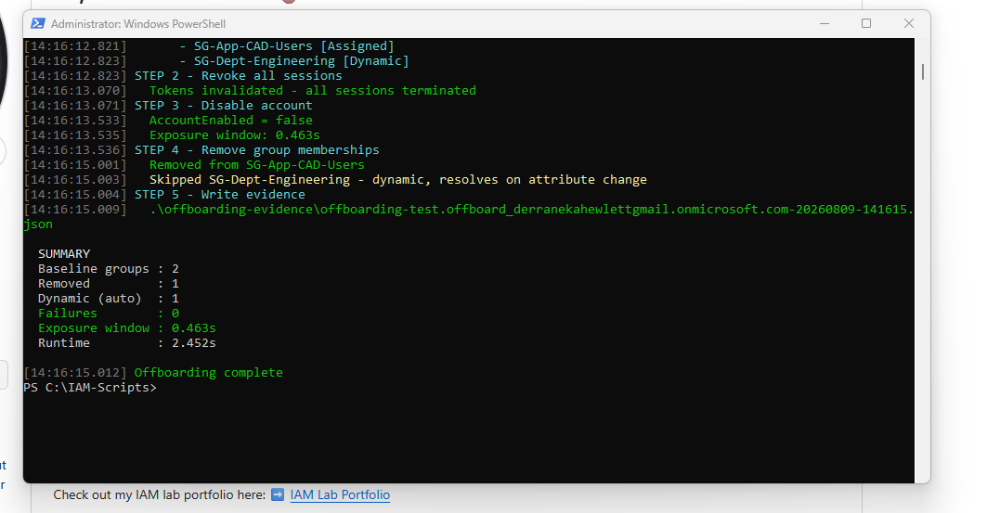

| Metric | Value |
|---|---|
| Baseline groups | 2 |
| Removed | 1 |
| Dynamic (auto-resolving) | 1 |
| Failures | **0** |
| **Exposure window** | **0.463s** |
| Total runtime | 2.452s |

---

## The result

| | Manual (Lab 2.1) | Automated (Lab 2.4) |
|---|---|---|
| Revoke → disable gap | **161 seconds** | **0.463 seconds** |
| Order | Disable, then revoke | Revoke, then disable |
| Baseline captured | Manually, by screenshot | Automatically, into JSON |
| Dynamic groups | Manual judgement | Detected and skipped |
| Evidence artifact | Screenshots | Structured JSON with timestamps |
| Repeatable | No | Yes |

**A 348× reduction in exposure time** — and the remaining 0.463s is network latency between two sequential Graph calls, not human hesitation.

The script also **measures its own exposure window and writes it into the evidence file.** It proves the thing it was built to fix, on every run. If a future SDK change or throttling event widens that gap, the number in the artifact will say so.

---

## Evidence output

Every run writes a JSON artifact. This is the actual file from the run above:

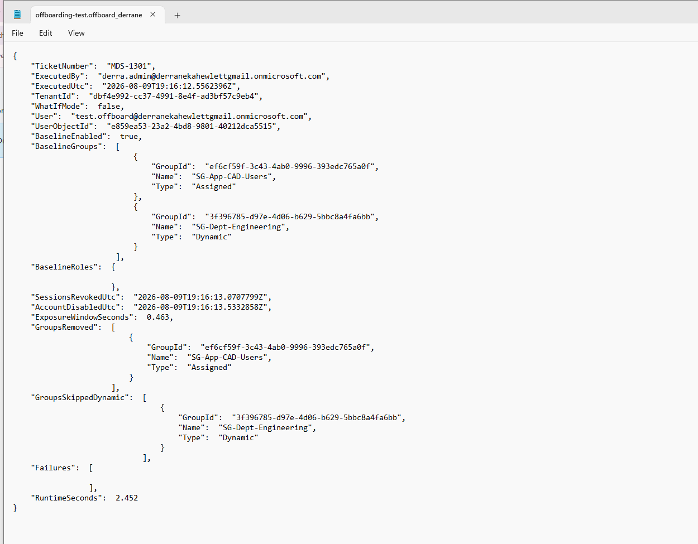

```json
{
  "TicketNumber": "MDS-1301",
  "ExecutedBy": "derra.admin@derranekahewlettgmail.onmicrosoft.com",
  "ExecutedUtc": "2026-08-09T19:16:12.5562396Z",
  "TenantId": "dbf4e992-cc37-4991-8e4f-ad3bf57c9eb4",
  "WhatIfMode": false,
  "User": "test.offboard@derranekahewlettgmail.onmicrosoft.com",
  "UserObjectId": "e859ea53-23a2-4bd8-9801-40212dca5515",
  "BaselineEnabled": true,
  "BaselineGroups": [
    { "GroupId": "ef6cf59f-3c43-4ab0-9996-393edc765a0f",
      "Name": "SG-App-CAD-Users",    "Type": "Assigned" },
    { "GroupId": "3f396785-d97e-4d06-b629-5bbc8a4fa6bb",
      "Name": "SG-Dept-Engineering", "Type": "Dynamic"  }
  ],
  "SessionsRevokedUtc":    "2026-08-09T19:16:13.0707799Z",
  "AccountDisabledUtc":    "2026-08-09T19:16:13.5332858Z",
  "ExposureWindowSeconds": 0.463,
  "GroupsRemoved":        [ { "Name": "SG-App-CAD-Users",    "Type": "Assigned" } ],
  "GroupsSkippedDynamic": [ { "Name": "SG-Dept-Engineering", "Type": "Dynamic"  } ],
  "Failures": [],
  "RuntimeSeconds": 2.452
}
```

The exposure window is not a claim in the write-up -- it is derivable from the artifact itself:

```
SessionsRevokedUtc   19:16:13.0707799
AccountDisabledUtc   19:16:13.5332858
                     ----------------
                              0.4625059  ->  0.463s
```

Both timestamps carry sub-millisecond precision, so an auditor can recompute the window independently rather than taking the summary line on trust. **Evidence that can be recalculated is stronger than evidence that must be believed.**

Object IDs are captured for every group, not just display names. Names get renamed; GUIDs don't. Three years later, `SG-App-CAD-Users` may not exist under that name -- `ef6cf59f-3c43-4ab0-9996-393edc765a0f` still resolves.

> The manual process in Lab 2.1 produced screenshots. This produces a machine-readable record with the ticket number, the operator, UTC timestamps for each action, and the measured exposure window.
>
> Screenshots satisfy a person reviewing one case. **Structured output satisfies an assessor sampling fifty**, and can be aggregated to answer questions like *"what was our median containment time across all terminations last quarter."*

---

## Scripts

| File | Purpose |
|---|---|
| [`Invoke-MDSOffboarding.ps1`](scripts/Invoke-MDSOffboarding.ps1) | Baseline, revoke, disable, strip, evidence |
| [`Test-MDSOffboarding.ps1`](scripts/Test-MDSOffboarding.ps1) | Independent verification against directory state |

```powershell
# Dry run
.\Invoke-MDSOffboarding.ps1 -UserPrincipalName user@contoso.com -TicketNumber MDS-1301 -WhatIf

# Live
.\Invoke-MDSOffboarding.ps1 -UserPrincipalName user@contoso.com -TicketNumber MDS-1301

# Verify
.\Test-MDSOffboarding.ps1 -UserPrincipalName user@contoso.com
```

> **Verification is a separate script by design.** A script that reports on its own work proves nothing — it can only report what it believes it did. `Test-MDSOffboarding` queries the directory fresh and checks five independent conditions.

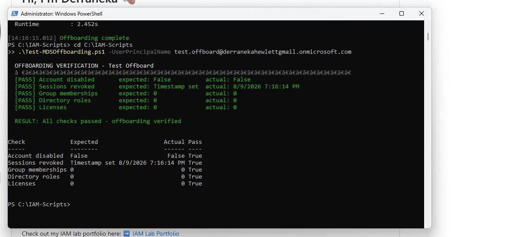

```
[PASS] Account disabled       expected: False           actual: False
[PASS] Sessions revoked       expected: Timestamp set   actual: 8/9/2026 7:16:14 PM
[PASS] Group memberships      expected: 0               actual: 0
[PASS] Directory roles        expected: 0               actual: 0
[PASS] Licenses               expected: 0               actual: 0

RESULT: All checks passed - offboarding verified
```

All five conditions confirmed against live directory state. The `Sessions revoked` check reads `SignInSessionsValidFromDateTime` — the timestamp the Graph API call set — which is the only durable proof that token invalidation actually occurred. Everything else could be true of an account that was simply disabled.

---

## Failure modes handled

| Risk | Mitigation |
|---|---|
| Live tokens survive account disable | Revoke executes first, before disable |
| Human latency widens the exposure window | Sequence automated; window measured on every run |
| Cannot prove what access existed | Baseline captured to JSON before any change |
| Dynamic group removal throws an error | Membership type detected; dynamic groups skipped |
| Accidental execution against wrong account | `-WhatIf` dry-run mode via `SupportsShouldProcess` |
| Script breaks on SDK upgrade | Direct REST call to a versioned endpoint |
| Over-permissioned automation session | Explicit `-Scopes`, minimum required |
| Partial failure passes silently | Per-group error capture; non-zero failure count surfaced |
| Script self-certifies its own success | Independent verification script |

---

## Key takeaways

**1 · Automation is a security control when timing is the vulnerability.** The 2m41s gap wasn't a mistake — it was how long clicking through four blades takes. Removing the human from the sequence removed the exposure.

**2 · The SDK is not the API.** Generated cmdlet names change between versions; documented REST endpoints don't. `Invoke-MgGraphRequest` against `/users/{id}/revokeSignInSessions` survives upgrades that break `Invoke-MgInvalidateUserRefreshToken`. Cmdlets for exploration, REST for unattended work.

**3 · A parse error points at where the parser gave up, not where the problem is.** An unterminated string from a mis-decoded UTF-8 character at line 111 surfaced as an error at line 324. Keep script files ASCII, or save with a BOM.

**4 · Make the script measure the thing it fixes.** Writing the exposure window into the evidence artifact means the control is verified continuously, not just the day it was written.

**5 · `-WhatIf` is report-only for automation.** Same principle as staging a Conditional Access policy: prove the behaviour against real data before it takes effect.

**6 · Verification belongs in a separate script.** Self-reported success is not evidence. Query the directory fresh.

**7 · Structured evidence scales; screenshots don't.** JSON with ticket, operator, UTC timestamps, and measured window can be aggregated across every termination. Screenshots answer one case at a time.

---

## SC-300 objectives covered

- Manage the identity lifecycle for internal users
- Automate identity management tasks using Microsoft Graph PowerShell
- Configure and use Microsoft Graph API for directory operations
- Revoke user sessions and manage account state
- Implement least-privilege scopes for automated access
- Generate audit evidence for identity lifecycle events

---

<sub>Meridian Defense Solutions is a fictional organization built in an isolated Microsoft Entra ID lab tenant. All users, data, and programs are synthetic.</sub>
