# Lab 4.1 — Conditional Access Baseline

### Establishing the first enforceable access boundary at Meridian Defense Solutions

---

## The requirement

Meridian Defense Solutions is a 250-person defense contractor handling CUI and ITAR-controlled technical data. The tenant was running on **security defaults** — a single blunt setting with no ability to scope, exclude, stage, or report.

Three gaps had to close:

| Gap | Risk |
|---|---|
| Legacy authentication protocols still permitted | Basic auth bypasses MFA entirely — the single most common path to account takeover |
| Global Administrators authenticating with password only | Highest-value targets in the tenant, least protected |
| No MFA requirement for the general workforce | 249 non-admin users, each a viable phishing entry point |

**Constraint:** this is a live directory with real users. A misconfigured policy locks out the entire tenant, including the person who wrote it. Deployment method mattered as much as policy content.

---

## What was built

| Policy | Target | Control | Final state |
|---|---|---|---|
| `CA001-Global-AllApps-BlockLegacyAuth` | All users | **Block** legacy auth clients | Enabled |
| `CA101-Admin-AllApps-RequireMFA` | 6 privileged directory roles | Require MFA | Enabled |
| `CA201-Internal-AllApps-RequireMFA` | All users | Require MFA | Enabled |

**Naming standard:** `CA<###>-<Persona>-<Target>-<Control>`

The number range *is* the framework — `0xx` global, `1xx` administrative, `2xx` internal workforce. An admin can read the policy list top to bottom and understand the tenant's posture without opening a single policy.

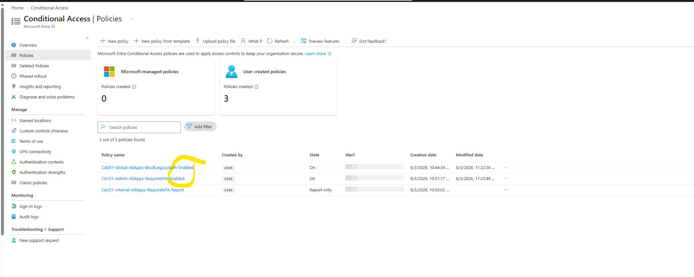

---

## Step 1 — Exclusion group before any policy

Nothing gets built until there is a way out.

Created `SG-CA-Exclude-BreakGlass` — a single security group containing only emergency access accounts, referenced as an exclusion by every policy in the tenant.

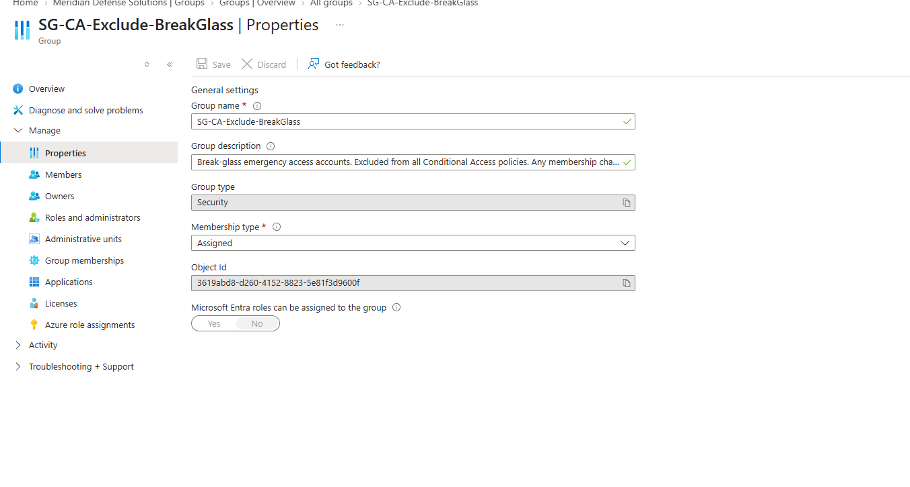

> **Design decision — one exclusion object, not twenty.**
> Excluding accounts per-policy means twenty places to audit and twenty places for drift to hide. One group means one object to review, and a single membership change propagates across the entire policy set.
>
> The exclusion contains **break-glass accounts only.** The working admin account was deliberately *not* excluded. Per-policy admin exemptions accumulate quietly until the most privileged people in the tenant are covered by the fewest controls — which is precisely the condition an attacker looks for after escalating.

---

## Step 2 — CA001: Block legacy authentication

Legacy protocols — Exchange ActiveSync and the "other clients" bucket covering POP, IMAP, SMTP AUTH, and older Office clients — cannot perform a modern authentication flow. They cannot be challenged for MFA. Any MFA policy built on top of an unblocked legacy surface has a hole underneath it.

**This policy goes first, before any MFA requirement, because MFA enforcement is meaningless while a bypass path is open.**

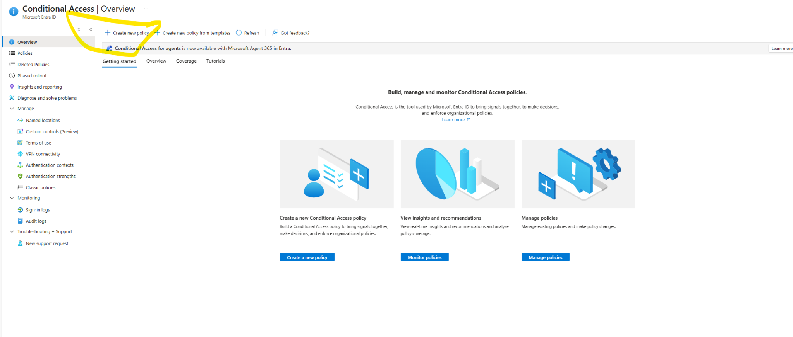

**Configuration**

| Setting | Value |
|---|---|
| Users | Include **All users** → Exclude `SG-CA-Exclude-BreakGlass` |
| Target resources | All resources |
| Conditions → Client apps | Exchange ActiveSync clients · Other clients |
| Grant | **Block access** |
| State | Report-only |

<table>
<tr>
<td width="50%">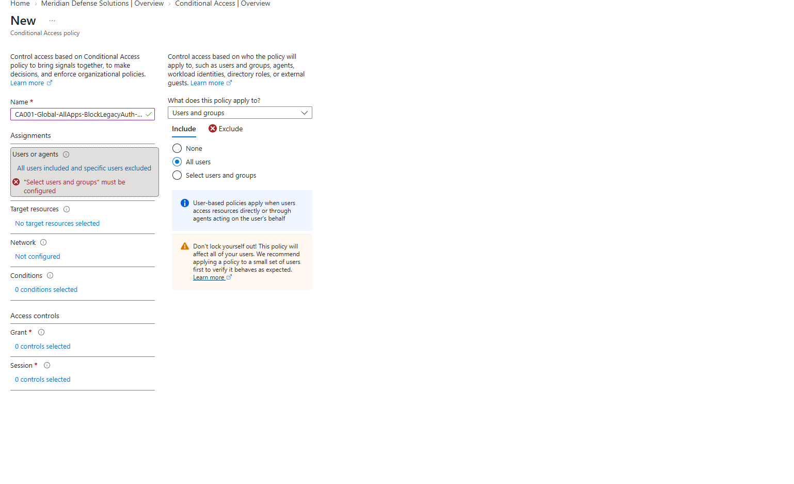</td>
<td width="50%">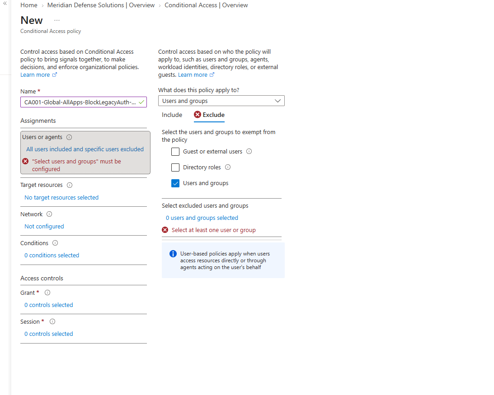</td>
</tr>
<tr>
<td><em>Include all users</em></td>
<td><em>Exclude break-glass group</em></td>
</tr>
<tr>
<td>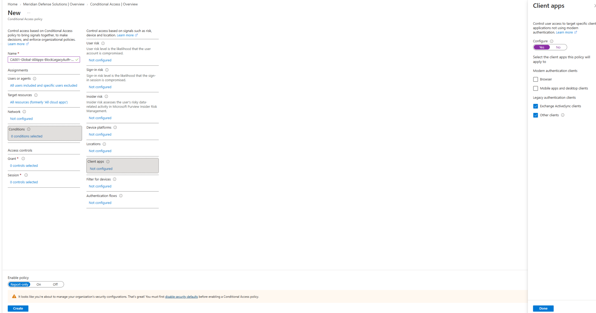</td>
<td>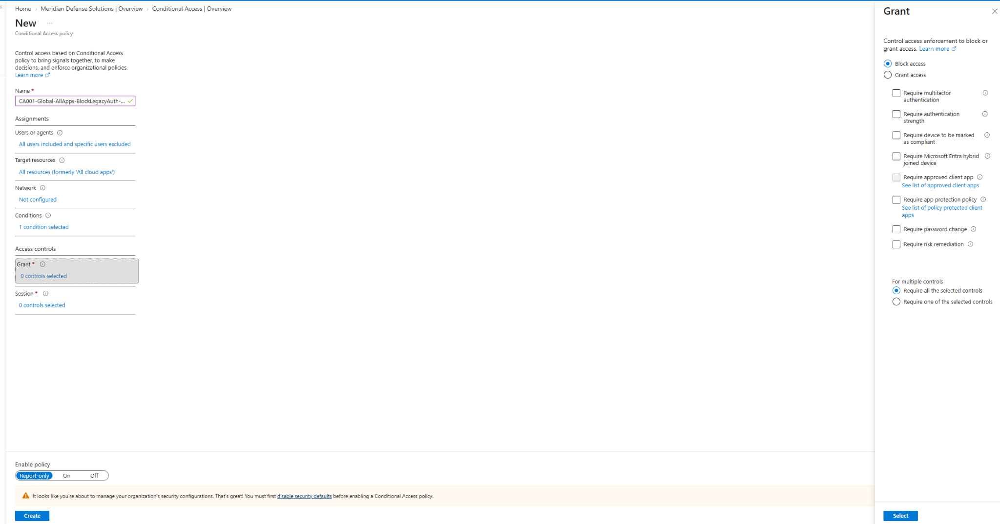</td>
</tr>
<tr>
<td><em>Client apps condition — legacy only</em></td>
<td><em>Grant control set to Block</em></td>
</tr>
</table>

> **Gotcha — security defaults and Conditional Access are mutually exclusive.**
> Security defaults must be disabled before any CA policy can be enabled. That leaves a window with **zero MFA enforcement** in the tenant.
>
> In a lab this gap was accepted knowingly. In production the cutover is sequenced tightly — policies built and validated in report-only first, defaults disabled and policies flipped to enabled in the same maintenance action, with break-glass credentials verified beforehand.

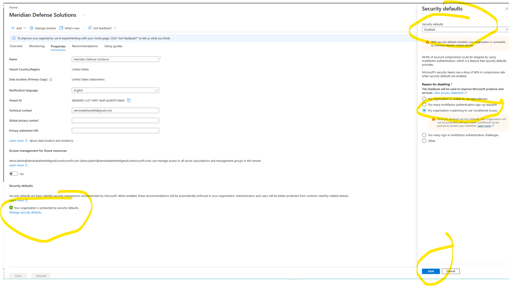

*Reason for disabling recorded as "planning to use Conditional Access" — the portal states plainly that the tenant is unprotected until a CA policy is created. That warning is the enforcement gap, in Microsoft's own words.*

---

## Step 3 — CA101: MFA for administrators

Six privileged directory roles targeted directly:

`Global Administrator` · `Privileged Role Administrator` · `User Administrator` · `Security Administrator` · `Conditional Access Administrator` · `Application Administrator`

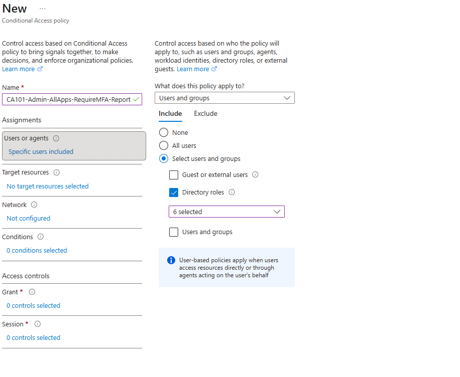

> **Design decision — role-based targeting, not group-based.**
> Directory role targeting evaluates **at sign-in time.** Assign someone User Administrator tomorrow and the policy covers them the moment the role takes effect — no group membership step to remember, no provisioning workflow to fail silently.
>
> Group-based targeting lets privilege and policy drift apart. That gap between "user has the role" and "user is in the policy group" is exactly the window an attacker uses after escalating privileges.

> **Compliance relevance.**
> **NIST SP 800-53 IA-2(1)** requires multifactor authentication for privileged accounts. FedRAMP and CMMC assessments both test it directly. "Do you enforce MFA on administrative roles?" is a yes-or-no question asked by someone holding a checklist — and this policy is the artifact that answers it.

<table>
<tr>
<td width="50%">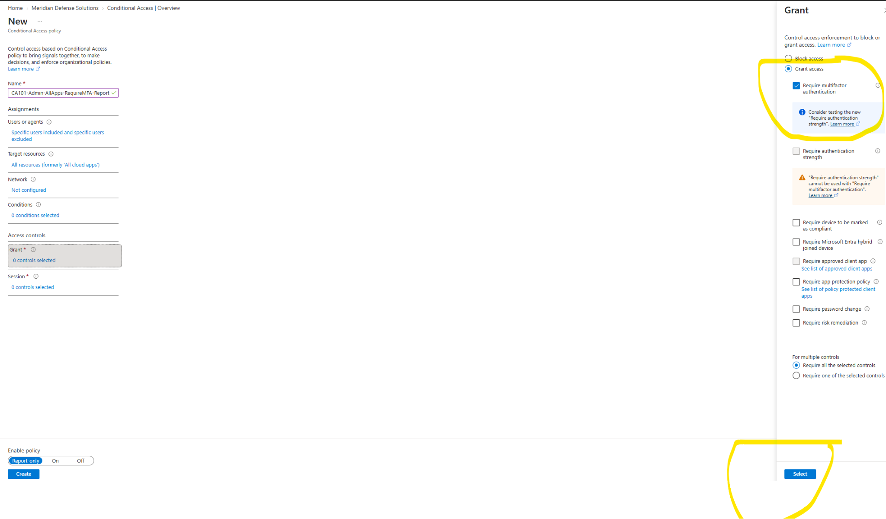</td>
<td width="50%">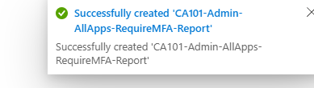</td>
</tr>
<tr>
<td><em>Grant — Require multifactor authentication</em></td>
<td><em>Policy created successfully</em></td>
</tr>
</table>

---

## Step 4 — CA201: MFA for the internal workforce

Same control, different population, **separate policy.**

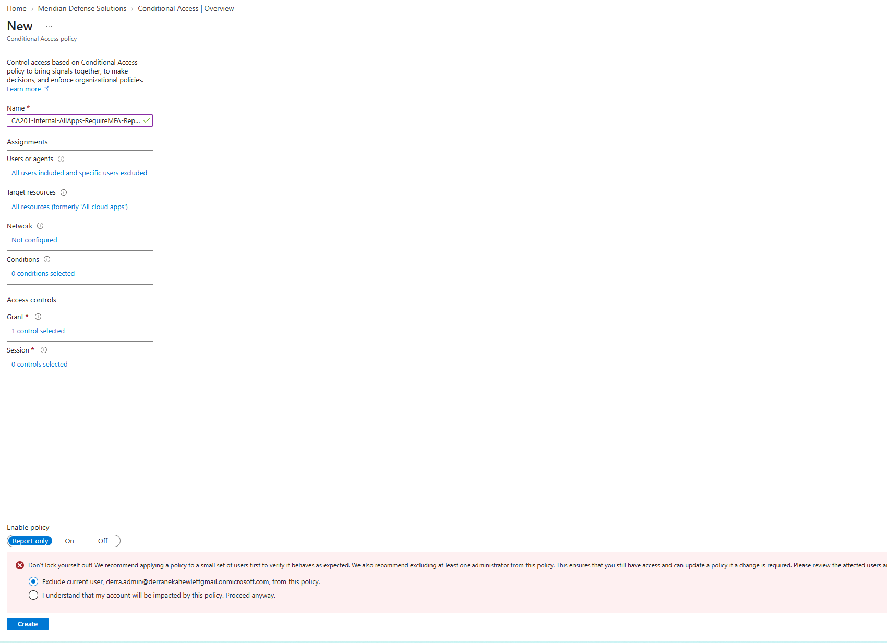

> **Why this exists when CA101 already covers admins.**
> CA101 protects six roles. CA201 protects the other 249 people. An attacker who phishes a contracts specialist doesn't need Global Administrator — they need her mailbox, the shared drive, and enough context to run invoice fraud against a DoD prime. Standard users are the volume target.

> **Why two policies instead of one.**
> Different populations need different controls **over time.** CA101 will eventually require *phishing-resistant* MFA — FIDO2 or certificate-based, no push notifications. CA201 stays on standard MFA, because you cannot hand 250 people security keys on day one.
>
> Combined into a single policy, tightening the admin requirement would break the entire workforce simultaneously. Separated, each population evolves at its own pace. **That is the entire argument for persona-based policy design.**

---

## Validation

Every policy was created in **report-only** and measured against real sign-in traffic before enforcement.

**Entra ID → Users → Sign-in logs → [select entry] → Report-only tab**

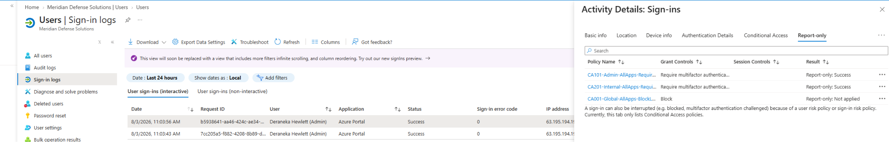

This is the evidence layer: each policy evaluated against an actual authentication event, with its result recorded, before a single user was affected.

### The finding that justified the whole method

Report-only surfaced a user who **would have been locked out on enforcement.**

**Dana Reyes** — IT Helpdesk Technician, in scope for CA201, with an **expired password and no MFA method registered.** Her sign-in log shows the failure directly:

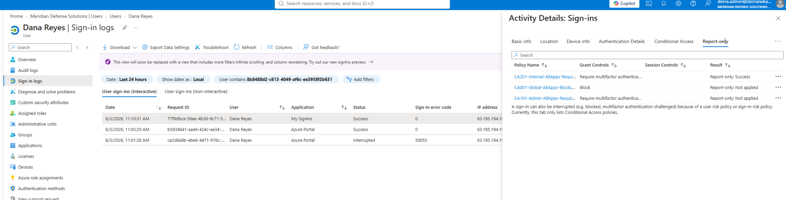

| Time | Result | Error | Meaning |
|---|---|---|---|
| 11:01:28 | Interrupted | `50055` | Expired password — blocked before MFA could even evaluate |
| 11:03:20 | Success | `0` | Post-remediation |
| 11:10:31 | Success | `0` | MFA satisfied under enforced CA201 |

| Time | Result | Error | Meaning |
|---|---|---|---|
| 11:01:28 | Interrupted | `50055` | Expired password — blocked before MFA could evaluate |
| 11:03:20 | Success | `0` | Post-remediation |
| 11:10:31 | Success | `0` | MFA satisfied under enforced CA201 |

Remediation: password reset, MFA method registered, re-tested. **Then** the policy was enforced.

Enabled from the start, this account would have been dead on arrival with no diagnostic trail — and the person best positioned to help other locked-out users would have been the one locked out.

---

## Enforcement sequence

Policies were enabled **in dependency order, not all at once.**

<table>
<tr>
<td width="50%">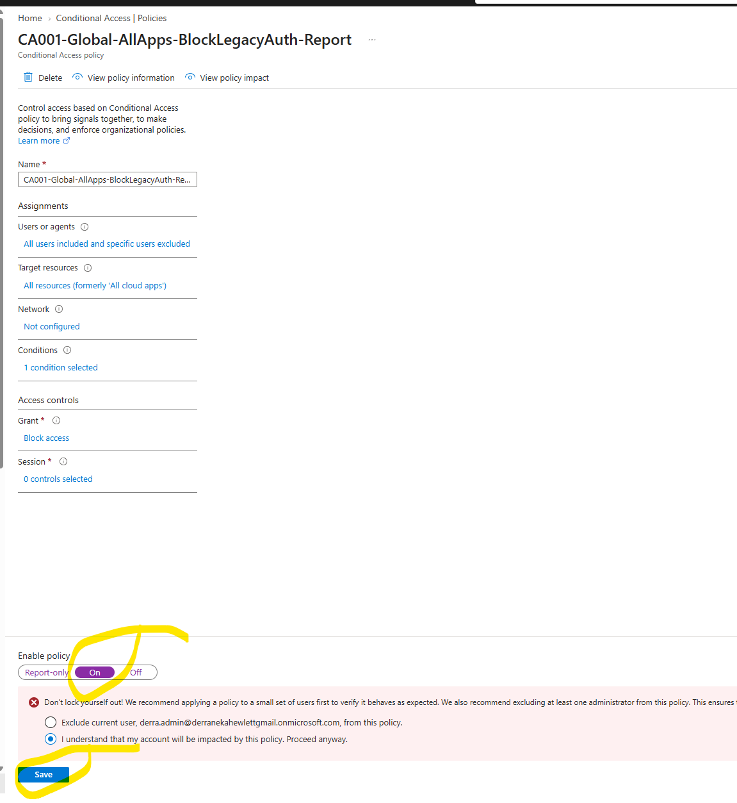</td>
<td width="50%">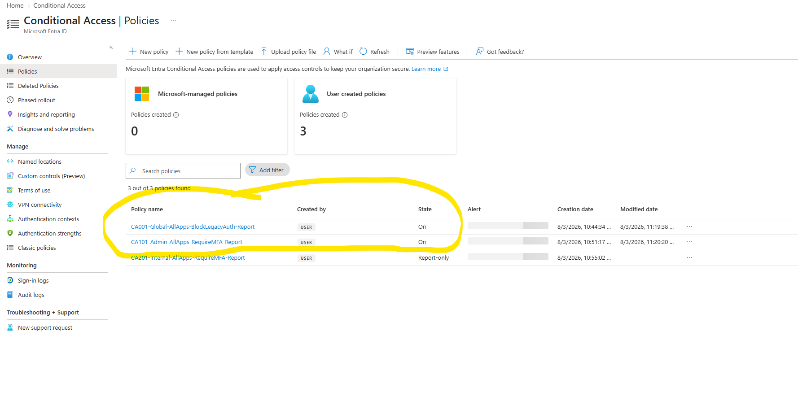</td>
</tr>
</table>

1. **CA001** enabled first — close the legacy bypass before enforcing MFA on top of it
2. **CA101** enabled second — admin accounts had verified MFA registration
3. **CA201 held** — one in-scope user could not yet authenticate
4. Dana remediated and validated
5. **CA201** enabled

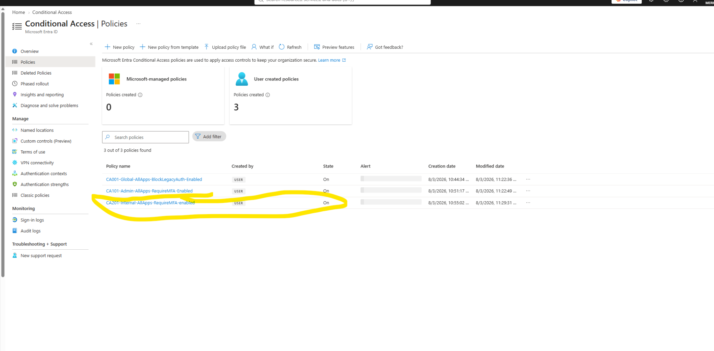

Policy names were updated from `-Report` to `-Enabled` at cutover so the policy list reflects true tenant state at a glance rather than requiring each policy to be opened.

Final confirmation: a fresh InPrivate sign-in produced a live MFA challenge — enforcement observed in practice, not inferred from configuration.

---

## Failure modes handled

| Risk | Mitigation |
|---|---|
| Tenant-wide admin lockout | Break-glass exclusion group created before the first policy |
| Author locks self out | Report-only staging; own account's MFA registration verified before enforcement |
| MFA bypassed via legacy protocols | CA001 enabled ahead of both MFA policies |
| Silent user lockout at enforcement | Report-only analysis of real sign-in logs; Dana Reyes identified and remediated pre-enforcement |
| Exclusion drift | Single exclusion group; break-glass only, no convenience exemptions |
| Enforcement gap during cutover | Sequencing documented; gap accepted knowingly in lab, sequenced tightly in production |

---

## Key takeaways

**1 · Report-only is the methodology, not a precaution.** The first sign-in after building CA101 and CA201 returned *user action required* on both — no MFA registered on the authoring account. Enabled from the start, that is a self-inflicted tenant lockout.

**2 · The deployment sequence is the deliverable.** Build in report-only → analyze real sign-in results → simulate with What If → remediate gaps → enable where validated, hold where not. That sequence is the answer to *"how do you deploy Conditional Access without breaking production."*

**3 · Exclusions belong in a group, and only break-glass belongs in the group.** One object to audit. No convenience exemptions, because they accumulate until privilege and protection are inversely correlated.

**4 · Security defaults and CA cannot coexist.** The transition creates a real enforcement gap that has to be planned for, not discovered.

**5 · Personas get separate policies so they can diverge.** CA101 and CA201 enforce identical controls today and will not in six months. Design for the divergence now.

**6 · Target roles, not groups, for privileged access.** Role targeting evaluates at sign-in. Group targeting lets privilege and policy fall out of sync — which is the post-escalation window.

---

## SC-300 objectives covered

- Plan and implement Conditional Access policies
- Configure Conditional Access grant controls
- Implement Conditional Access policy assignments and exclusions
- Block legacy authentication
- Test and troubleshoot Conditional Access using report-only mode, sign-in logs, and What If
- Migrate from security defaults to Conditional Access

---

Meridian Defense Solutions is a fictional organization built in an isolated Microsoft Entra ID lab tenant. All users, data, and programs are synthetic.
