# Lab 5.1 — PIM: Eliminating Standing Global Administrator

### Converting permanent privilege into just-in-time, audited activation

<p>


</p>

---

## The requirement

Meridian Defense Solutions had a Global Administrator with **permanent, standing assignment**. Signed in at 9 AM on a Tuesday with no particular reason, that account held the highest privilege in the tenant — every hour of every day, whether it was being used or not.

Standing privilege creates three problems:

| Problem | Consequence |
|---|---|
| The credential is always live | Phishing succeeds at 2 AM and the attacker has Global Admin immediately — no escalation step required |
| No reason is ever recorded | "Show me every time someone used Global Admin and why" has no answer |
| Blast radius is permanent | Session compromise means full tenant control until someone notices |

**The requirement:** no standing Global Administrator. Privilege becomes *eligible* — requested, justified, time-boxed, and expired automatically.

---

## Configuring the role

**Entra admin center → Identity Governance → Privileged Identity Management → Microsoft Entra roles → Roles → Global Administrator**

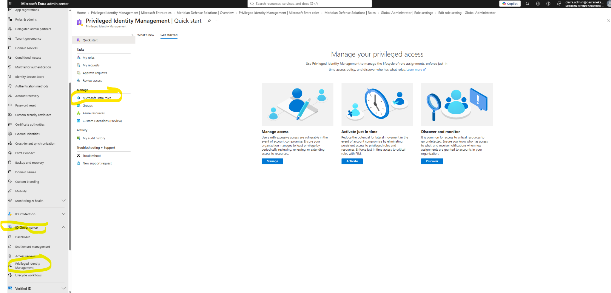

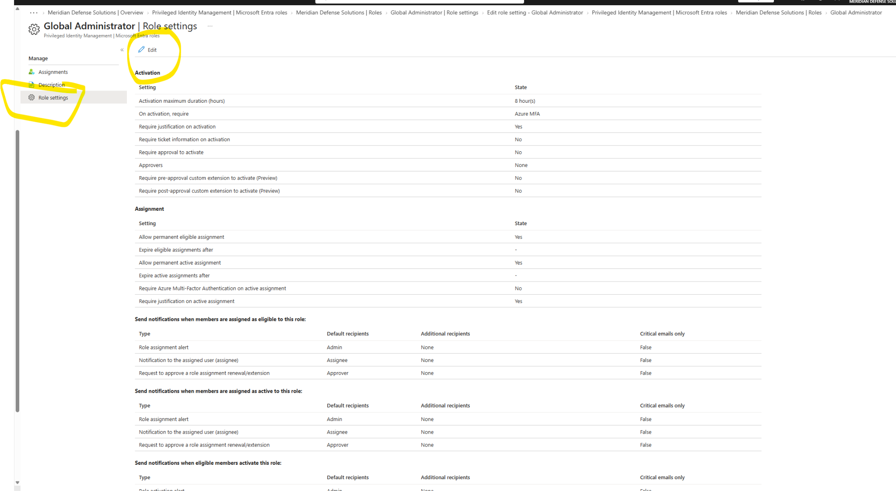

### Activation settings

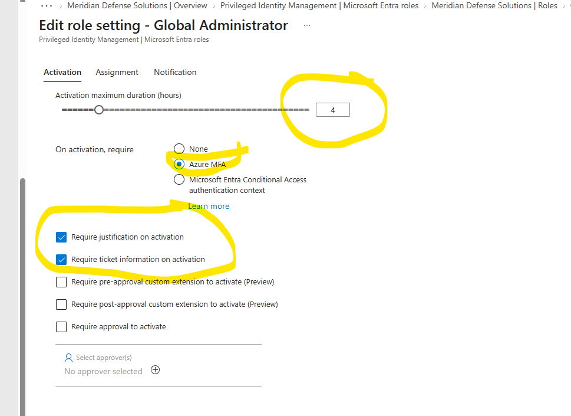

| Setting | Value | Reasoning |
|---|---|---|
| Maximum activation duration | **4 hours** | Long enough to finish real work, short enough that a compromised session expires on its own |
| Require MFA on activation | **Azure MFA** | Re-proves identity at the moment privilege is claimed, not just at sign-in |
| Require justification | **Enabled** | Forces a written reason into the audit record |
| Require ticket information | **Enabled** | Ties every activation to a documented work item |

> **Why 4 hours.**
> Some organizations go to 1–2 hours for Global Administrator. **Anything over 8 is standing privilege with extra steps** — if the window covers a full workday, the account is effectively always active and the control is decorative.
>
> The duration is the actual security boundary. Everything else is paperwork around it.

> **Why require a ticket number.**
> Justification text alone is free-form and unverifiable. A ticket number ties the activation to a work item that exists independently in another system, so the claim can be checked rather than taken at face value.
>
> When an assessor asks *"show me every time someone used Global Admin and why"* — a FedRAMP or CMMC assessor will — the activation log answers it directly, with a reference they can pull.

> **Approval was deliberately left off.**
> `Require approval to activate` is unchecked here. In a single-admin lab, requiring approval means nobody can ever activate. In production this gets enabled with a named approver group — and the approver must not be the same person requesting. Documented as a known gap between lab and production posture.

---

## The eligible assignment

**Add assignments → Global Administrator → `derra.admin@` → Assignment type: Eligible → Permanently eligible**

<table>
<tr>
<td width="50%">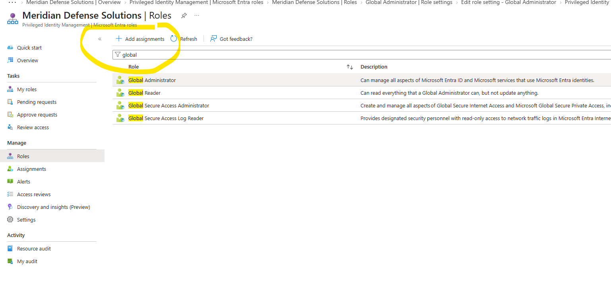</td>
<td width="50%">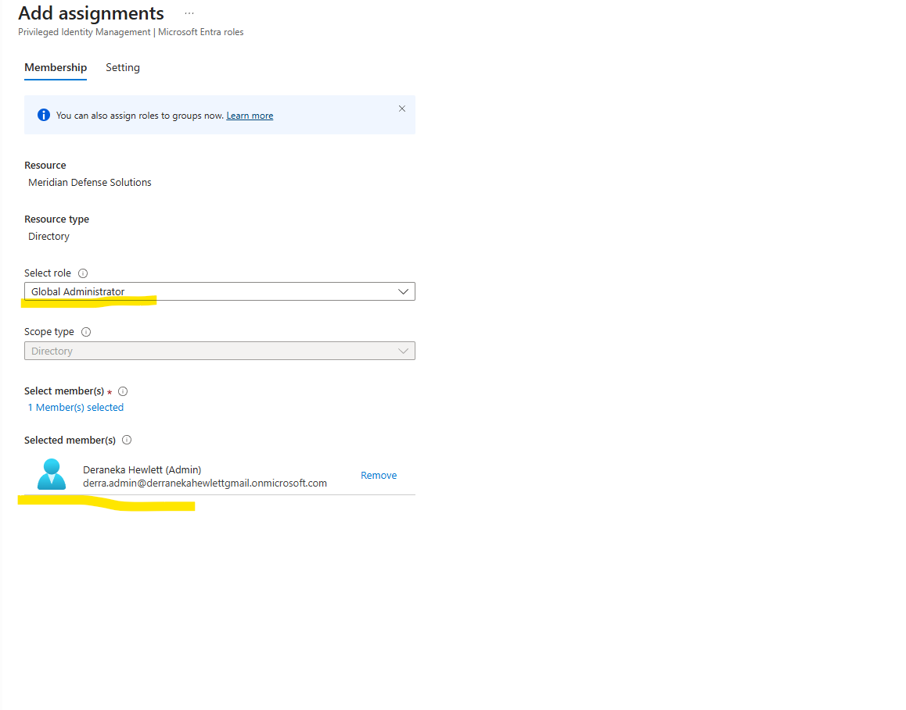</td>
</tr>
<tr>
<td><em>Assigning the role</em></td>
<td><em>Type set to Eligible, not Active</em></td>
</tr>
</table>

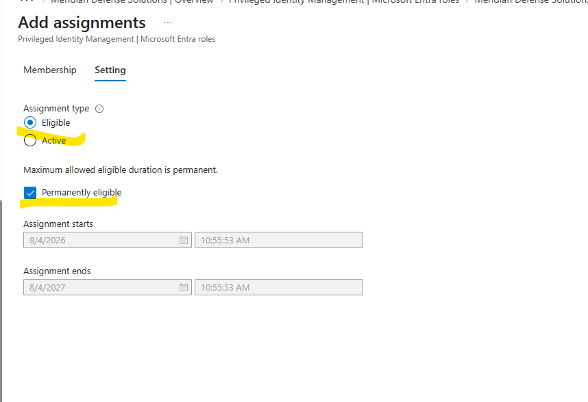

> **"Permanently eligible" is not standing privilege.**
> The wording trips people up. *Permanently eligible* means the person can request the role indefinitely — the **eligibility** never expires. The **privilege** still does, after 4 hours, every single time.
>
> Eligibility is a standing permission to ask. Activation is the grant.

---

## The finding — activation is blocked by the active assignment

**PIM → My roles → Eligible assignments → Global Administrator → Activate**

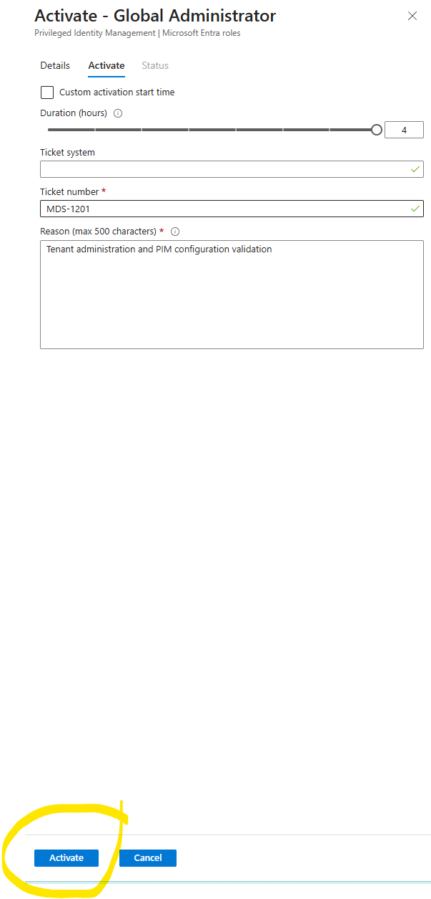

Filled in the ticket number and justification, clicked activate, and:

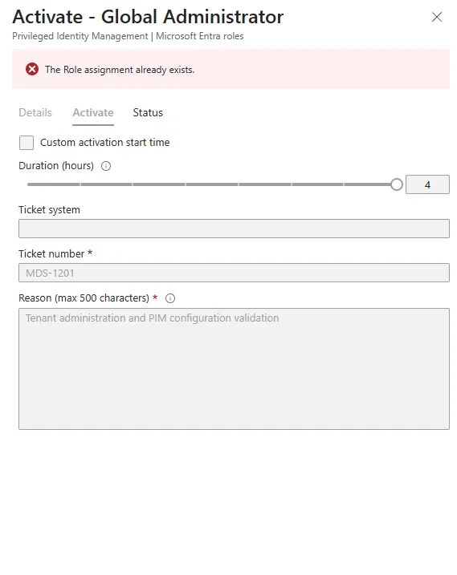

> **`The Role assignment already exists.`**

The account still held its **active** Global Administrator assignment. PIM will not activate a role that's already permanently held — the two states cannot overlap.

The intuitive migration order is *add eligible first, then remove active* — keep a safety net while making the change. **The tool does not permit that overlap.** The active assignment has to come off before eligible activation works at all.

### The corrected sequence

```
1. Add eligible assignment
2. Remove active assignment      ← the step that must come before activation
3. Activate
```

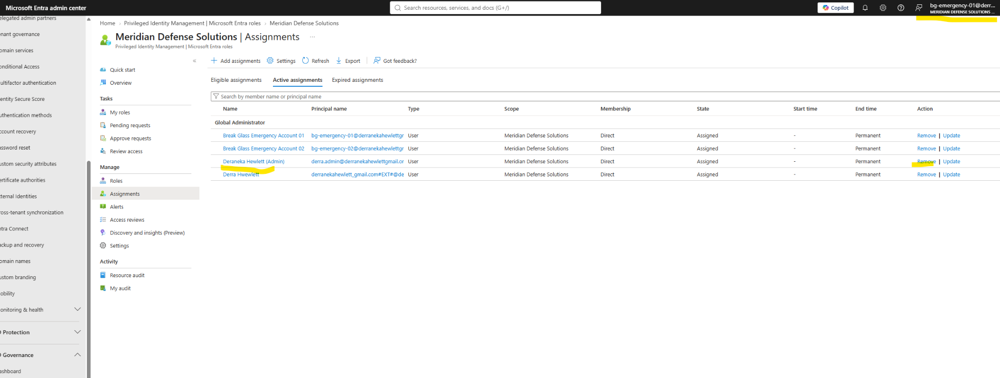

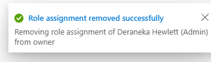

> **This is the part worth writing down.**
>
> Between step 2 and step 3 there is a window where the account holds **no** Global Administrator privilege at all — not active, not activated. If anything goes wrong in that gap, the tenant has no reachable Global Admin.
>
> Which leads directly to the bigger finding.

---

## PIM migration cannot be self-service

**Removing your own standing Global Administrator assignment requires a second administrator.**

An account cannot cleanly strip its own highest privilege and then rely on activating it back — the moment step 2 completes, the safety net is gone, and if activation fails for any reason (MFA problem, licensing, policy conflict), there is nobody left with the rights to fix it.

**Operational consequences:**

| Requirement | Why |
|---|---|
| Two-person operation | A second Global Admin holds standing access until the first has successfully activated through PIM |
| Scheduled maintenance window | Not a task performed ad hoc mid-week |
| Break-glass verified beforehand | Emergency access accounts tested and confirmed working *before* the migration begins |
| Rollback path defined | Known way back to standing assignment if activation fails |

This is the same lesson as the Conditional Access baseline in [Lab 4.1](../../04-conditional-access/lab-4-01/) — the control itself is straightforward to configure, and **the deployment sequence is where the actual risk lives.**

---

## Activation

With the active assignment removed, activation proceeds:

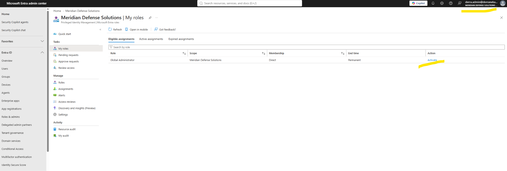

| Field | Value |
|---|---|
| Duration | 4 hours |
| Ticket number | `MDS-1201` |
| Reason | Tenant administration and PIM configuration validation |

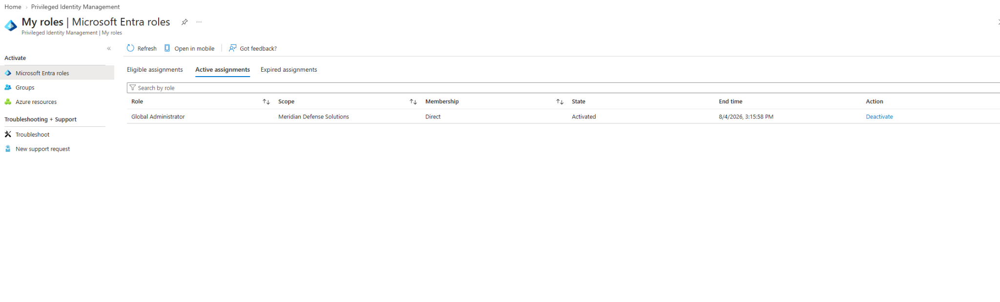

**My roles → Active assignments** now shows Global Administrator as **Activated**, with an explicit **End time** — the privilege has an expiry timestamp attached to it, and a Deactivate action to release it early.

That end time is the whole point. Standing assignment has no end time.

---

## Validation — the audit record

**PIM → Audit history → Audit details**

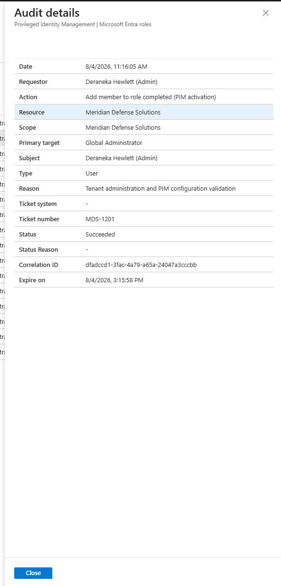

| Field | Value |
|---|---|
| Action | Add member to role completed (PIM activation) |
| Primary target | Global Administrator |
| Requestor | Deraneka Hewlett (Admin) |
| Reason | Tenant administration and PIM configuration validation |
| Ticket number | `MDS-1201` |
| Status | Succeeded |
| Correlation ID | `dfadccd1-3fac-4a79-a65a-24047a3cccbb` |
| Expire on | 8/4/2026, 3:15:58 PM |

**This single record is the compliance deliverable.** Who claimed the privilege, when, under what ticket, for what stated reason, and exactly when it expired — with a correlation ID that ties it to every downstream action taken during that session.

A standing assignment produces none of this. The account simply *has* the role, and the audit trail begins and ends with the fact that it was granted at some point in the past.

---

## Compliance mapping

| Control | Requirement | Evidence |
|---|---|---|
| **NIST SP 800-53 AC-2(1)** | Automated account management | PIM eligibility with automatic expiry |
| **NIST SP 800-53 AC-6(1)** | Least privilege — authorized access to security functions | No standing Global Administrator |
| **NIST SP 800-53 AC-6(9)** | Audit execution of privileged functions | PIM activation audit records |
| **NIST SP 800-53 IA-2(1)** | MFA for privileged accounts | Azure MFA required on activation |
| **CMMC AC.L2-3.1.5** | Employ least privilege | Just-in-time activation model |

---

## Failure modes handled

| Risk | Mitigation |
|---|---|
| Standing credential compromised outside working hours | No active privilege to steal — eligibility alone grants nothing |
| Compromised session retains privilege indefinitely | 4-hour maximum; expires automatically |
| Privileged action with no recorded reason | Justification and ticket number required on every activation |
| Tenant left with no reachable Global Admin mid-migration | Two-person operation; break-glass verified before starting |
| Activation without identity re-proof | Azure MFA required at activation, separate from sign-in |
| Self-approval of privileged access | Approval requirement documented as a production gap; approver must differ from requestor |

---

## Key takeaways

**1 · The activation duration *is* the control.** Everything else — MFA, justification, tickets — is evidence collection around it. An 8-hour window on a role someone uses daily is standing privilege wearing a costume.

**2 · Eligible and active cannot overlap.** PIM refuses to activate a role already held permanently. The migration sequence is forced: add eligible, **remove active**, then activate. The intuitive order does not work.

**3 · Migration is a two-person job.** You cannot safely remove your own standing Global Administrator and rely on activating it back — the gap between the two has no safety net. This is scheduled work with a second admin standing by, not a Tuesday afternoon task.

**4 · "Permanently eligible" is not standing privilege.** Eligibility persists; privilege expires every time. The distinction is the entire model.

**5 · Ticket numbers make justification verifiable.** Free-text reasons can say anything. A ticket number points at a record in another system that either exists or doesn't.

**6 · The audit record is the deliverable.** Configuration proves you can operate the tool. The activation log — requestor, reason, ticket, expiry, correlation ID — is what an assessor actually asks for.

---

## SC-300 objectives covered

- Configure Privileged Identity Management for Microsoft Entra roles
- Configure role settings including activation duration, MFA, and justification requirements
- Assign eligible and active role assignments
- Activate roles through PIM and manage activation requests
- Review PIM audit history and activation records
- Implement just-in-time privileged access

---

<sub>Meridian Defense Solutions is a fictional organization built in an isolated Microsoft Entra ID lab tenant. All users, data, and programs are synthetic.</sub>
