# Lab 6.1 — SAML 2.0 Application Integration

### Federating a third-party app, and reading the assertion that makes it work

<p>


</p>

---

## The requirement

**Ticket MDS-1220** — Engineering needs SSO for a third-party tool. No more separate passwords.

That last sentence is the security argument. Every application with its own credential store is another password users reuse, another database that can leak, and another account that survives offboarding because it isn't in the directory. The Leaver process in [Lab 2.1](../../02-identity-lifecycle/lab-2-01/) disables an Entra account and revokes its sessions — it does nothing to a standalone login on a vendor's server.

**Federation moves the authentication decision back to the identity provider,** which is the only place the lifecycle controls actually reach.

---

## Creating the application

**Entra admin center → Applications → Enterprise applications → New application → Create your own application**

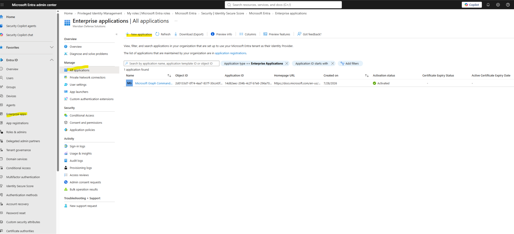

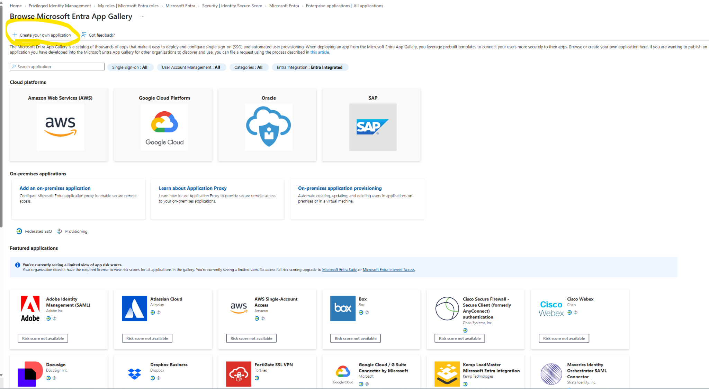

| Setting | Value |
|---|---|
| Name | MDS Engineering Portal |
| Type | **Integrate any other application you don't find in the gallery (Non-gallery)** |

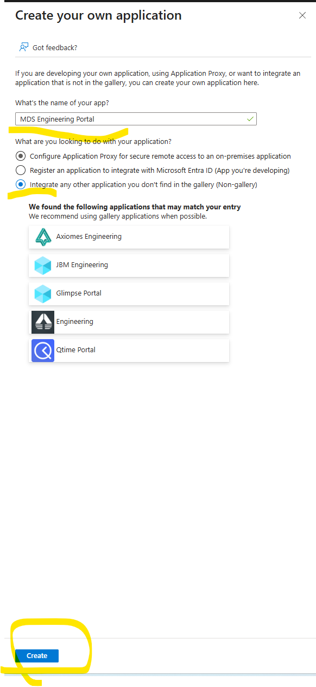

> **Non-gallery is the case worth practicing.**
> Gallery apps come pre-wired — Microsoft has already mapped the endpoints and claims. Real environments are full of internal tools, legacy engineering software, and niche vendor products that were never in anyone's gallery. Those are the integrations that land on an IAM analyst's desk, and they require understanding what the gallery templates are actually doing.

---

## SAML configuration

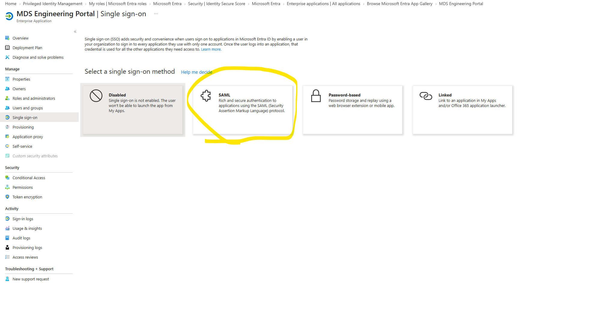

### Basic SAML configuration

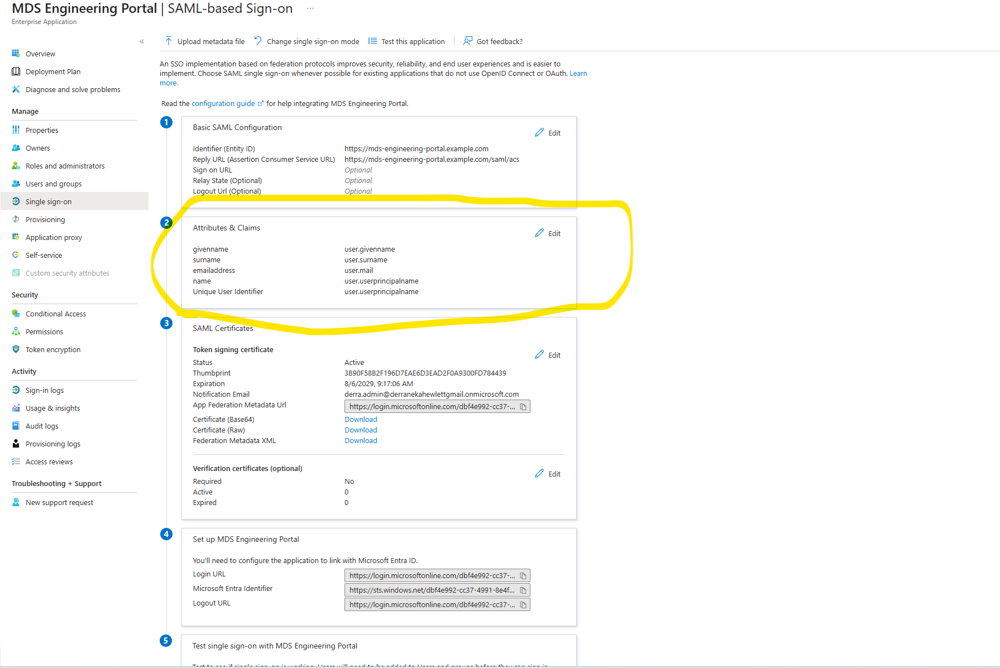

| Field | Value | What it does |
|---|---|---|
| **Identifier (Entity ID)** | `https://mds-engineering-portal.example.com` | Who the assertion is *for*. Lands in `<Audience>`. |
| **Reply URL (ACS URL)** | `https://mds-engineering-portal.example.com/saml/acs` | Where the assertion gets *posted*. |

> **These two fields are the security boundary of the integration.**
>
> The Entity ID becomes the `<Audience>` restriction inside the assertion. A service provider that validates it will reject any token minted for a different audience — which is what stops an assertion issued for App A being replayed against App B.
>
> The Reply URL is where Entra will POST the assertion, and it is the field attackers care about. An overly permissive or wildcard Reply URL means an assertion containing a valid signed identity can be redirected to a destination the tenant doesn't control. **Reply URLs get exact-matched, never wildcarded.**

---

## Claims — mapping directory attributes into the assertion

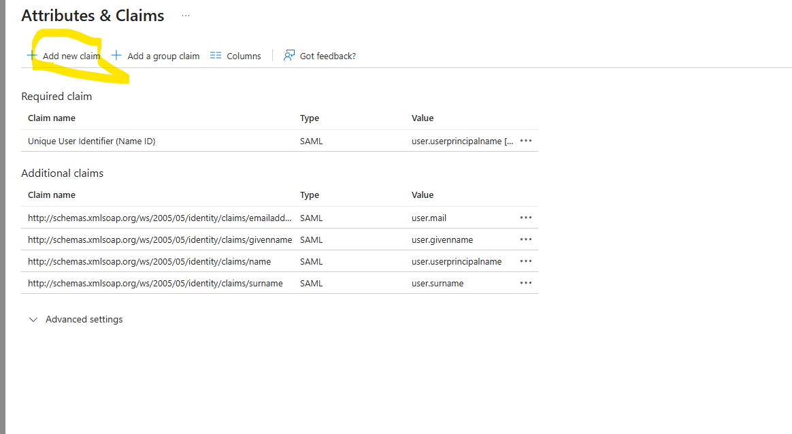

### A direct attribute claim

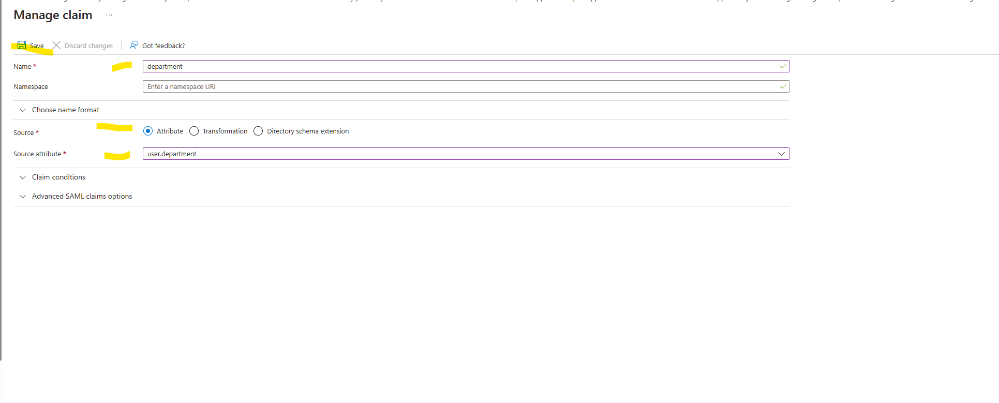

| Setting | Value |
|---|---|
| Name | `department` |
| Namespace | *(blank)* |
| Source | Attribute |
| Source attribute | `user.department` |

> **Why this claim matters beyond authentication.**
> `user.department` is the same attribute driving dynamic group membership in [Lab 2.3](../../02-identity-lifecycle/lab-2-03/). Passing it as a claim means the application can make *authorization* decisions from the same source of truth that drives directory membership.
>
> One attribute, one owner (HR), consistent downstream. The alternative is an app maintaining its own copy of who's in Engineering — which drifts the moment someone transfers, exactly like the privilege creep case in the Mover lab.

### A transformed claim

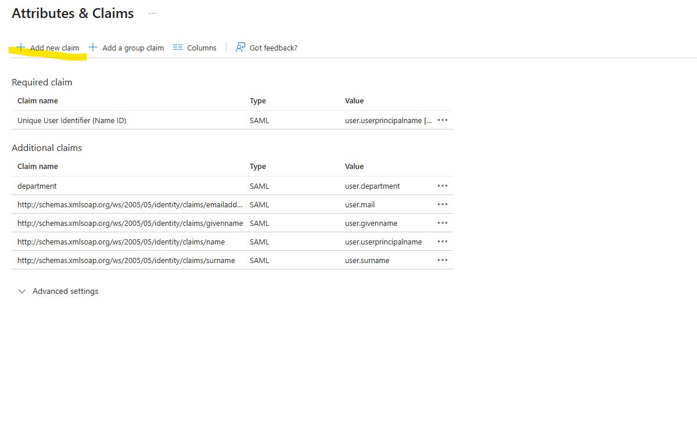

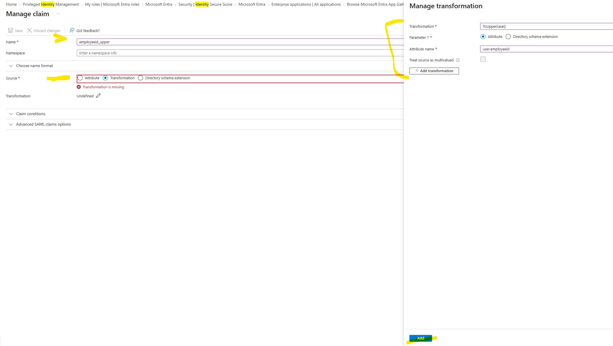

| Setting | Value |
|---|---|
| Name | `employeeid_upper` |
| Source | **Transformation** |
| Transformation | `Uppercase()` |
| Parameter 1 | `user.employeeid` |

> **Transformations exist because applications are inflexible and directories shouldn't be.**
> A vendor app that requires uppercase identifiers is not a reason to uppercase every employee ID in the directory. The transformation reshapes the value **in the assertion only**, leaving the source attribute clean for every other consumer.
>
> This is a recurring pattern in federation work: the app dictates a format, and the correct answer is to satisfy it at the claim layer rather than corrupt the directory to match one integration.

---

## SAML certificates

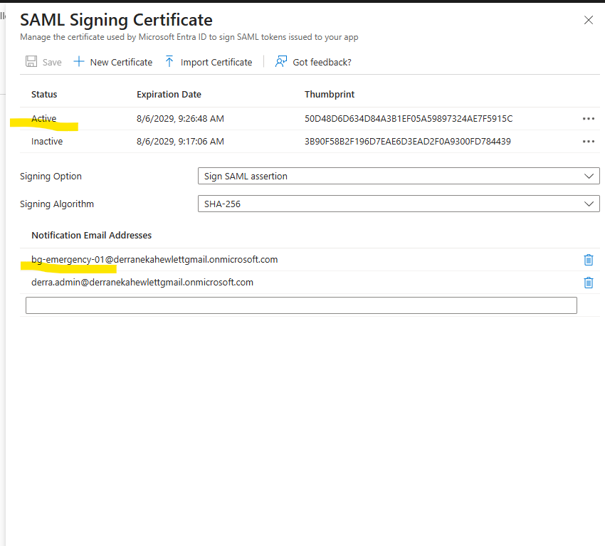

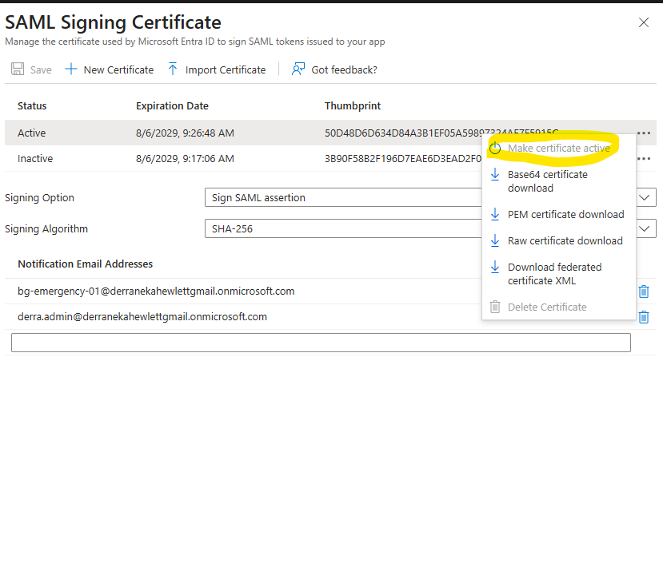

| Field | Value |
|---|---|
| Status | Active |
| Thumbprint | `50D48D6D634D84A381EF05A59897324AE7F5915C` |
| Expiration | **8/6/2029** |
| Notification email | `derra.admin@…` |
| App Federation Metadata URL | *(published)* |

This certificate signs every assertion. When it expires, **every federated sign-in for this app breaks at once** — and the failure looks like an outage, not a certificate problem, which is why it burns hours before anyone checks.

### Rollover procedure

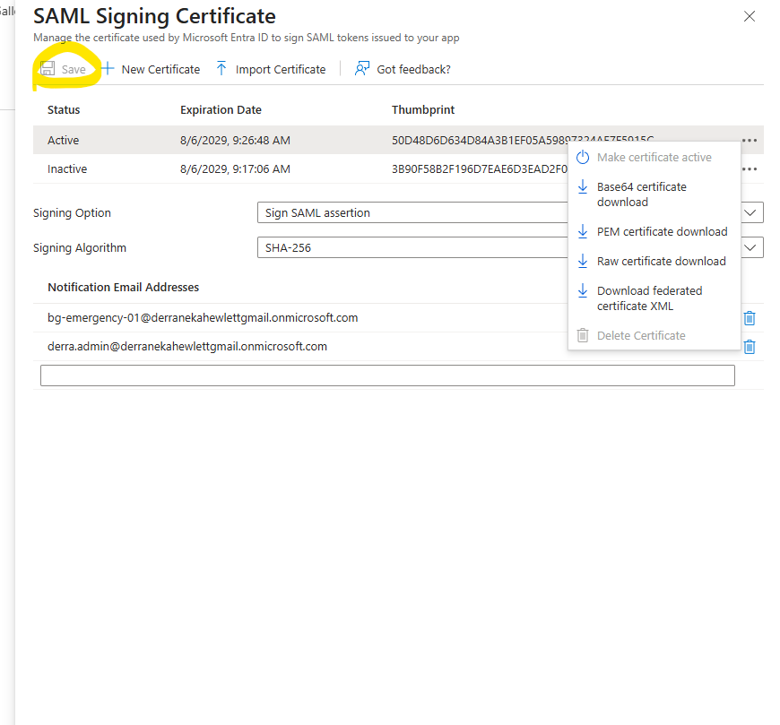

```
1. Create new certificate
2. Activate it
3. Update the app with the new cert or metadata
4. Verify sign-in works
5. Retire the old certificate
```

> **Step 3 is where the coordination cost lives.**
> Applications that consume the **Federation Metadata URL** pick up the new certificate automatically — rollover is nearly invisible.
>
> Applications that had a certificate file pasted into them at setup do not. Those require a **coordinated change window with the app owner**, because the new certificate has to be installed on their side before the old one is retired, and getting the order wrong means an outage.
>
> This is why the metadata URL question belongs in the *intake* conversation for every new integration — not discovered three years later when the certificate expires. A federated estate's real maintenance burden is the count of apps that can't consume metadata dynamically.

---

## Assignment

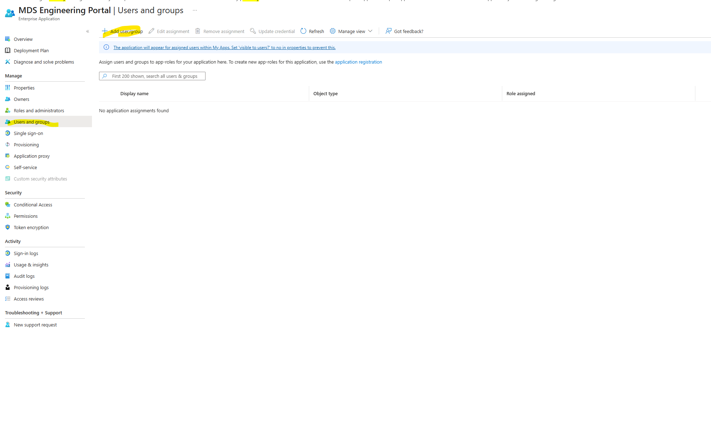

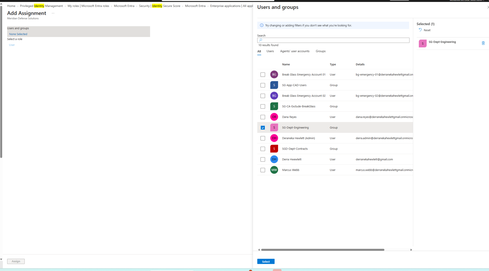

Assigned `SGD-Dept-Engineering` — the **group**, not individual users.

> Consistent with the standing rule from the org design: access is granted by group membership, never by direct assignment. Because that group is dynamic, an engineer hired next month gets portal access with no ticket, and a transfer out of Engineering removes it — the [Mover](../../02-identity-lifecycle/lab-2-03/) pattern extending automatically into application access.

---

## Testing — two failures worth documenting

### Failure 1 — the app doesn't exist

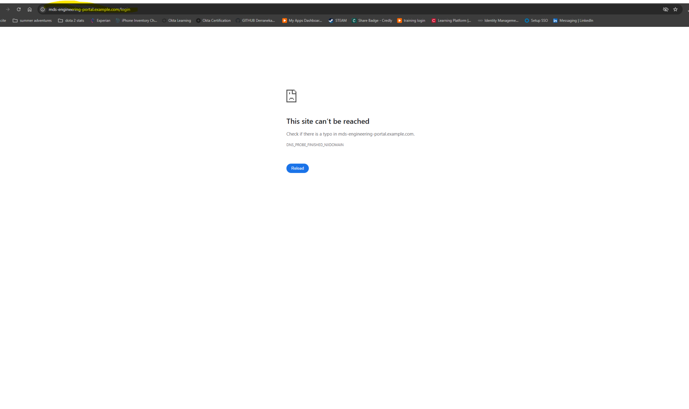

```
DNS_PROBE_FINISHED_NXDOMAIN
mds-engineering-portal.example.com
```

Expected. `example.com` is a reserved documentation domain with no host behind it. Entra generated and signed a valid assertion, then POSTed it into the void.

> **This distinction is the useful part.** The IdP side succeeded completely — the failure was entirely on the service provider side. Being able to say *"authentication worked; the app is unreachable"* separates an identity problem from an application problem, and that's most of what SAML troubleshooting is.

**Resolution:** point the integration at a real test service provider — `sptest.iamshowcase.com` — which accepts an assertion and renders its contents.

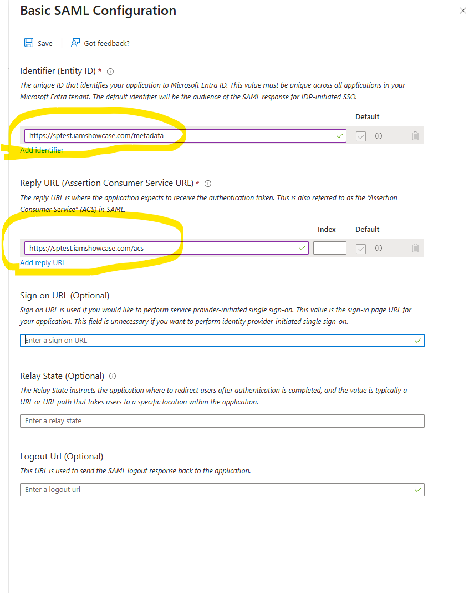

### Failure 2 — AADSTS501241

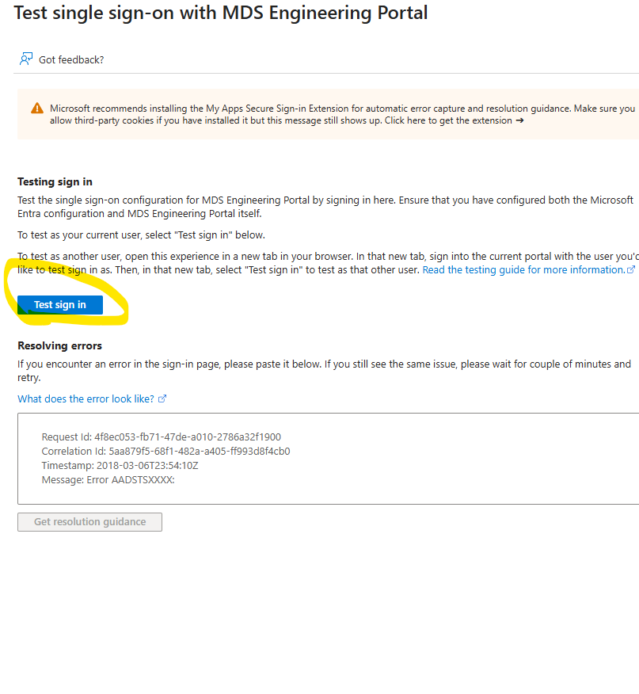

The `employeeid_upper` claim referenced `user.employeeid`, which was **empty** on the test account.

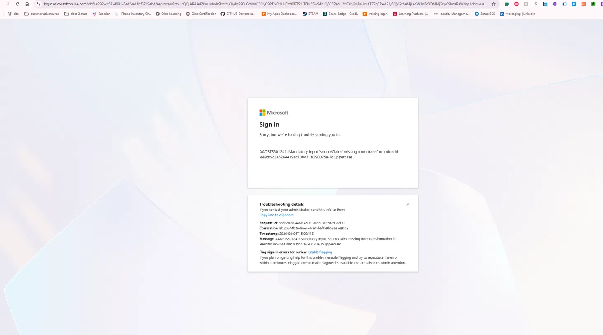

> **A transformation on an empty source attribute kills the entire assertion. It does not degrade.**
>
> This is the finding worth keeping. The reasonable assumption is that a claim with no data simply gets omitted — assertion issued, one attribute missing, app decides what to do about it. That is not what happens. `Uppercase()` on null throws, assertion generation fails, and the **entire sign-in** returns `AADSTS501241` for the user.
>
> **Operational consequence:** any claim built on a transformation makes its source attribute a hard dependency for authentication. A single blank field on a single user account breaks SSO for that user completely, and the error names the token service rather than the attribute — so troubleshooting starts in the wrong place.
>
> Before shipping a transformed claim: confirm the source attribute is populated for **every** assigned user, and treat it as a required field in the joiner process from that point forward.

**Resolution:** populated Employee ID = `100001`.

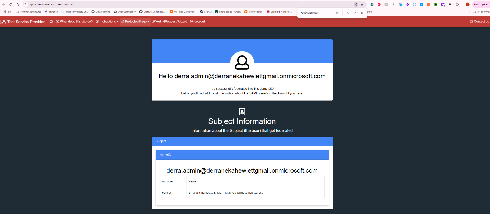

---

## Validation — reading the assertion

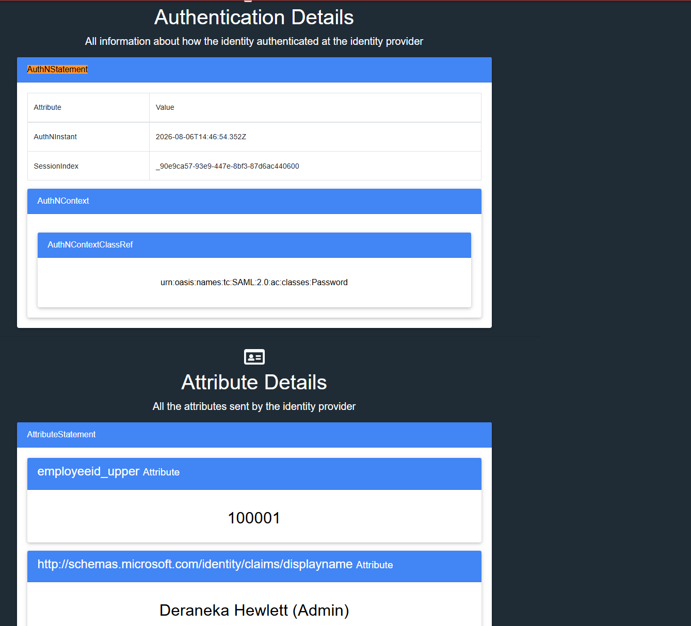

`employeeid_upper` arrives as **`100001`**. The transformation executed, the assertion issued, the service provider parsed it.

### The raw XML

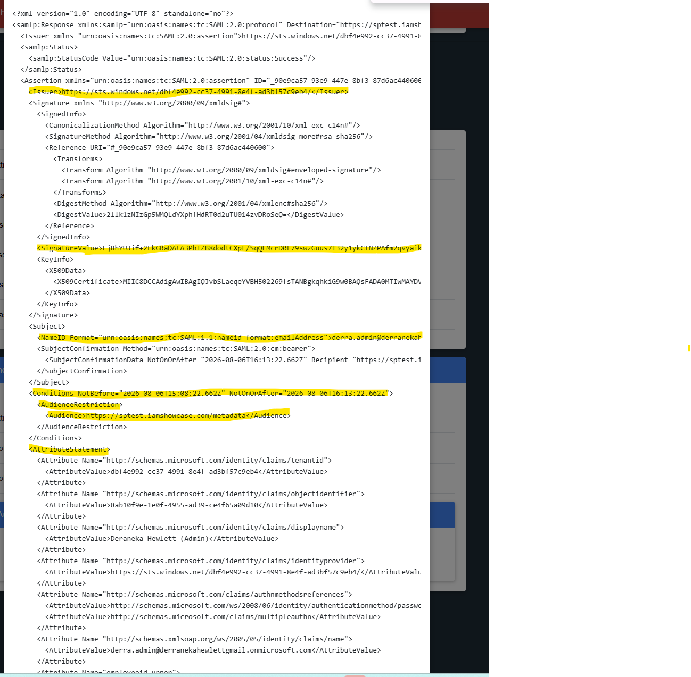

The six elements that matter, and what breaks when each is wrong:

| Element | Value in this assertion | Failure mode |
|---|---|---|
| **`<Issuer>`** | `https://sts.windows.net/dbf4e992-…/` | SP doesn't recognize the IdP → rejected as untrusted |
| **`<Signature>`** | RSA-SHA256, X.509 cert embedded | Invalid or expired cert → rejected; this is the certificate-expiry outage |
| **`<NameID>`** | `derra.admin@…`, format `emailAddress` | Wrong format or value → SP can't match to a local account |
| **`<Conditions>`** | `NotBefore` / `NotOnOrAfter`, ~65 min window | Clock skew between IdP and SP → assertion rejected as expired |
| **`<Audience>`** | `https://sptest.iamshowcase.com/metadata` | Mismatch with Entity ID → replay protection rejects it |
| **`<AttributeStatement>`** | tenantid, objectidentifier, displayname, `employeeid_upper` | Missing claim → app authenticates the user but can't authorize them |

> **Signature and Conditions cause the two most common production failures.**
>
> Signature failures are certificate expiry, and they take everyone down simultaneously.
>
> `Conditions` failures are clock skew, and they're worse to diagnose because they're intermittent — an SP whose clock has drifted a few minutes rejects assertions that look perfect in the logs. Both endpoints need NTP, and "check the time" is a legitimate first question in a federation outage.

### The NameID trade-off

This assertion uses `emailAddress` format, carrying the UPN.

| Format | Advantage | Risk |
|---|---|---|
| **emailAddress** | Human-readable; most SPs match on it natively | **Changes when someone's name changes.** |
| **persistent** | Immutable GUID; survives name changes | SP must support opaque identifiers; harder to debug |

> **The duplicate-account problem.**
> An employee marries, changes their name, and the UPN updates from `dana.reyes@` to `dana.whitfield@`. On the next sign-in, the SP receives a NameID it has never seen — and most service providers respond by **creating a new account.**
>
> The user loses their history, their permissions, and their saved work, while the old account lingers with access nobody is reviewing. The Leaver process won't catch it, because nobody was terminated.
>
> `persistent` NameID avoids this entirely — the identifier is a GUID that never changes regardless of what happens to the person's name. The cost is debuggability: a support ticket about `_90e9ca57-93e9-447e-8bf3…` is harder to trace than one about an email address.
>
> **Rule of thumb:** email format for apps where the population is stable and support burden matters; persistent for anything holding data the user would be devastated to lose access to. Name changes are not edge cases.

---

## Failure modes handled

| Risk | Mitigation |
|---|---|
| Standalone app credentials survive offboarding | Federated to Entra; lifecycle controls reach the app |
| Assertion replayed against a different application | Entity ID exact-matched into `<Audience>` |
| Assertion redirected to attacker-controlled endpoint | Reply URL exact-matched, no wildcards |
| App maintains its own drifting copy of department data | `user.department` passed as a claim from the directory |
| Directory corrupted to satisfy one app's format | Transformation applied at claim layer only |
| Certificate expiry takes down all federated sign-ins | Rollover procedure documented; notification email set |
| Static-cert apps break during rollover | Coordinated change window with app owner |
| Empty source attribute breaks all SSO for a user | `AADSTS501241` documented; source attribute treated as required |
| Access persists after department transfer | Assigned by dynamic group, not direct assignment |
| Duplicate accounts created on name change | NameID format trade-off documented |

---

## Key takeaways

**1 · A transformation on an empty attribute fails the whole assertion.** `AADSTS501241` isn't a missing claim — it's a failed sign-in. Any transformed claim makes its source attribute a hard authentication dependency, and the error message points at the token service rather than the blank field.

**2 · Entity ID and Reply URL are the security boundary.** One becomes the audience restriction that prevents cross-app replay; the other is where a signed identity gets delivered. Neither should ever be wildcarded.

**3 · Certificate rollover cost is set at integration time.** Apps that read the metadata URL roll over silently. Apps with a pasted certificate need a coordinated window with their owner. Ask which one it is during intake, not three years later.

**4 · Transform at the claim layer, never in the directory.** One app's formatting requirement is not a reason to reshape an attribute every other consumer depends on.

**5 · NameID format is a decision about name changes.** Email format is readable and breaks when someone's name changes — most SPs respond by creating a duplicate account. Persistent format is a GUID that survives it and is harder to debug.

**6 · Assign groups, never users.** A dynamic group means new engineers get access with no ticket and transfers lose it automatically. Direct assignment reintroduces exactly the privilege creep the lifecycle labs eliminated.

**7 · Knowing which side failed is most of the job.** The DNS failure proved the IdP had done everything correctly. Separating "the assertion was wrong" from "the app was unreachable" is the first fork in every federation troubleshooting path.

---

## SC-300 objectives covered

- Create and configure enterprise applications
- Implement and configure SAML-based single sign-on
- Configure SAML token claims and claim transformations
- Manage SAML signing certificates and rollover
- Assign users and groups to enterprise applications
- Troubleshoot single sign-on and interpret SAML assertions

---

<sub>Meridian Defense Solutions is a fictional organization built in an isolated Microsoft Entra ID lab tenant. All users, data, and programs are synthetic.</sub>
