# Lab 7.1 — Entitlement Management: Access Packages

### Self-service request with approval, expiry, and external identity governance

<p>


</p>

---

## The requirement

**Ticket MDS-1412** — A subcontractor at a partner firm needs CAD file share access and the Engineering Portal for a program engagement. Approval required. Access must expire automatically at contract end.

Every previous governance lab handled access that **already existed**. [Lab 7.2](../lab-7-02/) certifies it quarterly. [Lab 2.4](../lab-2-04/) revokes it on termination. Neither answers the first question:

> **How does access get requested and granted in the first place?**

Without an answer, the front door is a helpdesk ticket and an admin clicking *Add member*. That produces access with no business justification attached, no expiry, and no record of who approved it or why — which is exactly the kind of grant that survives four quarters of access reviews because nobody remembers enough about it to deny it.

Add an external identity and it gets worse. A guest added manually to a group is a guest nobody owns.

---

## Catalog — the delegation boundary

**Identity Governance → Catalogs → New catalog**

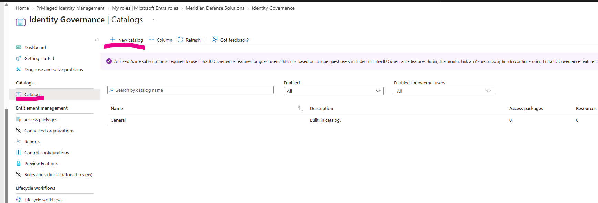

| Setting | Value |
|---|---|
| Name | `CAT-Engineering-Program-Resources` |
| Description | Engineering program resources available to internal staff and approved subcontractors |
| Enabled for external users | **Yes** |

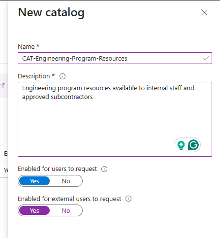

Resources added to the catalog:

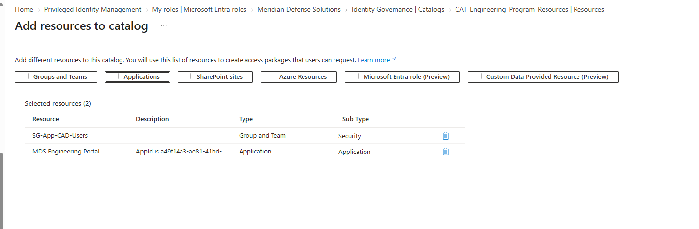

- Group: `SG-App-CAD-Users`
- Application: `MDS Engineering Portal` — the SAML app federated in [Lab 6.1](../lab-6-01/)

> **The catalog is a separation-of-duties boundary, not a folder.**
>
> A package author can only hand out what the catalog owner has stocked. That means an engineering manager can be delegated the ability to define access packages for their own program without being able to grant anything outside the catalog — no directory roles, no other departments' resources, no privileged groups.
>
> The alternative is delegating group management directly, which grants the ability to add anyone to anything. Catalogs let the *scope* of delegation be defined once, centrally, and the *packaging* be delegated outward.

> **`Enabled for external users` is a security decision made at the catalog level.**
> Switching it on declares that everything in this catalog is appropriate for people outside the tenant. That's the right place for the decision — one review of the container rather than a judgement call on every package built inside it.

---

## The access package

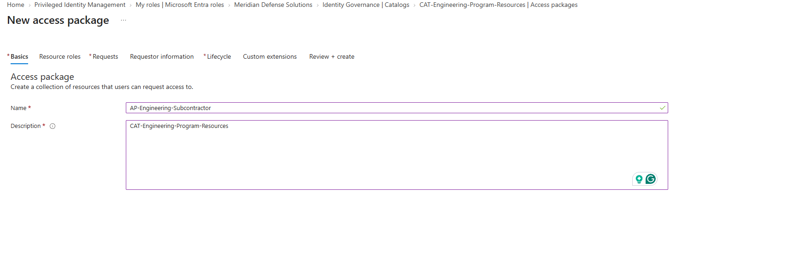

`AP-Engineering-Subcontractor`

### Resource roles

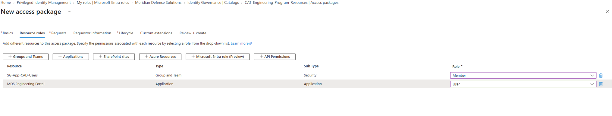

| Resource | Role |
|---|---|
| `SG-App-CAD-Users` | Member |
| `MDS Engineering Portal` | User |

> **A package is a bundle of access defined by job function, not by resource.**
> The subcontractor doesn't request "add me to a group" and then separately "give me the portal." They request the thing that describes their situation, and the package resolves it into two grants across two different systems.
>
> This also means the *definition* of subcontractor access lives in one object. Add a third resource next quarter and every future requester gets it — no ticket, no back-fill, no drift between what people were told they'd get and what they actually have.

---

## Request policy

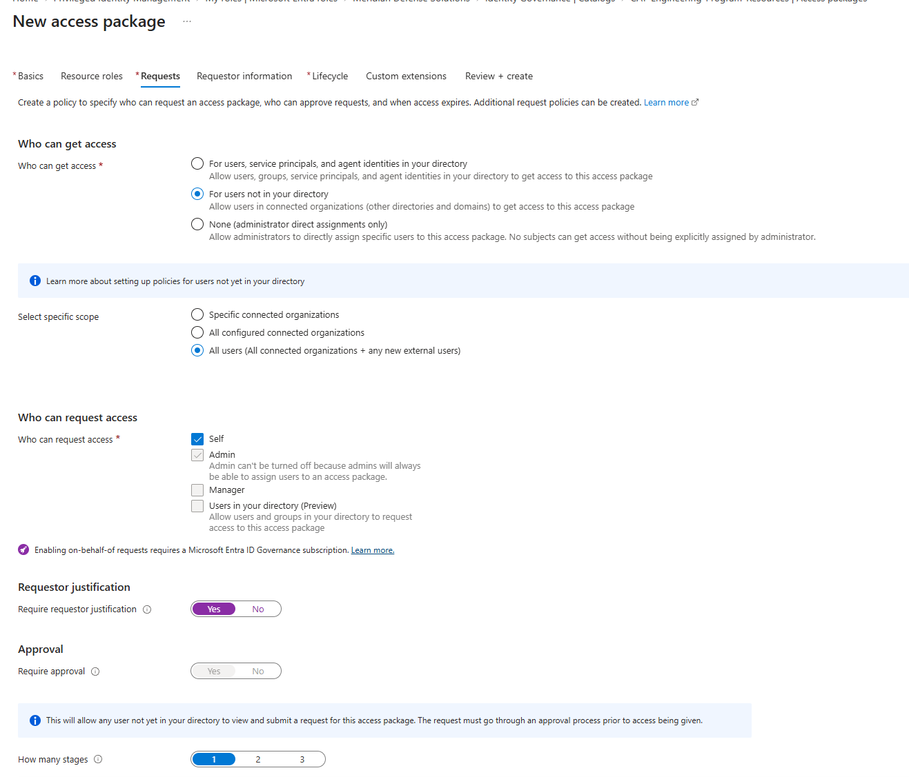

| Setting | Value |
|---|---|
| Who can get access | **For users not in your directory** |
| Specific scope | All users (all connected organizations + any new external users) |
| Who can request | **Self** + Admin |
| Requestor justification | Required |

> **"Self" is what makes this entitlement management rather than a nicer admin console.**
> With only Admin ticked, an administrator still has to assign the package — the workflow is the same helpdesk ticket with extra configuration. Self-service request is the entire point: the person who needs access initiates, and the control lives in the approval, not the gatekeeping.

### Approval

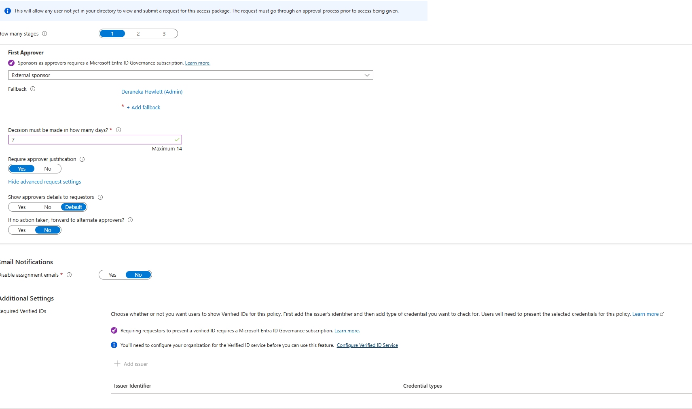

| Setting | Value |
|---|---|
| Stages | 1 |
| First approver | Specific approver |
| Decision deadline | 7 days |
| Approver justification | **Required** |

> **Manager-based approval doesn't work for this population.**
> The obvious configuration is *approver = manager*, and it fails immediately here — an external subcontractor has no manager attribute in the tenant. There is nobody for Entra to resolve.
>
> Same lesson as reviewer selection in [Lab 7.2](../lab-7-02/): **the approver model has to match the requester population.** Manager approval fits employees. External requests need a named approver or a designated sponsor group, because the relationship the approval depends on doesn't exist in the directory.

### Requestor information

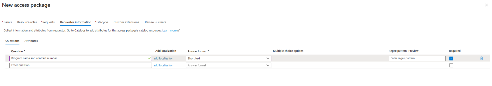

Custom question, required: **"Program name and contract number"**

> **This is the field that makes the request auditable.**
> Free-text justification says why someone wants access. A contract number points at a record in a system the identity team doesn't control and can't influence — it either exists or it doesn't.
>
> Same reasoning as requiring a ticket number on PIM activation in [Lab 5.1](../lab-5-01/). Verifiable beats descriptive.

### Lifecycle

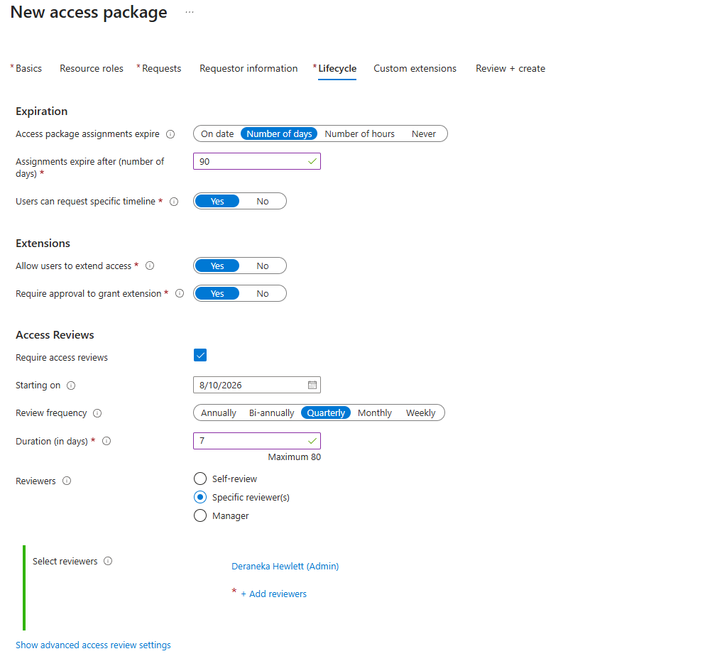

| Setting | Value |
|---|---|
| Assignments expire after | **90 days** |
| Users can request specific timeline | Yes |
| Allow users to extend | Yes |
| **Require approval to grant extension** | **Yes** |
| Access reviews | Quarterly, specific reviewers, 7-day duration |

> **Expiry is the control. Extension approval is what keeps it real.**
> Without approval on extension, a 90-day limit is decorative — the holder extends indefinitely and the expiration date becomes a recurring notification nobody acts on. Requiring approval means every renewal is a fresh decision with a fresh justification.

> **Reviewers set to specific, not self-review.**
> Self-review would have the subcontractor certify their own continued need for CAD access at a defense contractor. That isn't a control — it manufactures audit evidence for a decision no independent party made. The failure mode is worse than in an internal review, because the subject is outside the organization entirely.

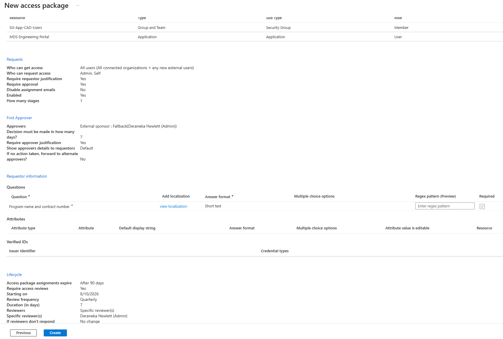

---

## The requester experience

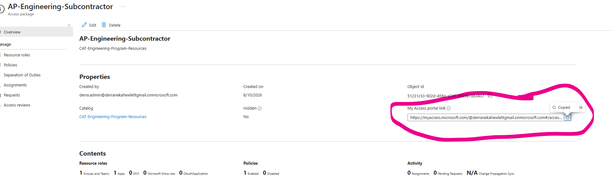

The package publishes a **My Access portal link** that can be sent to someone who has no account in the tenant at all.

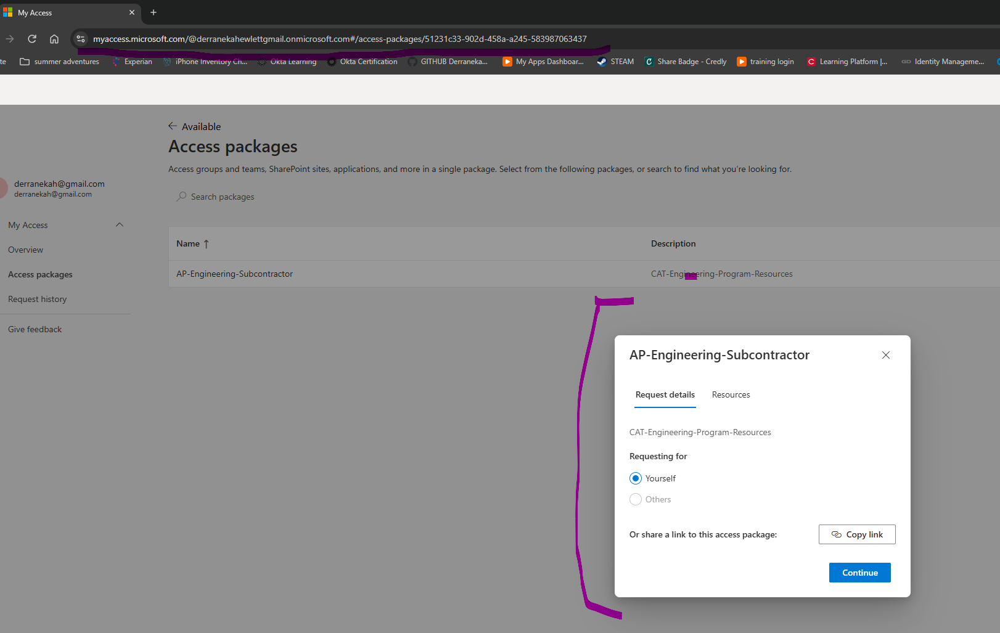

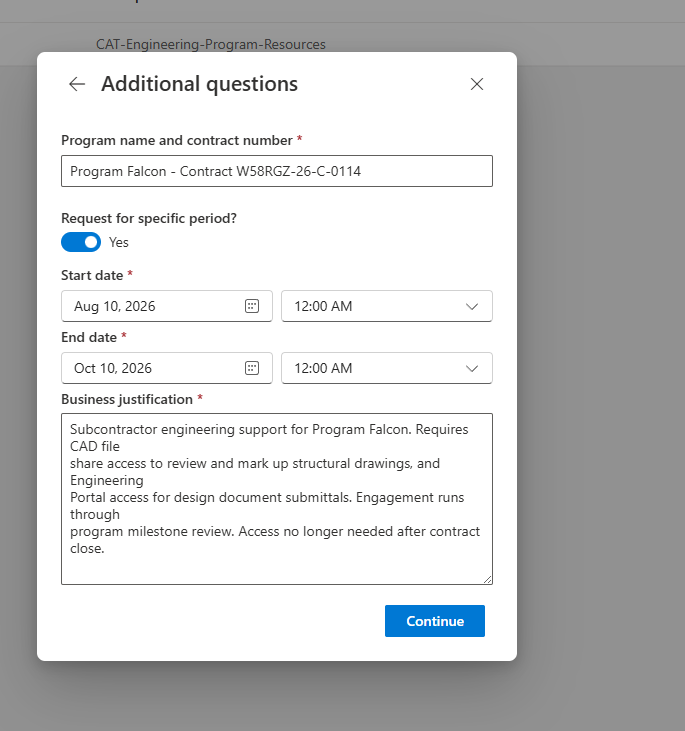

Submitted as an external identity:

| Field | Value |
|---|---|
| Program name and contract number | Program Falcon — Contract W58RGZ-26-C-0114 |
| Request for specific period | **Yes — 60 days** |
| Business justification | Subcontractor engineering support for Program Falcon. Requires CAD file share access to review structural drawings and Engineering Portal access for design document submittals. Access no longer needed after contract close. |

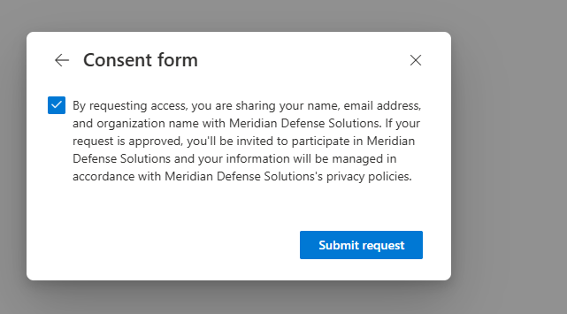

> **The requester asked for 60 days against a 90-day maximum.**
> Least privilege is usually framed as scope — which resources, which roles. Duration is the same axis. A 90-day grant for a 60-day engagement is 30 days of access with no business purpose behind it, and it will not be noticed, because it's within policy.
>
> Enabling *users can request specific timeline* lets the person who actually knows the engagement length set it. The maximum becomes a ceiling rather than a default.

---

## Approval

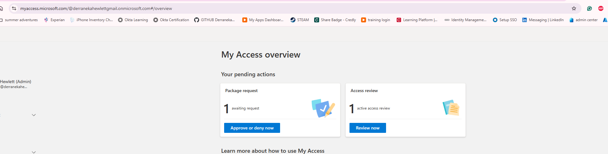

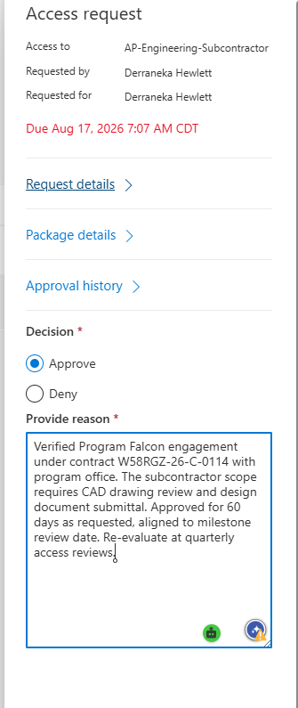

**Decision: Approve.** Reason recorded:

> Verified Program Falcon engagement under contract W58RGZ-26-C-0114 with program office. Subcontractor scope requires CAD drawing review and design document submittal. Approved for 60 days as requested, aligned to milestone review date. Re-evaluate at quarterly access review; deny extension if contract has closed.

> **A good approval states what was verified and leaves a rule behind.**
> "Verified ... with program office" records that the contract number was checked, not merely read. "Deny extension if contract has closed" hands the next approver a decision rule instead of a blank judgement call.
>
> Same pattern as Dana's certification justification in [Lab 7.2](../lab-7-02/): the useful part of an approval is the condition it sets for the future.

> **Lab constraint — separation of duties.**
> In this single-admin tenant, the requester and the approver are the same identity. In production that is a violation: an approver group must exclude the requester, and for external access a designated internal sponsor should hold the approval.
>
> This is the same gap flagged for PIM approval in [Lab 5.1](../lab-5-01/), where `Require approval to activate` was left off because a single admin cannot approve themselves. Both are lab limitations, documented rather than papered over.

---

## Validation

### The guest was created by the workflow

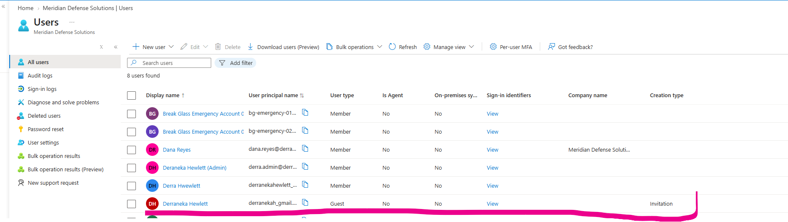

| Field | Value |
|---|---|
| User type | **Guest** |
| Creation type | **Invitation** |

No admin created this account. The approved request provisioned the identity, invited it, and granted the resources — the B2B invitation is a *product* of the governance workflow rather than a prerequisite for it.

> This is the difference from manual guest handling. An invited guest sits in the directory owned by nobody, with access granted ad hoc and no record of why. This guest arrived with a contract number, an approver, a justification, an expiry date, and a scheduled review already attached.

### The dynamic group guardrail held

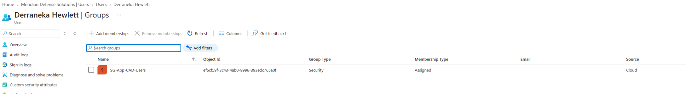

The guest holds **only** `SG-App-CAD-Users` — the resource in the package.

**`SG-Dept-Engineering` did not pick them up**, despite the dynamic rule matching on department.

> **This is the guardrail from [Lab 2.3](../lab-2-03/), proven by a real external identity.**
>
> ```
> (user.department -eq "Engineering") and (user.accountEnabled -eq true) and (user.userType -eq "Member")
> ```
>
> That third condition was written as a defensive measure with an argument attached: *a subcontractor whose record happens to carry a department value should never inherit internal department access.* At the time it was a table entry in a design rationale.
>
> Here it's tested. An external identity entered the tenant through a legitimate, approved workflow and was correctly excluded from department-derived access — receiving exactly the package's scope and nothing else.
>
> **Guardrails that are never exercised are assumptions.** This one is now a demonstrated behaviour.

### The assignment carries an expiry

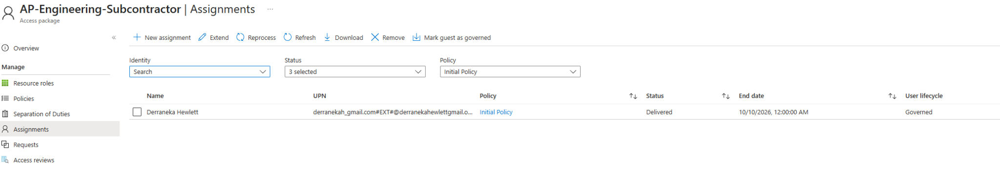

| Field | Value |
|---|---|
| Status | **Delivered** |
| End date | **10/10/2026** |
| User lifecycle | **Governed** |

The 60-day request was honoured — not the 90-day maximum. The requested timeline propagated through approval into the assignment.

> **"Governed" is the state that matters.**
> It marks this guest as belonging to a lifecycle: the account has an owner, an expiry, and a review schedule. Manually invited guests are *ungoverned* — they exist, hold access, and nothing will ever remove them except someone noticing.
>
> The distinction is visible in the portal as a column, and it's the honest measure of external identity hygiene: what fraction of guests are governed, and what fraction are just present.

---

## Compliance mapping

| Control | Requirement | Evidence |
|---|---|---|
| **NIST SP 800-53 AC-2(1)** | Automated account management | Provisioning and expiry driven by the package |
| **NIST SP 800-53 AC-2(j)** | Review accounts at defined frequency | Quarterly review attached to assignment |
| **NIST SP 800-53 AC-3** | Access enforcement per approved authorizations | Approval recorded with verified contract reference |
| **NIST SP 800-53 AC-20** | Use of external systems | External identity governed with sponsor and expiry |
| **NIST SP 800-53 PS-7** | Third-party personnel security | Contract number required; access tied to engagement |
| **CMMC AC.L2-3.1.5** | Employ least privilege | Requested duration below maximum; scope limited to package |

---

## Failure modes handled

| Risk | Mitigation |
|---|---|
| Access granted with no business justification | Required custom question tied to a contract number |
| Package author grants resources outside their remit | Catalog defines the delegation boundary |
| Approval fails to resolve for external requester | Named approver instead of manager-based |
| Expiry becomes decorative | Extension requires approval |
| Access outlives the engagement | Automatic expiry plus quarterly review |
| External party certifies their own access | Specific reviewers, not self-review |
| Guest inherits internal department access | `userType -eq "Member"` guardrail — verified |
| Guest exists with no owner or lifecycle | Assignment marked Governed |
| Requester and approver are the same person | Documented as a lab constraint; production requires exclusion |

---

## Key takeaways

**1 · Entitlement management is the front door governance was missing.** Access reviews certify what exists and offboarding removes it. Neither addresses how access is granted. Without a request workflow, the front door is a helpdesk ticket with no justification, no expiry, and no approval record.

**2 · "Self" is the setting that makes it self-service.** Leave only Admin ticked and the whole thing collapses back into an admin console with more configuration. The control belongs in the approval, not in gatekeeping the request.

**3 · The approver model must match the requester population.** Manager-based approval cannot resolve for someone with no manager in the directory. External requests need a named approver or a sponsor group — the same principle that governs reviewer selection.

**4 · Duration is a dimension of least privilege.** A 90-day grant for a 60-day engagement is 30 days of purposeless access that nobody will flag, because it's within policy. Letting requesters state a shorter period turns the maximum into a ceiling rather than a default.

**5 · Extension approval is what makes expiry real.** Without it, the holder renews indefinitely and the expiration date becomes a notification nobody acts on.

**6 · The catalog is a separation-of-duties boundary.** It defines what a delegated package author is permitted to hand out, so delegation of packaging doesn't become delegation of the directory.

**7 · Guardrails are assumptions until something tests them.** The `userType -eq "Member"` condition from Lab 2.3 was a defensive argument in a design table. A real external identity entering through an approved workflow, and being correctly excluded from department access, converted it into a demonstrated behaviour.

---

## SC-300 objectives covered

- Plan and implement entitlement management
- Create and configure catalogs and access packages
- Configure access package request and approval policies
- Configure access package lifecycle settings and expiration
- Manage access for external users and B2B guests
- Configure access reviews on access package assignments

---

<sub>Meridian Defense Solutions is a fictional organization built in an isolated Microsoft Entra ID lab tenant. All users, data, and programs are synthetic.</sub>
