# Lab 7.2 — Access Reviews: Certifying Approved Entitlements

### The control that closes the loop on access no automation should touch

---

## The requirement

Two earlier labs left a deliberate gap.

In [Lab 2.1 — Joiner and Leaver](../../02-identity-lifecycle/lab-2-01/), `SG-App-CAD-Users` was defined as **approved access** — a human decision, not a fact derived from an attribute. In [Lab 2.3 — Mover](../../02-identity-lifecycle/lab-2-03/), Dana Reyes transferred from Engineering to Contracts and her department access recalculated automatically, while her CAD access **deliberately persisted**.

That was the correct design decision. It also created an open question:

> **If automation won't remove approved access, what will?**

Nothing, is the honest answer — until someone builds the mechanism. Approved access with no review cycle isn't governed access, it's permanent access with extra paperwork at the front.

**The requirement:** a recurring certification where the person with business context confirms each member of `SG-App-CAD-Users` still needs it.

---

## Configuration

**Identity Governance → Access reviews → New access review**

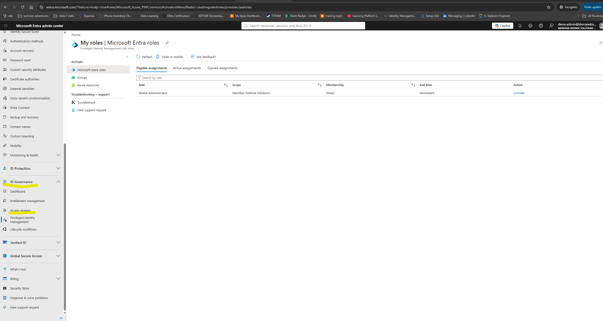

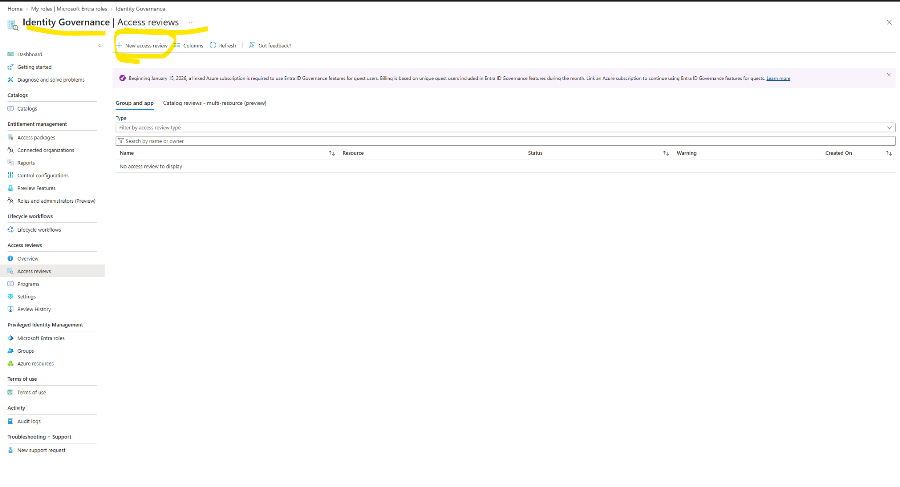

### Review type and scope

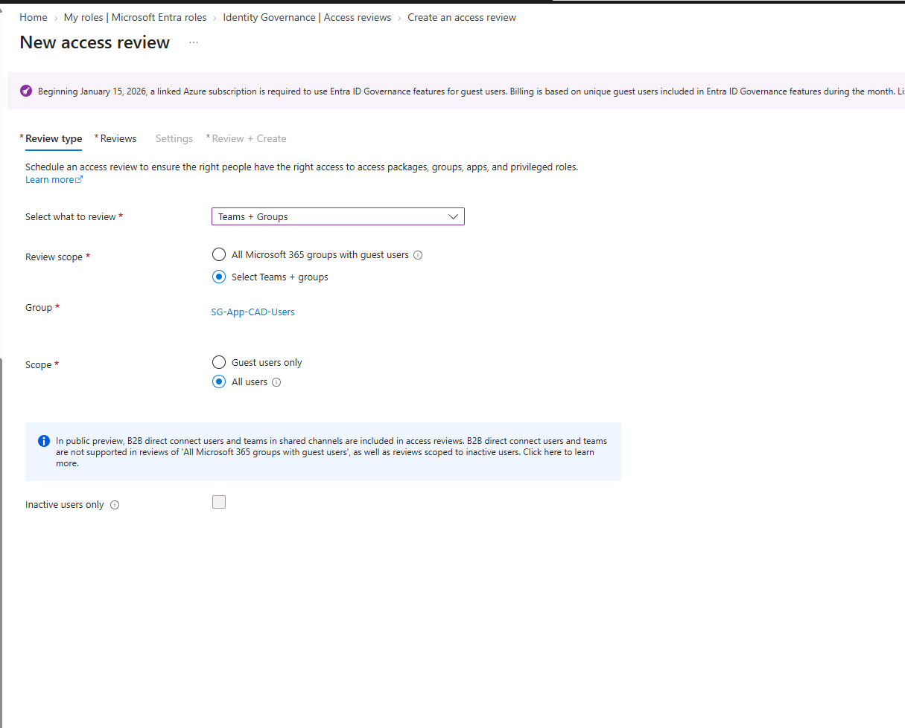

| Setting | Value |
|---|---|
| Select what to review | Teams + Groups |
| Review scope | Select Teams + groups → `SG-App-CAD-Users` |
| Scope | **All users** |
| Inactive users only | Unchecked |

> **Why "All users" and not "Guest users only."**
> The guest-only option is the common default, and it's the wrong fit here. CAD access at Meridian is held by employees and contractors alike — a subcontractor with lapsed CAD access is a risk, but so is an internal engineer who moved to Contracts eight months ago. Scoping to guests only would have missed Dana entirely, which is the exact case this review exists to catch.

> **Why not "Inactive users only."**
> Tempting, because it produces a shorter list. But inactivity and entitlement are different questions. Someone who signed in yesterday can still hold access they no longer need for their role — Dana signed in two days before the review and had no current Engineering role. Filtering by inactivity would have cleared her automatically.

### Reviewers and recurrence

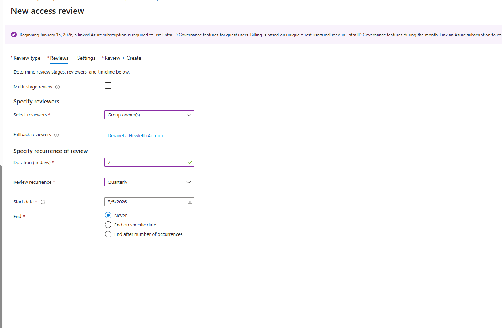

| Setting | Value | Reasoning |
|---|---|---|
| Reviewers | **Group owner(s)** | The person who granted it has the context to judge it |
| Fallback reviewers | Deraneka Hewlett (Admin) | Ensures the review never stalls with no reviewer |
| Duration | **7 days** | Long enough to act, short enough to stay urgent |
| Recurrence | **Quarterly** | Matches the stated business rule for approved access |
| Start date | 8/5/2026 | |
| End | **Never** | Governance is continuous, not a project |

> **Why group owners rather than managers.**
> Manager-based review is the reflex, and it's usually wrong for *application* entitlements. A manager knows whether someone still works for them. They frequently do not know whether that person still needs the CAD file share — that's the group owner's domain, because the owner is the one who approved it in the first place.
>
> Manager review fits department and role membership. Owner review fits application entitlements. Using the wrong reviewer produces rubber-stamp approvals, which is worse than no review at all: it manufactures audit evidence for a decision nobody actually made.

> **Why a fallback reviewer is not optional.**
> If the group owner leaves, changes roles, or simply ignores the notification, a review with no fallback sits open until it expires. The fallback is what guarantees the control produces a decision rather than a silence.

### Naming and description

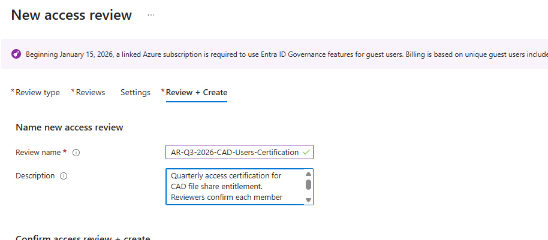

**`AR-Q3-2026-CAD-Users-Certification`**

Same principle as the Conditional Access naming standard in [Lab 4.1](../../04-conditional-access/lab-4-01/) — `AR-<Quarter>-<Year>-<Resource>-<Type>`. An assessor asking for Q3 certification evidence can find it by name without opening anything.

The description states the standard the reviewer is applying: *quarterly access certification for CAD file share entitlement; reviewers confirm each member retains a current business need.* That sentence is what makes an approval defensible later — it records what question was being answered.

---

## The review, live

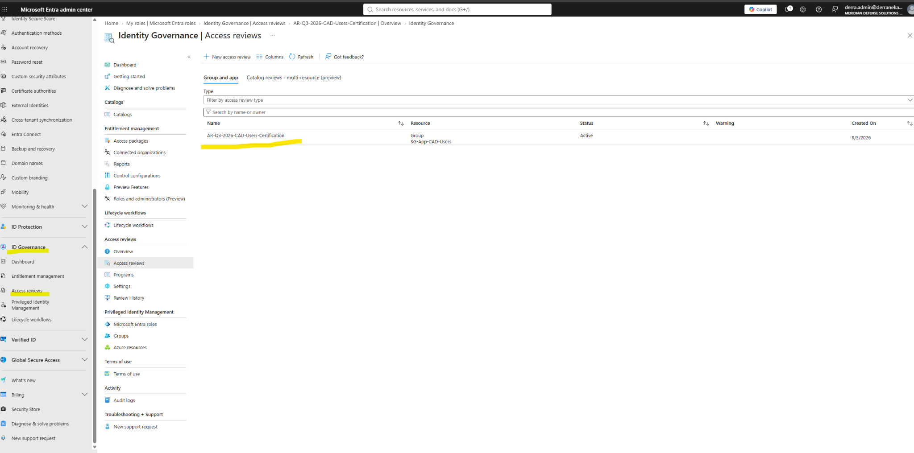

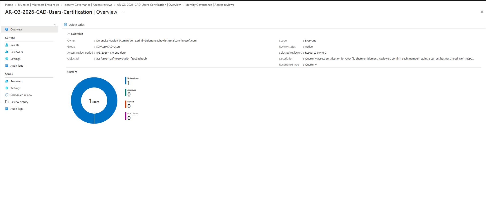

| Field | Value |
|---|---|
| Owner | Deraneka Hewlett (Admin) |
| Group | `SG-App-CAD-Users` |
| Review period | 8/5/2026 — no end date |
| Object ID | `ac6fc508-19af-4939-b9d2-1f5acb4d1abb` |
| Selected reviewers | Resource owners |
| Recurrence | Quarterly |
| Status | Active |

---

## The reviewer experience

Reviewers don't work in the admin center. They use **myaccess.microsoft.com** — a portal with no Entra administrative rights attached to it.

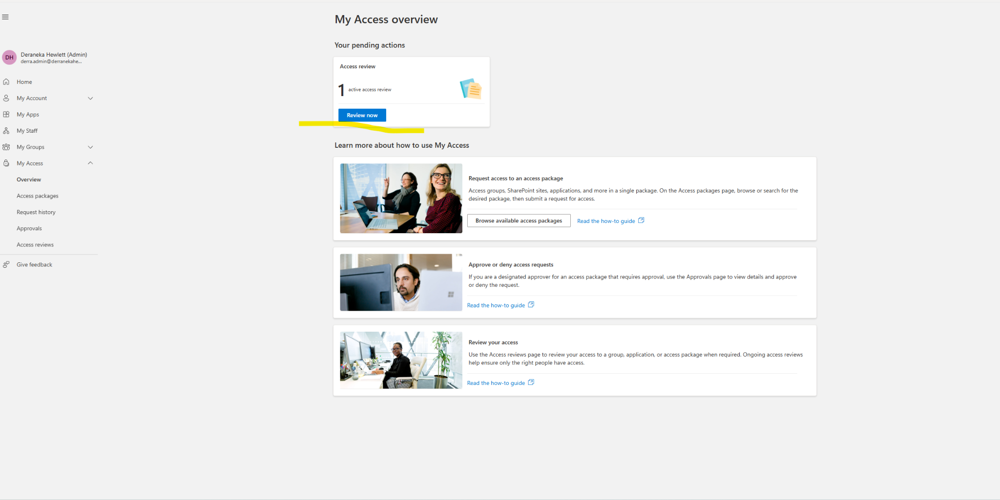

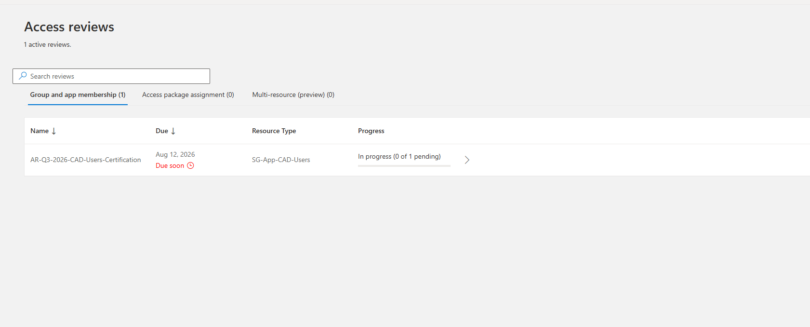

> **This separation is the point.**
> A group owner who needs Global Administrator to certify access is a group owner who will never do it — and an organization that hands out admin rights so reviews can happen has traded a governance gap for a privilege gap.
>
> My Access lets the person with business context make the decision without touching the directory.

### The decision

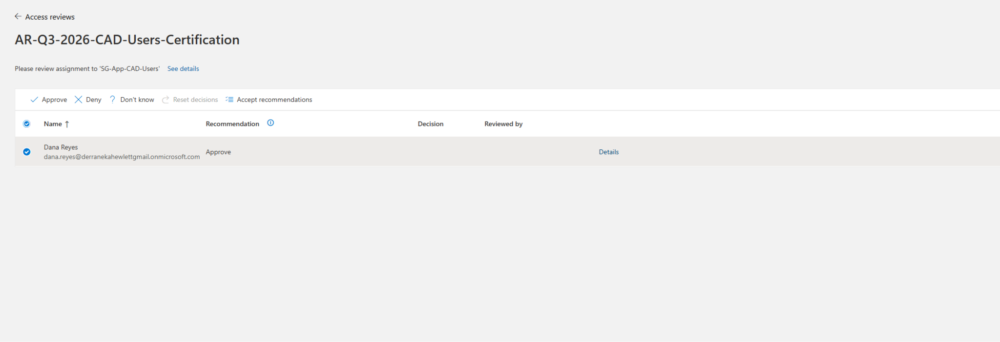

Entra surfaces a **recommendation** alongside each member — here, *Approve*, derived from sign-in activity within the review window.

> **Recommendations are an input, not an answer.**
> The recommendation is computed from last sign-in. It cannot see business context. Dana's recommendation was *Approve* because she'd signed in recently — but recent sign-in and continued business need are different claims, and only one of them is what the review is asking about.
>
> The **Accept recommendations** button exists and is genuinely useful at scale. Used without thought, it converts a governance control into an activity report.

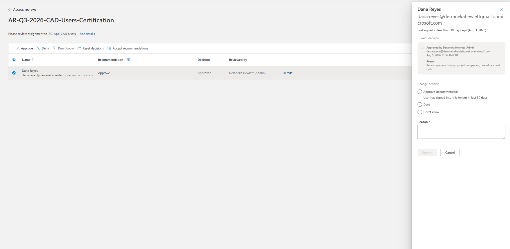

**Decision: Approve.**
**Justification: *Retaining access through project completion; re-evaluate next cycle.***

> **This is what a good certification decision looks like.**
> It's not "yes." It states a **reason** (project completion), sets an **expectation** (re-evaluate next cycle), and creates a **condition** that a future reviewer can test. Next quarter, the question isn't "does Dana need CAD?" — it's "did that project finish?"
>
> Compare with a bare approval. Bare approvals compound: each one inherits the last with no reasoning attached, and after four quarters nobody can reconstruct why the access exists at all. That's how permanent entitlements get manufactured out of a governance process designed to prevent them.

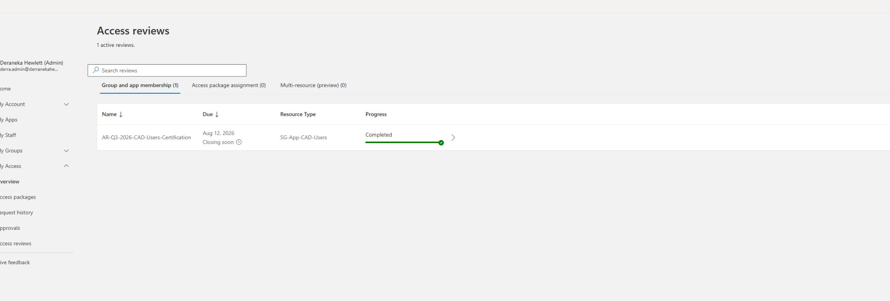

---

## Results

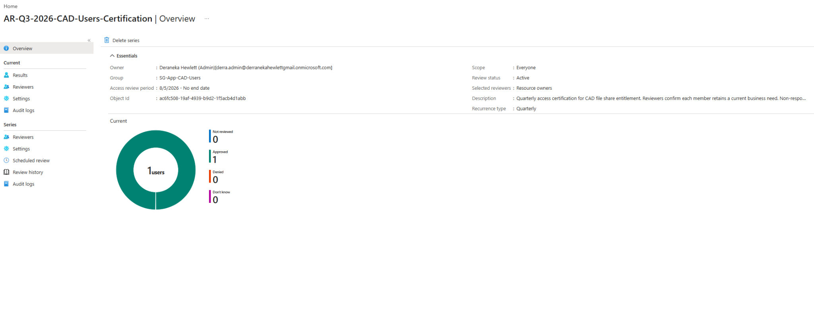

| Outcome | Count |
|---|---|
| Approved | **1** |
| Denied | 0 |
| Don't know | 0 |
| **Not reviewed** | **0** |

The number that matters is the last one. **Zero not-reviewed** means every member got an actual decision from an actual person. A review that completes with unreviewed entries hasn't governed anything — it's produced a list.

---

## Evidence — the CSV export

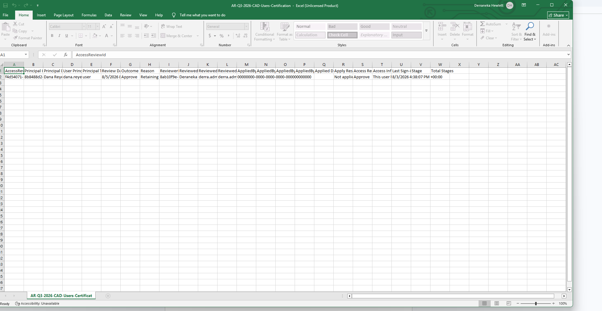

Exported for the compliance record. Column set:

| Column | Value captured |
|---|---|
| `AccessReviewId` | `f4d54071-…` |
| `Principal Name` / `UPN` | Dana Reyes / `dana.reyes@…` |
| `Review Date` | 8/5/2026 |
| `Outcome` | Approve |
| `Reason` | Retaining access through project completion |
| `Reviewer` | Deraneka Hewlett |
| `Applied By` | `derra.adm…` |
| `Access Recommendation` | Approve |
| `Last Sign-in` | 8/3/2026 4:38:07 PM |
| `Stage` / `Total Stages` | 1 / 1 |

> **This file is the deliverable.**
> The control isn't "we run access reviews." The control is *"here is every entitlement, who certified it, on what date, with what stated reason, and what the system recommended versus what the human decided."*
>
> That last comparison — recommendation versus decision — is what proves a human was actually in the loop. If every decision matches every recommendation across every cycle, an assessor is entitled to ask whether anyone is reviewing anything.

---

## Compliance mapping

| Control | Requirement | Evidence |
|---|---|---|
| **NIST SP 800-53 AC-2(j)** | Review account compliance at defined frequency | Quarterly recurring review, never-ending schedule |
| **NIST SP 800-53 AC-6(7)** | Review privileges assigned to users | Per-member certification decisions |
| **NIST SP 800-53 PS-4 / PS-5** | Access review on termination and transfer | Catches transfers that lifecycle automation deliberately doesn't touch |
| **CMMC AC.L2-3.1.5** | Employ least privilege | Entitlements expire unless re-justified |
| **ISO 27001 A.5.18** | Review of access rights at regular intervals | CSV export with reviewer, date, and reason |

---

## Failure modes handled

| Risk | Mitigation |
|---|---|
| Approved access persists indefinitely | Quarterly recurring certification with no end date |
| Reviewer never responds; review stalls | Fallback reviewer configured |
| Reviewer lacks context to judge | Group owner reviews, not manager |
| Reviewers need admin rights to participate | My Access portal — no directory privileges required |
| Rubber-stamp approvals | Justification required; recommendation-vs-decision comparison in export |
| Transfers missed by dynamic groups | Review scoped to All users, not inactive-only |
| No evidence for assessor | CSV export with full decision provenance |

---

## Key takeaways

**1 · Access reviews are the other half of the lifecycle design.** Dynamic groups deliberately don't touch approved access. That's correct — and it means approved access needs its own removal mechanism. Without reviews, "we don't automate that" quietly becomes "we never revoke that."

**2 · Reviewer selection determines whether the control works.** Owner review for application entitlements, manager review for role membership. Pick wrong and you get approvals from people with no basis to approve — audit evidence for a decision nobody made.

**3 · Recommendations measure activity, not need.** Last sign-in cannot see business context. Dana's recommendation said Approve because she'd logged in, not because she still needed CAD. Accepting recommendations wholesale turns governance into telemetry.

**4 · Justifications should set a condition, not just say yes.** *"Through project completion, re-evaluate next cycle"* gives the next reviewer something testable. Bare approvals compound into permanent access nobody can explain.

**5 · Zero "not reviewed" is the success metric.** Approved-versus-denied counts say what happened. The not-reviewed count says whether the control ran at all.

**6 · The export is the control's output.** Running reviews proves nothing. The CSV — reviewer, date, reason, recommendation, decision — is what an assessor asks for, and the gap between recommendation and decision is what proves a human was in the loop.

---

## SC-300 objectives covered

- Plan and implement entitlement management
- Create and configure access reviews for groups and applications
- Configure access review settings, reviewers, and recurrence
- Monitor and respond to access review results
- Manage the review lifecycle and apply decisions
- Export access review results for compliance reporting

---

Meridian Defense Solutions is a fictional organization built in an isolated Microsoft Entra ID lab tenant. All users, data, and programs are synthetic.
