# Lab 8.2 — Identity Protection: Risk-Based Conditional Access

### Automating response to compromised credentials — and what Secure Score gets wrong about it

---

## The requirement

The Conditional Access baseline in [Lab 4.1](../../04-conditional-access/lab-4-01/) enforces MFA for everyone, every time. That's a **static** control — it applies the same requirement to a routine sign-in from the San Antonio office and to a sign-in from an anonymous IP at 3 AM using credentials that appeared in a breach dump last week.

Static controls can't respond to signal. They also can't remediate: a user whose password is already compromised satisfies an MFA prompt just fine, and keeps working with a credential an attacker also holds.

Identity Protection adds two signals Conditional Access can act on:

| Signal | Question it answers | Response |
|---|---|---|
| **Sign-in risk** | Is *this authentication attempt* suspicious? | Step up — challenge for MFA |
| **User risk** | Is *this account* likely compromised? | Remediate — force a password change |

**The requirement:** step up on suspicious sign-ins, and force credential remediation on accounts believed to be compromised — without a human in the loop, because attacks don't wait for business hours.

---

## CA202 — Sign-in risk policy

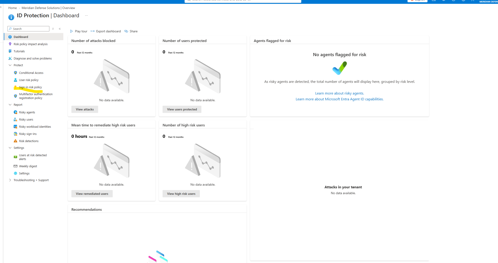

| Setting | Value |
|---|---|
| Name | `CA202-Internal-AllApps-SignInRisk` |
| Users | All users → exclude `SG-CA-Exclude-BreakGlass` |
| Target resources | All resources |
| Conditions → Sign-in risk | **High** and **Medium** |
| Grant | Require multifactor authentication |
| Initial state | Report-only |

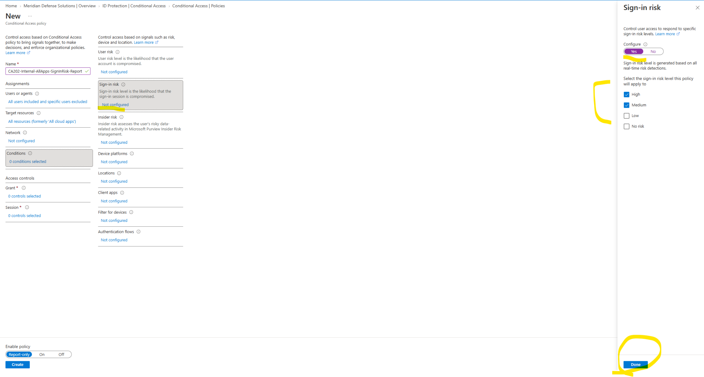

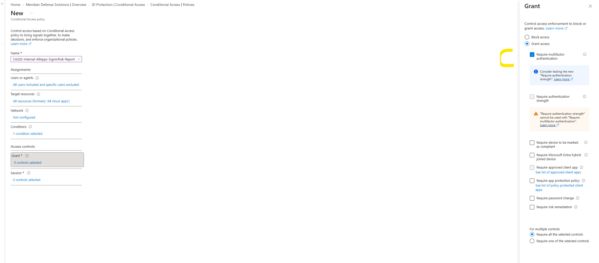

> **Why High *and* Medium, not High only.**
> High-only is the conservative default and it leaves the most common attack profile uncovered. Medium is where impossible-travel, unfamiliar sign-in properties, and anonymous IP detections land — the signals that actually fire during credential stuffing and session hijacking. High is largely reserved for confirmed leaked credentials and Microsoft threat-intelligence matches.
>
> The cost of including Medium is one extra MFA prompt for a legitimate user on an unfamiliar network. The cost of excluding it is silence during the attack pattern most likely to occur.

> **Why MFA rather than block.**
> A risky sign-in is a *probability*, not a verdict. Blocking treats a false positive as an incident and generates a helpdesk ticket for someone who did nothing wrong. MFA lets the legitimate user prove identity and continue, while stopping an attacker who has the password but not the second factor.
>
> Block is the right control for legacy authentication, where there is no legitimate use case. Risk is different — it's an inference, and inferences deserve a challenge rather than a wall.

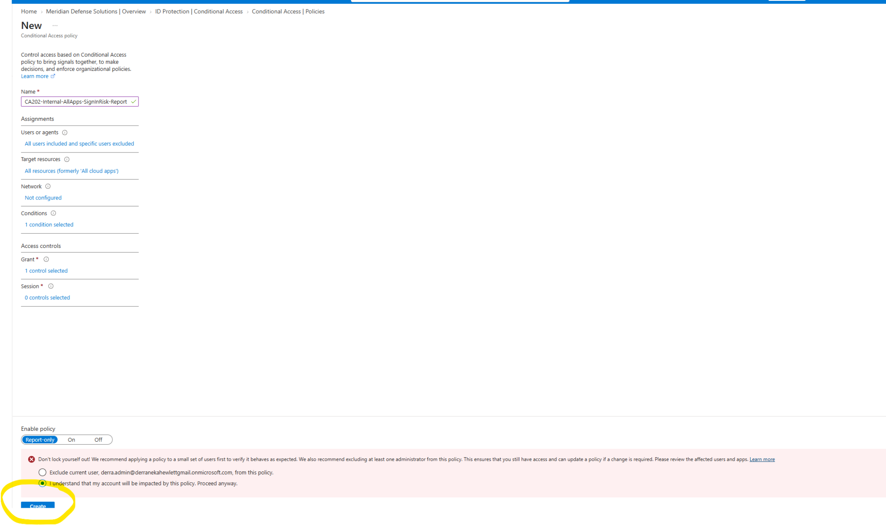

---

## CA203 — User risk policy

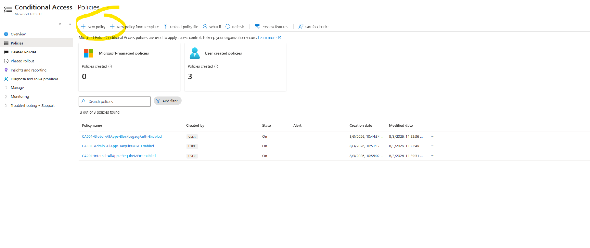

| Setting | Value |
|---|---|
| Name | `CA203-Internal-AllApps-UserRisk` |
| Users | All users → exclude `SG-CA-Exclude-BreakGlass` |
| Target resources | All resources |
| Conditions → User risk | **High** only |
| Grant | Require authentication strength (MFA) **+** Require password change |
| Initial state | Report-only |

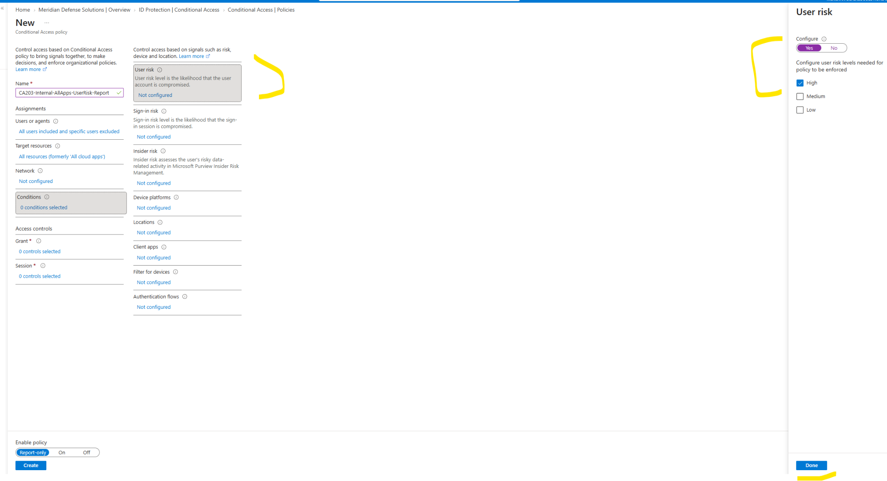

> **Why High only, unlike the sign-in risk policy.**
> The two signals mean different things, so they get different thresholds.
>
> Sign-in risk asks whether *this attempt* is odd — a low-cost question with a low-cost response. User risk asks whether *the account itself* is compromised, and the response is a forced password reset. Firing that at Medium means routinely resetting passwords for users who did nothing wrong, which trains people to treat security prompts as noise and drives helpdesk volume through the roof.
>
> **Match the threshold to the cost of the response.** Cheap response, broader trigger. Disruptive response, narrow trigger.

### Two constraints the portal enforces

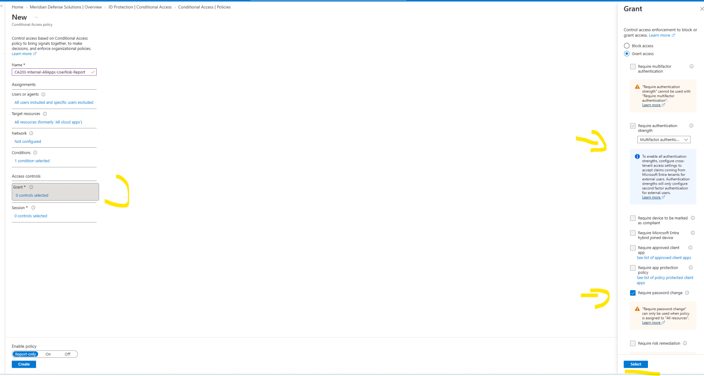

The Grant blade surfaces two rules worth documenting:

**1 · `Require authentication strength` cannot be combined with `Require multifactor authentication`.**
They're mutually exclusive controls. Authentication strength is the newer, more granular mechanism — it specifies *which* methods satisfy the requirement rather than just "some second factor." Selected authentication strength set to Multifactor authentication here.

> This matters for the road ahead. Authentication strength is the path to phishing-resistant enforcement — the same migration flagged for admins in [Lab 4.1](../../04-conditional-access/lab-4-01/). Building on authentication strength now means tightening later is a dropdown change rather than a policy rewrite.

**2 · `Require password change` only works when the policy targets All resources.**
Scoping a user-risk policy to specific applications silently breaks the remediation control. The reasoning is sound — a compromised credential is compromised everywhere, so remediation can't be partial — but it's a constraint you discover in the portal, not in the planning doc.

> **Why MFA is required alongside the password change.**
> The user must prove identity *before* setting a new password. Without it, an attacker holding the compromised credential could simply set a new one and lock the legitimate owner out — remediation would become the attack.

---

## The finding — Secure Score dropped 24 points

After enabling P2 and creating both policies, Identity Secure Score fell from **58.67%** (recorded during [Lab 5.1](../../05-privileged-identity-management/lab-5-01/)) to **34.95%**.

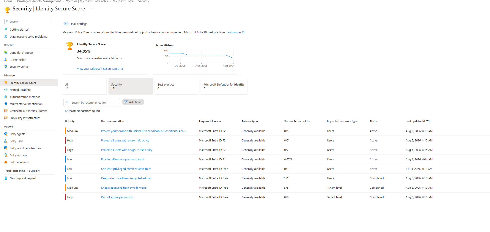

A 24-point drop immediately after *adding* security controls looks alarming. It isn't. Two things happened at once:

**1 · The denominator expanded.** P2 licensing unlocked recommendations that didn't previously exist in the tenant's scoring:

| Recommendation | Points | Status |
|---|---|---|
| Protect all users with a user risk policy | **0 / 7** | Active |
| Protect all users with a sign-in risk policy | **0 / 7** | Active |
| Protect your tenant with Insider Risk condition | **0 / 5** | Active |

Nineteen points of new denominator appeared the moment the license did — none of which existed to be scored against the day before.

**2 · Report-only scores as zero.** Both risk policies existed, were correctly configured, and were evaluating live traffic. Secure Score recorded **0/7** for each, because the metric measures **enforcement**, not configuration.

> **The safe-deployment practice and the scoring model disagree.**
>
> Report-only is the correct way to deploy a policy that can lock out a tenant — established in [Lab 4.1](../../04-conditional-access/lab-4-01/), where report-only caught a user who would otherwise have been locked out on day one. Secure Score gives that same discipline a zero.
>
> Which means a falling Secure Score during a well-run rollout is **expected**, and an organization that optimizes for the number will skip staging and enable straight to enforcement. The metric quietly incentivizes the riskier deployment.
>
> **Secure Score measures posture at a point in time. It cannot see intent, and it cannot see a staged rollout in progress.** Useful as a checklist of controls you haven't considered. Actively misleading as a KPI during a migration.

This is worth knowing before a leadership conversation. "Our security score dropped after we bought the premium license" is a question that gets asked, and the answer is that the denominator grew and the numerator is waiting on a deliberate staging period.

---

## Enforcement

Report-only ran for several days to observe real sign-in evaluation before enforcement.

<table>
<tr>
<td width="50%">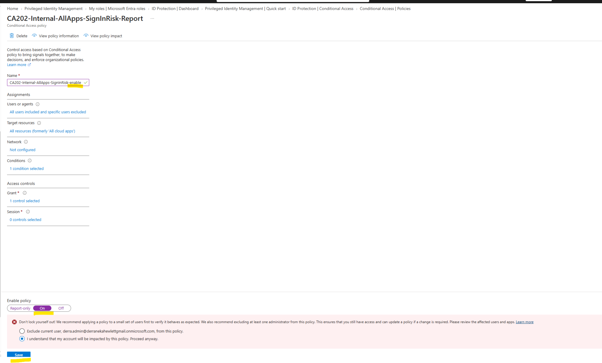</td>
<td width="50%">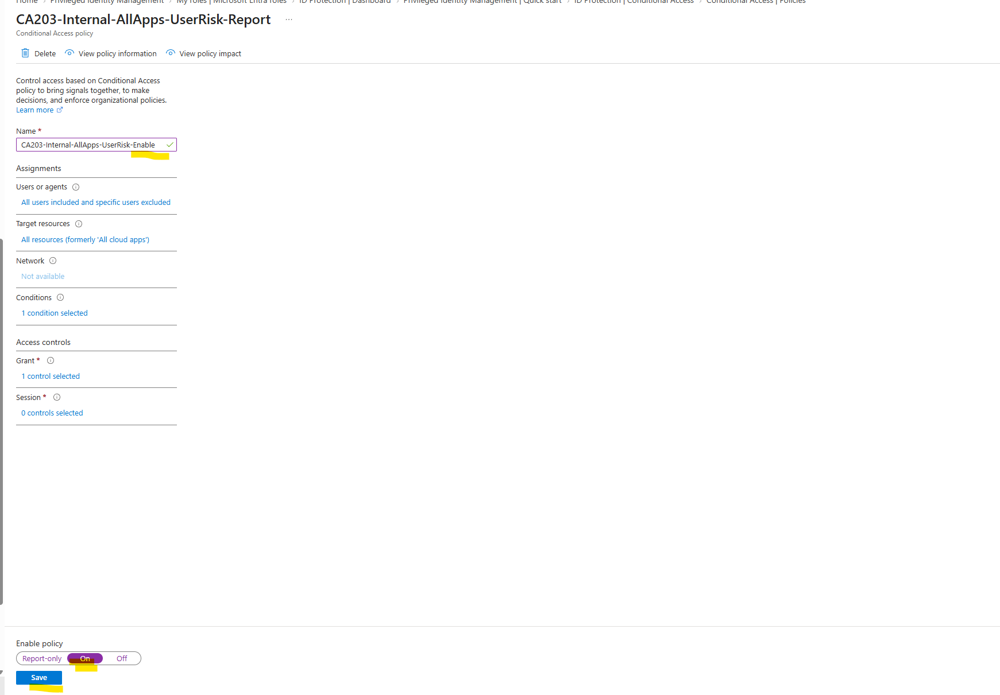</td>
</tr>
<tr>
<td><em>CA202 switched to On</em></td>
<td><em>CA203 switched to On</em></td>
</tr>
</table>

Policy names updated from `-Report` to `-Enable` at cutover, consistent with the convention from Lab 4.1 — the policy list reflects true tenant state without opening anything.

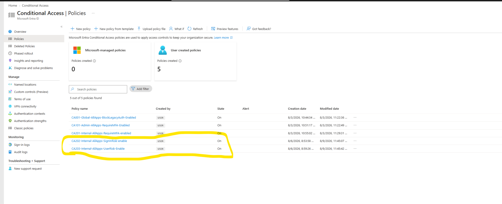

The complete Conditional Access posture, five policies:

| Policy | Control | State |
|---|---|---|
| `CA001-Global-AllApps-BlockLegacyAuth-Enabled` | Block legacy authentication | On |
| `CA101-Admin-AllApps-RequireMFA-Enabled` | Admin MFA | On |
| `CA201-Internal-AllApps-RequireMFA-enabled` | Workforce MFA | On |
| `CA202-Internal-AllApps-SignInRisk-enable` | Risk-based step-up | On |
| `CA203-Internal-AllApps-UserRisk-Enable` | Credential remediation | On |

The `0xx / 1xx / 2xx` numbering established in Lab 4.1 absorbed two new policies without any restructuring. That's the test of a naming standard — whether it still holds when the estate grows.

---

## Compliance mapping

| Control | Requirement | Evidence |
|---|---|---|
| **NIST SP 800-53 AC-2(12)** | Monitor accounts for atypical usage | Sign-in risk detection and response |
| **NIST SP 800-53 IA-5(1)** | Authenticator management | Forced password change on user risk |
| **NIST SP 800-53 SI-4** | System monitoring | Identity Protection risk detections |
| **NIST SP 800-53 IR-4** | Incident handling | Automated remediation without human latency |
| **CMMC AC.L2-3.1.12** | Monitor and control remote access sessions | Risk-based session evaluation |

---

## Failure modes handled

| Risk | Mitigation |
|---|---|
| Compromised credential passes static MFA | User risk policy forces password change |
| Attacker resets password before user | MFA required alongside password change |
| Credential stuffing at Medium risk goes unchallenged | Sign-in risk set to High **and** Medium |
| False positive blocks legitimate user | MFA challenge rather than block |
| Password-change control silently inert | Policy targets All resources, per portal constraint |
| Tenant lockout during risk-policy rollout | Report-only staging; break-glass excluded |
| Secure Score drop misread as regression | Documented as expected during staged deployment |

---

## Key takeaways

**1 · Match the risk threshold to the cost of the response.** Sign-in risk fires at Medium because the response is one MFA prompt. User risk fires at High only because the response is a forced password reset. Same signal family, different economics.

**2 · Challenge beats block for probabilistic signals.** Risk is an inference. MFA lets a false positive resolve itself in ten seconds; a block turns it into a helpdesk ticket. Block belongs where there's no legitimate use case, like legacy authentication.

**3 · Authentication strength and Require MFA are mutually exclusive.** Building on authentication strength now makes the eventual phishing-resistant migration a dropdown change instead of a policy rewrite.

**4 · `Require password change` needs All resources.** Scope it narrower and the remediation control silently does nothing. Discovered in the portal, not in documentation.

**5 · Secure Score punishes safe deployment.** Report-only scores zero. A staged, well-managed rollout will *lower* the number, and optimizing for the number pushes toward enabling straight to enforcement. Know this before someone asks why the score fell after the premium purchase.

**6 · New licensing expands the denominator immediately.** Nineteen points of new recommendations appeared the instant P2 activated. The score didn't measure a regression — it measured a larger question set.

---

## SC-300 objectives covered

- Implement and manage Microsoft Entra Identity Protection
- Configure and implement sign-in risk policies
- Configure and implement user risk policies
- Implement risk-based Conditional Access
- Configure authentication strength requirements
- Review and interpret Identity Secure Score recommendations

---

Meridian Defense Solutions is a fictional organization built in an isolated Microsoft Entra ID lab tenant. All users, data, and programs are synthetic.
